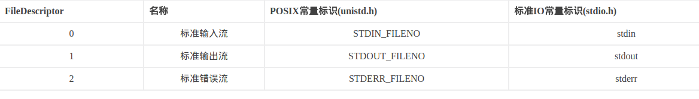
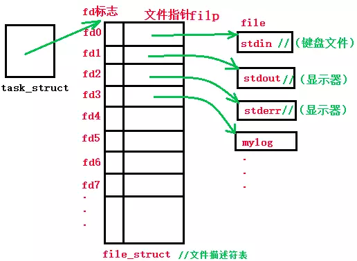
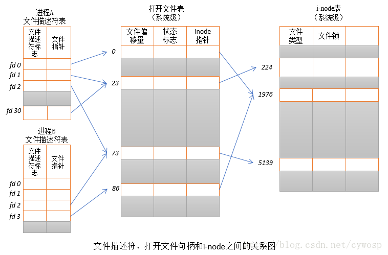
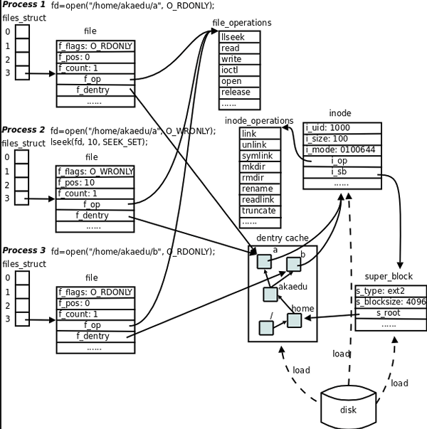
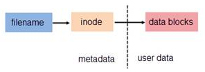

# Linux

## Linux系统

### 文件描述符

> linux为了实现一切皆文件的设计哲学，不仅将数据抽象成了文件，也将一切操作和资源抽象成了文件，比如说硬件设备，socket，磁盘，进程，线程等。



在linux内核中通常会有个task_struct结构体来维护进程相关的表，叫进程控制块，这个块里面会有指针指向file_struct的结构体，称为文件描述表，文件描述符就是这个表的索引。



每一个文件描述符会与一个打开文件相对应，同时，不同的文件描述符也会指向同一个文件。相同的文件可以被不同的进程打开也可以在同一个进程中被多次打开。系统为每一个进程维护了一个文件描述符表，该表的值都是从0开始的，所以在不同的进程中你会看到相同的文件描述符，这种情况下相同文件描述符有可能指向同一个文件，也有可能指向不同的文件。具体情况要具体分析，要理解具体其概况如何，需要查看由内核维护的3个数据结构。

- 进程级的文件描述符表
- 系统级的打开文件描述符表
- 文件系统的i-node表

#### 进程级的文件描述符表

进程级的描述符表的每一条目记录了单个文件描述符的相关信息。

1. 控制文件描述符操作的一组标志。（目前，此类标志仅定义了一个，即close-on-exec标志）

2. 对打开文件句柄的引用

#### 系统级的描述符表格（open file description table）

   内核对所有打开的文件的文件维护有一个系统级的描述符表格（open file description table）。有时，也称之为打开文件表（open file table），并将表格中各条目称为打开文件句柄（open file handle）。一个打开文件句柄存储了与一个打开文件相关的全部信息，如下所示：

   1. 当前文件偏移量（调用read()和write()时更新，或使用lseek()直接修改）
   2. 打开文件时所使用的状态标识（即，open()的flags参数）
   3. 文件访问模式（如调用open()时所设置的只读模式、只写模式或读写模式）
   4. 与信号驱动相关的设置
   5. 对该文件i-node对象的引用
   6. 文件类型（例如：常规文件、套接字或FIFO）和访问权限
   7. 一个指针，指向该文件所持有的锁列表
   8. 文件的各种属性，包括文件大小以及与不同类型操作相关的时间戳

   下图展示了文件描述符、打开的文件句柄以及i-node之间的关系，图中，两个进程拥有诸多打开的文件描述符。



在进程A中，文件描述符1和30都指向了同一个打开的文件句柄（标号23）。这可能是通过调用dup()、dup2()、fcntl()或者对同一个文件多次调用了open()函数而形成的。
进程A的文件描述符2和进程B的文件描述符2都指向了同一个打开的文件句柄（标号73）。这种情形可能是在调用fork()后出现的（即，进程A、B是父子进程关系），或者当某进程通过UNIX域套接字将一个打开的文件描述符传递给另一个进程时，也会发生。再者是不同的进程独自去调用open函数打开了同一个文件，此时进程内部的描述符正好分配到与其他进程打开该文件的描述符一样。
此外，进程A的描述符0和进程B的描述符3分别指向不同的打开文件句柄，但这些句柄均指向i-node表的相同条目（1976），换言之，指向同一个文件。发生这种情况是因为每个进程各自对同一个文件发起了open()调用。同一个进程两次打开同一个文件，也会发生类似情况。




而这个file_struct会指向一个file的结构体，一般情况下，进程是没有办法直接访问文件的，只能通过文件描述表里面的文件描述符找到文件。file有几个主要的结构体成员，分别是count，file_operation和dentry（directory entry）。
 count：这个是引用计数，像上面的pipe，还有fork，dup等的文件描述符可能会指向同一个file，比如现在有fd1和fd2，他们都指向了同一个文件，那么这个文件的计数就是2,要想关闭这个文件，close（fd1）是不能关掉的，因为这个时候计数为1,只有在计数为0的时候才算完全关闭
 file_operation：这个指向的文件操作指针，file_operation里面包含了对文件操作的内核函数指针，他指向内核操作函数，比如说read，write，release，open，当然，不同的文件file_opertions有不同的操作，像读取字符设备的文件操作肯定不会和读取正常文件的一样，他们不是读取磁盘，而是读取硬件设备
 dentry：目录项，一个指向带有文件路径的dentry结构体指针，我们在操作文件时，一定要知道他的路径，才能进行操作。为了减少读盘次数,内核缓存了目录的树状结构,称为dentry cache,其中每个节点是一 个dentry结构体,只要沿着路径各部分的dentry搜索即可。

现在看下dentry这个结构体指向了什么？
 dentry指向了inode，inode是一个包含所有者、文件大小、文件类型和权限位，创建、修改和更新时间等的结构体，保存着从磁盘inode读上来的信息。里面还有两个重要的成员：
 分别是inode_opertions和super_block
 inode_opertions：是描述文件能进行哪些操作的结构体，他指向了文件操作的内核函数，比如说rm，mkdir，mv等，
 super_block：保存着从磁盘分区的超级块读上来的信息，像文件系统类型（比如说是ext2，ext3等），块大小，不同的文件类型，底层的实现是不同的。当然，super_block还有s_root个成员指向了dentry，因为他需要知道文件的根目录被mount 到哪里

file 、dentry、inode 、super_block这几个结构体组成了**VFS**的核心概念


### VFS

//TODO


### 软硬连接

#### 硬链接

硬链接是指通过索引节点来进行链接。在Linux的文件系统中，保存在磁盘分区中的文件不管是什么类型都会给它分配一个编号，这个编号被称为索引节点编号号(Inode

Index)或者Inode，它是文件或者目录在一个文件系统中的唯一标识，文件的实际数据放置在数据区域（data block），它存储着文件重要参数信息，也就是元数据 （metadata），比如创建时间、修改时间、文件大小、属主、归属的用户组、读写权限、数据所在block号等，如下图所示。



 在Linux系统中，多个文件名指向同一索引节点(Inode)是正常且允许的。一般这种链接就称为**硬链接**。硬链接的作用之一是允许一个文件拥有多个有效路径名，这样用户就可以建立硬链接到重要的文件，以防止“误删”源数据(很多硬件，如netapp存储中的快照功能就应用了这个原理，增加一个快照就多了一个硬链接》。不过硬链接只能在同一文件系统中的文件之间进行链接，不能对目录进行创建。之所以文件建立了硬链接就会防止数据误删，是因为文件系统的原理是，只要文件的索引节点还有一个以上的链接（仅删除了该文件的指向），只删除其中一个链接并不影响索引节点本身和其他的链接（数据的实体并未删除），只有当最后一个链接被删除后，此时如果有新数据要存储到磁盘上，被删除的文件的数据块及目录的链接才会被释放，空间被新数据暂用覆盖。

```sh
ln infile infile_hard_file
```

**硬链接不能指向目录** 软链接可以

#### 软链接

软链接（也叫符号链接），类似于windows系统中的快捷方式，与硬链接不同，软链接就是一个普通文件，只是数据块内容有点特殊，文件用户数据块中存放的内容是另一文件的路径名的指向，通过这个方式可以快速定位到软连接所指向的源文件实体。软链接可对文件或目录创建。

```sh
ln -s infile infile_soft_file
```

我们知道硬链接是有着相同 inode 号仅文件名不同的文件，用ls命令查看。

```sh
[root@localhost dirIn]# ls -li
1177358 -rw-r--r-- 2 root root 0 5月  31 14:53 infile
1177358 -rw-r--r-- 2 root root 0 5月  31 14:53 infile_hard_file
```

软连接和硬链接的特点：

软链接：

- 1. 软链接是存放另一个文件的路径的形式存在。
- 2. 软链接可以 跨文件系统 ，硬链接不可以。
- 3. 软链接可以对一个不存在的文件名进行链接，硬链接必须要有源文件。
- 4. 软链接可以对目录进行链接。

硬链接：

- 1. 硬链接，以文件副本的形式存在。但不占用实际空间。
- 2. 不允许给目录创建硬链接。
- 3. 硬链接只有在同一个文件系统中才能创建。
- 4. 删除其中一个硬链接文件并不影响其他有相同 inode 号的文件。

### select & poll & epoll 

>  目前支持I/O多路复用的系统调用有 `select，pselect，poll，epoll`，I/O多路复用就是`通过一种机制，一个进程可以监视多个描述符，一旦某个描述符就绪（一般是读就绪或者写就绪），能够通知程序进行相应的读写操作`。但select，pselect，poll，epoll本质上都是同步I/O，因为他们都需要在读写事件就绪后自己负责进行读写，也就是说这个读写过程是阻塞的，而异步I/O则无需自己负责进行读写，异步I/O的实现会负责把数据从内核拷贝到用户空间。
>
> ​     与多进程和多线程技术相比，I/O多路复用技术的最大优势是系统开销小，系统不必创建进程/线程，也不必维护这些进程/线程，从而大大减小了系统的开销。

#### **select模型**

**基本原理：**select 函数监视的文件描述符分3类，分别是writefds、readfds、和exceptfds。调用后select函数会阻塞，直到有描述符就绪（有数据 可读、可写、或者有except），或者超时（timeout指定等待时间，如果立即返回设为null即可），函数返回。当select函数返回后，可以通过遍历fdset，来找到就绪的描述符。

select目前几乎在所有的平台上支持，其良好跨平台支持也是它的一个优点。select的一个缺点在于单个进程能够监视的文件描述符的数量存在最大限制，在Linux上一般为1024，可以通过修改宏定义甚至重新编译内核的方式提升这一限制，但是这样也会造成效率的降低。

select本质上是通过设置或者检查存放fd标志位的数据结构来进行下一步处理。这样所带来的缺点是：

1. select最大的缺陷就是单个进程所打开的FD是有一定限制的，它由FD_SETSIZE设置，默认值是1024。

　　一般来说这个数目和系统内存关系很大，具体数目可以cat /proc/sys/fs/file-max察看。32位机默认是1024个。64位机默认是2048.

2. 对socket进行扫描时是线性扫描，即采用轮询的方法，效率较低。

　　当套接字比较多的时候，每次select()都要通过遍历FD_SETSIZE个Socket来完成调度，不管哪个Socket是活跃的，都遍历一遍。这会浪费很多CPU时间。如果能给套接字注册某个回调函数，当他们活跃时，自动完成相关操作，那就避免了轮询，这正是epoll与kqueue做的。

3. 需要维护一个用来存放大量fd的数据结构，这样会使得用户空间和内核空间在传递该结构时复制开销大。

#### **poll模型**

**基本原理：**poll本质上和select没有区别，它将用户传入的数组拷贝到内核空间，然后查询每个fd对应的设备状态，如果设备就绪则在设备等待队列中加入一项并继续遍历，如果遍历完所有fd后没有发现就绪设备，则挂起当前进程，直到设备就绪或者主动超时，被唤醒后它又要再次遍历fd。这个过程经历了多次无谓的遍历。

**它没有最大连接数的限制，原因是它是基于链表来存储的，但是同样有一个缺点：**

1）大量的fd的数组被整体复制于用户态和内核地址空间之间，而不管这样的复制是不是有意义。

2）poll还有一个特点是“水平触发”，如果报告了fd后，没有被处理，那么下次poll时会再次报告该fd。

**注意：**从上面看，select和poll都需要在返回后，通过遍历文件描述符来获取已经就绪的socket。事实上，同时连接的大量客户端在一时刻可能只有很少的处于就绪状态，因此随着监视的描述符数量的增长，其效率也会线性下降。

> Edge Triggered (ET) **边缘触发**只有数据到来,才触发,不管缓存区中是否还有数据。
> Level Triggered (LT) **水平触发**只要有数据都会触发。

#### **epoll模型**

　epoll是在2.6内核中提出的，是之前的select和poll的增强版本。相对于select和poll来说，epoll更加灵活，没有描述符限制。epoll使用一个文件描述符管理多个描述符，将用户关系的文件描述符的事件存放到内核的一个事件表中，这样在用户空间和内核空间的copy只需一次。

**基本原理：**epoll支持水平触发和边缘触发，最大的特点在于边缘触发，它只告诉进程哪些fd刚刚变为就绪态，并且只会通知一次。还有一个特点是，epoll使用“事件”的就绪通知方式，通过epoll_ctl注册fd，一旦该fd就绪，内核就会采用类似callback的回调机制来激活该fd，epoll_wait便可以收到通知。

**epoll的优点：**

1. 没有最大并发连接的限制，能打开的FD的上限远大于1024（1G的内存上能监听约10万个端口）。

2. 效率提升，不是轮询的方式，不会随着FD数目的增加效率下降。

　　只有活跃可用的FD才会调用callback函数；即Epoll最大的优点就在于它只管你“活跃”的连接，而跟连接总数无关，因此在实际的网络环境中，Epoll的效率就会远远高于select和poll。

3. 内存拷贝，利用mmap()文件映射内存加速与内核空间的消息传递；即epoll使用mmap减少复制开销。

epoll对文件描述符的操作有两种模式：LT（level trigger）和ET（edge trigger）。LT模式是默认模式，LT模式与ET模式的区别如下：

LT模式：当epoll_wait检测到描述符事件发生并将此事件通知应用程序，`应用程序可以不立即处理该事件`。下次调用epoll_wait时，会再次响应应用程序并通知此事件。

ET模式：当epoll_wait检测到描述符事件发生并将此事件通知应用程序，`应用程序必须立即处理该事件`。如果不处理，下次调用epoll_wait时，不会再次响应应用程序并通知此事件。

**1、LT模式**

　　LT(level triggered)是缺省的工作方式，并且同时支持block和no-block socket。在这种做法中，内核告诉你一个文件描述符是否就绪了，然后你可以对这个就绪的fd进行IO操作。如果你不作任何操作，内核还是会继续通知你的。

**2、ET模式**

　　ET(edge-triggered)是高速工作方式，只支持no-block socket。在这种模式下，当描述符从未就绪变为就绪时，内核通过epoll告诉你。然后它会假设你知道文件描述符已经就绪，并且不会再为那个文件描述符发送更多的就绪通知，直到你做了某些操作导致那个文件描述符不再为就绪状态了(比如，你在发送，接收或者接收请求，或者发送接收的数据少于一定量时导致了一个EWOULDBLOCK 错误）。但是请注意，如果一直不对这个fd作IO操作(从而导致它再次变成未就绪)，内核不会发送更多的通知(only once)。

　　ET模式在很大程度上减少了epoll事件被重复触发的次数，因此效率要比LT模式高。epoll工作在ET模式的时候，必须使用非阻塞套接口，以避免由于一个文件句柄的阻塞读/阻塞写操作把处理多个文件描述符的任务饿死。

3、在select/poll中，进程只有在调用一定的方法后，内核才对所有监视的文件描述符进行扫描，而epoll事先通过epoll_ctl()来注册一个文件描述符，一旦基于某个文件描述符就绪时，内核会采用类似callback的回调机制，迅速激活这个文件描述符，当进程调用epoll_wait()时便得到通知。(此处去掉了遍历文件描述符，而是通过监听回调的的机制。这正是epoll的魅力所在。)

**注意：**如果没有大量的idle-connection或者dead-connection，epoll的效率并不会比select/poll高很多，但是当遇到大量的idle-connection，就会发现epoll的效率大大高于select/poll。

#### 区别

##### 消息传递方式：

select：内核需要将消息传递到用户空间，需要内核的拷贝动作；

poll：同上；

epoll：通过内核和用户空间共享一块内存来实现，性能较高；

##### 文件句柄剧增后带来的IO效率问题：

select：因为每次调用都会对连接进行线性遍历，所以随着FD剧增后会造成遍历速度的“线性下降”的性能问题；

poll：同上；

epoll：由于epoll是根据每个FD上的callable函数来实现的，只有活跃的socket才会主动调用callback，所以在活跃socket较少的情况下，使用epoll不会对性能产生线性下降的问题，如果所有socket都很活跃的情况下，可能会有性能问题；

##### 支持一个进程所能打开的最大连接数：

select：单个进程所能打开的最大连接数，是由FD_SETSIZE宏定义的，其大小是32个整数大小（在32位的机器上，大小是32*32,64位机器上FD_SETSIZE=32*64），我们可以对其进行修改，然后重新编译内核，但是性能无法保证，需要做进一步测试；

poll：本质上与select没什么区别，但是他没有最大连接数限制，他是基于链表来存储的；

epoll：虽然连接数有上线，但是很大，和内存有瓜(:-，1G内存的机器上可以打开10W左右的连接；


## 虚拟机

### 网络适配器

VMware三种网络模式联网:

```
VMnet0：用于虚拟桥接网络下的虚拟交换机
VMnet1：用于虚拟Host-Only网络下的虚拟交换机
VMnet8：用于虚拟NAT网络下的虚拟交换机
VMware Network AdepterVMnet1：Host用于与Host-Only虚拟网络进行通信的虚拟网卡
VMware Network Adepter VMnet8：Host用于与NAT虚拟网络进行通信的虚拟网卡
```

#### bridge 桥接

```
在这种模式下，VMware虚拟出来的操作系统就像是局域网中的一台独立的主机，它可以访问网内任何一台机器。需要手工为虚拟系统配置IP地址、子网掩码，而且还要和宿主机器处于同一网段，这样虚拟系统才能和宿主机器进行通信。同时，由于这个虚拟系统是局域网中的一个独立的主机系统，那么就可以手工配置它的TCP/IP配置信息，以实现通过局域网的网关或路由器访问互联网。
```

#### NAT

```
使用NAT模式，就是让虚拟系统借助NAT(网络地址转换)功能，通过宿主机器所在的网络来访问公网。也就是说，使用NAT模式可以实现在虚拟系统里访问互联网。NAT模式下的虚拟系统的TCP/IP配置信息是由VMnet8(NAT)虚拟网络的DHCP服务器提供的，无法进行手工修改，因此虚拟系统也就无法和本局域网中的其他真实主机进行通讯。采用NAT模式最大的优势是虚拟系统接入互联网非常简单，不需要进行任何其他的配置，只需要主机器能访问互联网即可。这种情况下，主机可以ping通虚拟机，虚拟机也能ping通主机。
```

#### host only

```
在Host-Only模式下，虚拟网络是一个全封闭的网络，它唯一能够访问的就是主机。其实Host-Only网络和NAT网络很相似，不同的地方就是 Host-Only网络没有NAT服务，所以虚拟网络不能连接到Internet。主机和虚拟机之间的通信是通过VMwareNetworkAdepterVMnet1虚拟网卡来实现的。此时如果想要虚拟机上外网则需要主机联网并且网络共享。
```

参考

[博客]: https://blog.csdn.net/tyutzhangyukang/article/details/78525086
[博客]: https://blog.csdn.net/qq_28090573/article/details/78730552


## CentOS

### 网络

#### 查看网关

```
# netstat -rn

(以0.0.0.0开始的行的gateway是默认网关)
```

#### 内网穿透技术

> natapp