# Linux 系统编程

## 进程

### 进程相关概念

#### 程序和进程

程序，是指编译好的二进制文件，在磁盘上，不占用系统资源(cpu、内存、打开的文件、设备、锁....)

进程，是一个抽象的概念，与操作系统原理联系紧密。进程是活跃的程序，占用系统资源。在内存中执行。(程序运行起来，产生一个进程)

程序 → 剧本(纸)           进程 → 戏(舞台、演员、灯光、道具...)

同一个剧本可以在多个舞台同时上演。同样，同一个程序也可以加载为不同的进程(彼此之间互不影响)

如：同时开两个终端。各自都有一个bash但彼此ID不同。

#### 并发

并发，在[操作系统](http://baike.baidu.com/view/880.htm)中，一个时间段中有多个进程都处于已启动运行到运行完毕之间的状态。但，任一个时刻点上仍只有一个进程在运行。

例如，当下，我们使用计算机时可以边听音乐边聊天边上网。 若笼统的将他们均看做一个进程的话，为什么可以同时运行呢，因为并发。

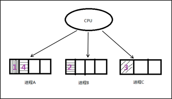

#### 单道程序设计

所有进程一个一个排对执行。若A阻塞，B只能等待，即使CPU处于空闲状态。而在人机交互时阻塞的出现时必然的。所有这种模型在系统资源利用上及其不合理，在计算机发展历史上存在不久，大部分便被淘汰了。

#### 多道程序设计

在计算机内存中同时存放几道相互独立的程序，它们在管理程序控制之下，相互穿插的运行。多道程序设计必须有[硬件基础](http://baike.baidu.com/view/4419390.htm)作为保证。

**时钟中断**即为多道程序设计模型的理论基础。 并发时，任意进程在执行期间都不希望放弃cpu。因此系统需要一种强制让进程让出cpu资源的手段。时钟中断有硬件基础作为保障，对进程而言不可抗拒。 操作系统中的中断处理函数，来负责调度程序执行。

在多道程序设计模型中，多个进程轮流使用CPU (分时复用CPU资源)。而当下常见CPU为纳秒级，1秒可以执行大约10亿条指令。由于人眼的反应速度是毫秒级，所以看似同时在运行。

1s = 1000ms, 1ms = 1000us, 1us = 1000ns    1000000000 

实质上，并发是宏观并行，微观串行！                       -----推动了计算机蓬勃发展，将人类引入了多媒体时代。

#### CPU和MMU

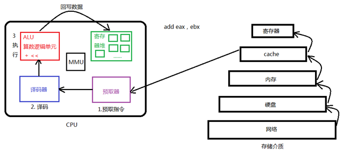

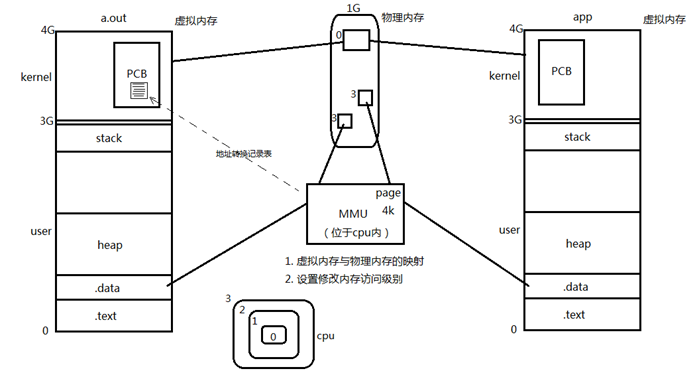

#### 进程控制块PCB

我们知道，每个进程在内核中都有一个进程控制块（PCB）来维护进程相关的信息，Linux内核的进程控制块是task_struct结构体。

/usr/src/linux-headers-3.16.0-30/include/linux/sched.h文件中可以查看struct task_struct 结构体定义。其内部成员有很多，我们重点掌握以下部分即可：

\* 进程id。系统中每个进程有唯一的id，在C语言中用pid_t类型表示，其实就是一个非负整数。

\* 进程的状态，有就绪、运行、挂起、停止等状态。

\* 进程切换时需要保存和恢复的一些CPU寄存器。

\* 描述虚拟地址空间的信息。

\* 描述控制终端的信息。

\* 当前工作目录（Current Working Directory）。

\* umask掩码。

\* 文件描述符表，包含很多指向file结构体的指针。

\* 和信号相关的信息。

\* 用户id和组id。

\* 会话（Session）和进程组。

\* 进程可以使用的资源上限（Resource Limit）。

#### 进程状态（C 中）

进程基本的状态有5种。分别为初始态，就绪态，[运行态](http://baike.baidu.com/subview/1730379/1730379.htm)，挂起态与终止态。其中初始态为进程准备阶段，常与就绪态结合来看。

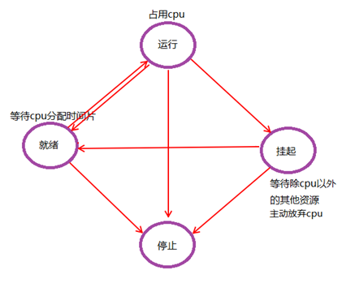

### 环境变量：

环境变量，是指在[操作系统](http://baike.baidu.com/view/880.htm)中用来指定操作系统运行环境的一些参数。通常具备以下特征：

```
① 字符串(本质) ② 有统一的格式：名=值[:值] ③ 值用来描述进程环境信息。
存储形式：与命令行参数类似。char *[]数组，数组名environ，内部存储字符串，NULL作为哨兵结尾。
使用形式：与命令行参数类似。
加载位置：与命令行参数类似。位于用户区，高于stack的起始位置。
引入环境变量表：须声明环境变量。extern char ** environ; 
```

#### 常见环境变量

按照惯例，环境变量字符串都是name=value这样的形式，大多数name由大写字母加下划线组成，一般把name的部分叫做环境变量，value的部分则是环境变量的值。环境变量定义了进程的运行环境，一些比较重要的环境变量的含义如下：

##### PATH

可执行文件的搜索路径。ls命令也是一个程序，执行它不需要提供完整的路径名/bin/ls，然而通常我们执行当前目录下的程序a.out却需要提供完整的路径名./a.out，这是因为PATH环境变量的值里面包含了ls命令所在的目录/bin，却不包含a.out所在的目录。PATH环境变量的值可以包含多个目录，用:号隔开。在Shell中用echo命令可以查看这个环境变量的值：

$ echo $PATH

##### SHELL

当前Shell，它的值通常是/bin/bash。

##### TERM

当前终端类型，在图形界面终端下它的值通常是xterm，终端类型决定了一些程序的输出显示方式，比如图形界面终端可以显示汉字，而字符终端一般不行。

##### LANG

语言和locale，决定了字符编码以及时间、货币等信息的显示格式。

##### HOME

当前用户主目录的路径，很多程序需要在主目录下保存配置文件，使得每个用户在运行该程序时都有自己的一套配置。

#### getenv函数

获取环境变量值

​    char *getenv(const char *name);  成功：返回环境变量的值；失败：NULL (name不存在)

练习：编程实现getenv函数。                                                                                                                                        【getenv.c】

#### setenv函数

设置环境变量的值         

​    int setenv(const char *name, const char *value, int overwrite);          成功：0；失败：-1

​         参数overwrite取值：   1：覆盖原环境变量 

0：不覆盖。(该参数常用于设置新环境变量，如：ABC = haha-day-night)

#### unsetenv函数

删除环境变量name的定义

​    int unsetenv(const char *name);   成功：0；失败：-1 

​         注意事项：name不存在仍返回0(成功)，当name命名为"ABC="时则会出错。

### fork函数

> 创建一个子进程。fork之后，操作系统会复制一个与父进程完全相同的子进程，虽说是父子关系，但是在操作系统看来，他们更像兄弟关系，这2个进程共享代码空间，但是数据空间是互相独立的，子进程数据空间中的内容是父进程的完整拷贝，指令指针也完全相同，子进程拥有父进程当前运行到的位置.两进程的程序计数器pc值相同


```
pid_t fork(void);
失败返回-1；成功返回：
父进程返回子进程的ID(非负)     
子进程返回 0 
pid_t类型表示进程ID，但为了表示-1，它是有符号整型。(0不是有效进程ID，init最小，为1)注意返回值，不是fork函数能返回两个值，而是fork后，fork函数变为两个，父子需【各自】返回一个。
```

#### 循环创建n个子进程

> 如果想循环创建n个子进程，直接用for循环 ，将会创建 2^n -1 个子进程，因为子进程复制了父进程的pc，会继续fork子孙进程。
>
> 解决方法：在fork后判断pid是否为0 ，如果是0则为刚刚fork出来的子进程，则跳出循环

#### C函数

* getpid
* getppid
* getuid  获取用户id
* getgid 有效用户组id

#### 进程共享

父子进程之间在fork后。有哪些相同，那些相异之处呢？

刚fork之后：

父子相同处: 全局变量、.data、.text、栈、堆、环境变量、用户ID、宿主目录、进程工作目录、信号处理方式...

父子不同处: 1.进程ID   2.fork返回值   3.父进程ID    4.进程运行时间    5.闹钟(定时器)   6.未决信号集

似乎，子进程复制了父进程0-3G用户空间内容，以及父进程的PCB，但pid不同。真的每fork一个子进程都要将父进程的0-3G地址空间完全拷贝一份，然后在映射至物理内存吗？

当然不是!父子进程间遵循**读时共享写时复制**的原则。这样设计，无论子进程执行父进程的逻辑还是执行自己的逻辑都能节省内存开销。   

重点注意！躲避父子进程共享全局变量的知识误区！

【重点】：父子进程共享：

1. 文件描述符(打开文件的结构体) 

2. mmap建立的映射区 

#### gdb调试

使用gdb调试的时候，gdb只能跟踪一个进程。可以在fork函数调用之前，通过指令设置gdb调试工具跟踪父进程或者是跟踪子进程。默认跟踪父进程。

set follow-fork-mode child 命令设置gdb在fork之后跟踪子进程。

set follow-fork-mode parent 设置跟踪父进程。

注意，一定要在fork     

#### exec函数族 

fork创建子进程后执行的是和父进程相同的程序（但有可能执行不同的代码分支），子进程往往要调用一种exec函数以执行另一个程序。当进程调用一种exec函数时，该进程的用户空间代码和数据完全被新程序替换，从新程序的启动例程开始执行。调用exec并不创建新进程，所以调用exec前后该进程的id并未改变。

将当前进程的.text、.data替换为所要加载的程序的.text、.data，然后让进程从新的.text第一条指令开始执行，但进程ID不变，换核不换壳。

其实有六种以exec开头的函数，统称exec函数：

int execl(const char *path, const char *arg, ...);

int execlp(const char *file, const char *arg, ...);

int execle(const char *path, const char *arg, ..., char *const envp[]);

int execv(const char *path, char *const argv[]);

int execvp(const char *file, char *const argv[]);

int execve(const char *path, char *const argv[], char *const envp[]);

##### execlp函数

加载一个进程，借助PATH环境变量       

int execlp(const char *file, const char *arg, ...);              成功：无返回；失败：-1

​    参数1：要加载的程序的名字。该函数需要配合PATH环境变量来使用，当PATH中所有目录搜索后没有参数1则出错返回。

​    该函数通常用来调用系统程序。如：ls、date、cp、cat等命令。

##### execl函数

加载一个进程， 通过 路径+程序名 来加载。 

​    int execl(const char *path, const char *arg, ...);              成功：无返回；失败：-1

对比execlp，如加载"ls"命令带有-l，-F参数

execlp("ls", "ls", "-l", "-F", NULL);         使用程序名在PATH中搜索。

execl("/bin/ls", "ls", "-l", "-F", NULL);    使用参数1给出的绝对路径搜索。

##### execvp函数

加载一个进程，使用自定义环境变量env

int execvp(const char *file, const char *argv[]);

变参形式： ①... ② argv[]  (main函数也是变参函数，形式上等同于 int main(int argc, char *argv0, ...)) 

变参终止条件：① NULL结尾 ② 固参指定

execvp与execlp参数形式不同，原理一致。

练习：将当前系统中的进程信息，打印到文件中。                                                                                           【exec_ps.c】

##### exec函数族一般规律

exec函数一旦调用成功即执行新的程序，不返回。**只有失败才返回，错误值****-1**。所以通常我们直接在exec函数调用后直接调用perror()和exit()，无需if判断。

l (list)                           命令行参数列表

p (path)                       搜素file时使用path变量

v (vector)                    使用命令行参数数组

e (environment)       使用环境变量数组,不使用进程原有的环境变量，设置新加载程序运行的环境变量

事实上，只有execve是真正的系统调用，其它五个函数最终都调用execve，所以execve在man手册第2节，其它函数在man手册第3节。这些函数之间的关系如下图所示。

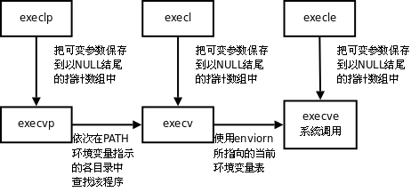

### 回收子进程

#### 孤儿进程

​         孤儿进程: 父进程先于子进程结束，则子进程成为孤儿进程，子进程的父进程成为init进程，称为init进程领养孤儿进程。

> 正常情况下 父进程死后，子进程的pid会被init 进程回收，这个进程的pid 在root执行的情况下为1  ，但是如果是一般用户，进程id 可能不为1！


### 僵尸进程

僵尸进程: 进程终止，父进程尚未回收，子进程残留资源（PCB）存放于内核中，变成僵尸（Zombie）进程。  

> [死亡进程]<defunlt>

特别注意，僵尸进程是不能使用kill命令清除掉的。因为kill命令只是用来终止进程的，而僵尸进程已经终止。

#### 清理僵尸进程的函数

* wait
* waitpid

## 进程间通信(IPC)方法

Linux环境下，进程地址空间相互独立，每个进程各自有不同的用户地址空间。任何一个进程的全局变量在另一个进程中都看不到，所以进程和进程之间不能相互访问，要交换数据必须通过内核，在内核中开辟一块缓冲区，进程1把数据从用户空间拷到内核缓冲区，进程2再从内核缓冲区把数据读走，内核提供的这种机制称为进程间通信（IPC，InterProcess Communication）。

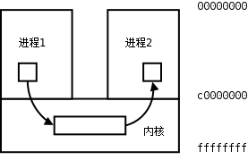

​         在进程间完成数据传递需要借助操作系统提供特殊的方法，如：文件、管道、信号、共享内存、消息队列、套接字、命名管道等。随着计算机的蓬勃发展，一些方法由于自身设计缺陷被淘汰或者弃用。现今常用的进程间通信方式有：

* 管道 (使用最简单)
*  信号 (开销最小)
* 共享映射区 (无血缘关系)
* 本地套接字 (最稳定)
* 信号量

> linux 下的文件类型
>
> * \- 文件
> * d 目录
> * l 符号链接
> * s 套接字
> * b 块设备
> * c 字符设备
> * p 管道
>
> 只有前三种是文件，占用磁盘空间，后面的都是伪文件

### 管道

#### 管道的概念：

管道是一种最基本的IPC机制，作用于有血缘关系的进程之间，完成数据传递。调用pipe系统函数即可创建一个管道。有如下特质：

1. 其本质是一个伪文件(实为内核缓冲区) 

2. 由两个文件描述符引用，一个表示读端，一个表示写端。

3. 规定数据从管道的写端流入管道，从读端流出。

管道的原理: 管道实为内核使用环形队列机制，借助内核缓冲区(4k)实现。

管道的局限性：

* 数据自己读不能自己写。

* 数据一旦被读走，便不在管道中存在，不可反复读取。

* 由于管道采用半双工通信方式。因此，数据只能在一个方向上流动。

* 只能在有公共祖先的进程间使用管道。

常见的通信方式有，单工通信、半双工通信、全双工通信。

#### pipe函数

创建管道

```c
int pipe(int pipefd[2]);               成功：0；失败：-1，设置errno
```

> 函数调用成功返回r/w两个文件描述符。无需open，但需手动close。
>
> 规定：fd[0] → r； fd[1] → w，就像0对应标准输入，1对应标准输出一样。向管道文件读写数据其实是在读写内核缓冲区。

管道创建成功以后，创建该管道的进程（父进程）同时掌握着管道的读端和写端。如何实现父子进程间通信呢？通常可以采用如下步骤：

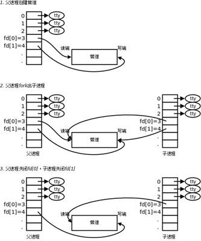

1. 父进程调用pipe函数创建管道，得到两个文件描述符fd[0]、fd[1]指向管道的读端和写端。

2. 父进程调用fork创建子进程，那么子进程也有两个文件描述符指向同一管道。

3. 父进程关闭管道读端，子进程关闭管道写端。父进程可以向管道中写入数据，子进程将管道中的数据读出。由于管道是利用环形队列实现的，数据从写端流入管道，从读端流出，这样就实现了进程间通信。

#### 管道的读写行为

​    使用管道需要注意以下4种特殊情况（假设都是阻塞I/O操作，没有设置O_NONBLOCK标志）：

1. 如果所有指向管道写端的文件描述符都关闭了（管道写端引用计数为0），而仍然有进程从管道的读端读数据，那么管道中剩余的数据都被读取后，再次read会返回0，就像读到文件末尾一样。

2. 如果有指向管道写端的文件描述符没关闭（管道写端引用计数大于0），而持有管道写端的进程也没有向管道中写数据，这时有进程从管道读端读数据，那么管道中剩余的数据都被读取后，再次read会阻塞，直到管道中有数据可读了才读取数据并返回。

3. 如果所有指向管道读端的文件描述符都关闭了（管道读端引用计数为0），这时有进程向管道的写端write，那么该进程会收到信号SIGPIPE，通常会导致进程异常终止。当然也可以对SIGPIPE信号实施捕捉，不终止进程。具体方法信号章节详细介绍。

4. 如果有指向管道读端的文件描述符没关闭（管道读端引用计数大于0），而持有管道读端的进程也没有从管道中读数据，这时有进程向管道写端写数据，那么在管道被写满时再次write会阻塞，直到管道中有空位置了才写入数据并返回。

**总结：**

① 读管道：  

1. 管道中有数据，read返回实际读到的字节数。

2. 管道中无数据：
   1. 管道写端被全部关闭，read返回0 (好像读到文件结尾)
   2. 写端没有全部被关闭，read阻塞等待(不久的将来可能有数据递达，此时会让出cpu)

② 写管道：  

1. 管道读端全部被关闭， 进程异常终止(也可使用捕捉SIGPIPE信号，使进程不终止)

2. 管道读端没有全部关闭： 
   1. 管道已满，write阻塞。
   2. 管道未满，write将数据写入，并返回实际写入的字节数。

#### 管道缓冲区大小

可以使用ulimit –a 命令来查看当前系统中创建管道文件所对应的内核缓冲区大小。通常为：

```shell
pipe size            (512 bytes, -p) 8
```

也可以使用fpathconf函数，借助参数        选项来查看。使用该宏应引入头文件<unistd.h>

```shell
long fpathconf(int fd, int name);#成功：返回管道的大小 失败：-1，设置errno
```

#### 管道的优劣

优点：简单，相比信号，套接字实现进程间通信，简单很多。

缺点：

1. 只能单向通信，双向通信需建立两个管道。

2. 只能用于父子、兄弟进程(有共同祖先)间通信。该问题后来使用fifo有名管道解决。

### FIFO 

FIFO常被称为命名管道，以区分管道(pipe)。管道(pipe)只能用于“有血缘关系”的进程间。但通过FIFO，不相关的进程也能交换数据。

​         FIFO是Linux基础文件类型中的一种。但，FIFO文件在磁盘上没有数据块，仅仅用来标识内核中一条通道。各进程可以打开这个文件进行read/write，实际上是在读写内核通道，这样就实现了进程间通信。

创建方式：

1. 命令：mkfifo 管道名

2. 库函数：int mkfifo(const char *pathname,  mode_t mode);  成功：0； 失败：-1

​         一旦使用mkfifo创建了一个FIFO，就可以使用open打开它，常见的文件I/O函数都可用于fifo。如：close、read、write、unlink等。

### 共享存储映射

#### 文件进程间通信

使用文件也可以完成IPC，理论依据是，fork后，父子进程共享文件描述符。也就共享打开的文件。

#### 存储映射I/O 

​         存储映射I/O (Memory-mapped I/O) 使一个磁盘文件与存储空间中的一个缓冲区相映射。于是当从缓冲区中取数据，就相当于读文件中的相应字节。于此类似，将数据存入缓冲区，则相应的字节就自动写入文件。这样，就可在不适用read和write函数的情况下，使用地址（指针）完成I/O操作。

​         使用这种方法，首先应通知内核，将一个指定文件映射到存储区域中。这个映射工作可以通过mmap函数来实现。

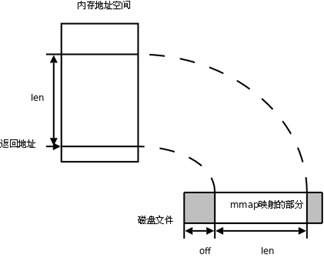

#### mmap函数

```c
void *mmap(void *adrr, size_t length, int prot, int flags, int fd, off_t offset); 
```

返回：成功：返回创建的映射区首地址；**失败：****MAP_FAILED****宏**

参数：     

```c
addr:       建立映射区的首地址，由Linux内核指定。使用时，直接传递NULL
length： 欲创建映射区的大小
prot：      映射区权限PROT_READ、PROT_WRITE、PROT_READ|PROT_WRITE
flags：     标志位参数(常用于设定更新物理区域、设置共享、创建匿名映射区)
               MAP_SHARED:  会将映射区所做的操作反映到物理设备（磁盘）上。
               MAP_PRIVATE: 映射区所做的修改不会反映到物理设备。
fd：         用来建立映射区的文件描述符
offset：  映射文件的偏移(4k的整数倍)
```


#### munmap函数

同malloc函数申请内存空间类似的，mmap建立的映射区在使用结束后也应调用类似free的函数来释放。

```c
int munmap(void *addr, size_t length);  成功：0； 失败：-1
```

#### mmap注意事项

【mmap.c】

思考：

1. 可以open的时候O_CREAT一个新文件来创建映射区吗?
2. 如果open时O_RDONLY, mmap时PROT参数指定PROT_READ|PROT_WRITE会怎样？

3. 文件描述符先关闭，对mmap映射有没有影响？

4. 如果文件偏移量为1000会怎样？

5. 对mem越界操作会怎样？

6. 如果mem++，munmap可否成功？

7. mmap什么情况下会调用失败？

8. 如果不检测mmap的返回值，会怎样？

**总结：使用mmap****时务必注意以下事项：**

1. 创建映射区的过程中，隐含着一次对映射文件的读操作。

2. 当MAP_SHARED时，要求：映射区的权限应 <=文件打开的权限(出于对映射区的保护)。而MAP_PRIVATE则无所谓，因为mmap中的权限是对内存的限制。

3. 映射区的释放与文件关闭无关。只要映射建立成功，文件可以立即关闭。

4. 特别注意，当映射文件大小为0时，不能创建映射区。所以：用于映射的文件必须要有实际大小！！ mmap使用时常常会出现总线错误，通常是由于共享文件存储空间大小引起的。

5. munmap传入的地址一定是mmap的返回地址。坚决杜绝指针++操作。

6. 如果文件偏移量必须为4K的整数倍

7. mmap创建映射区出错概率非常高，一定要检查返回值，确保映射区建立成功再进行后续操作。

### mmap父子进程通信

​         父子等有血缘关系的进程之间也可以通过mmap建立的映射区来完成数据通信。但相应的要在创建映射区的时候指定对应的标志位参数flags：

MAP_PRIVATE:  (私有映射)  父子进程各自独占映射区；

MAP_SHARED:  (共享映射)  父子进程共享映射区；

### 匿名映射

通过使用我们发现，使用映射区来完成文件读写操作十分方便，父子进程间通信也较容易。但缺陷是，每次创建映射区一定要依赖一个文件才能实现。通常为了建立映射区要open一个temp文件，创建好了再unlink、close掉，比较麻烦。 可以直接使用匿名映射来代替。其实Linux系统给我们提供了创建匿名映射区的方法，无需依赖一个文件即可创建映射区。同样需要借助标志位参数flags来指定。

使用MAP_ANONYMOUS (或MAP_ANON)， 如: 

```c
int *p = mmap(NULL, 4, PROT_READ|PROT_WRITE, MAP_SHARED|MAP_ANONYMOUS, -1, 0); 
```

> "4"随意举例，该位置表大小，可依实际需要填写。

需注意的是，MAP_ANONYMOUS和MAP_ANON这两个宏是Linux操作系统特有的宏。在类Unix系统中如无该宏定义，可使用如下两步来完成匿名映射区的建立。

① fd = open("/dev/zero", O_RDWR);

② p = mmap(NULL, size, PROT_READ|PROT_WRITE, MMAP_SHARED, fd, 0);

### mmap无血缘关系进程间通信

实质上mmap是内核借助文件帮我们创建了一个映射区，多个进程之间利用该映射区完成数据传递。由于内核空间多进程共享，因此无血缘关系的进程间也可以使用mmap来完成通信。只要设置相应的标志位参数flags即可。若想实现共享，当然应该使用MAP_SHARED了。

### 信号量

> 信号量(Semaphore)，有时被称为信号灯，是在多线程环境下使用的一种设施，是可以用来保证两个或多个关键代码段不被并发调用。在进入一个关键代码段之前，线程必须获取一个信号量；一旦该关键代码段完成了，那么该线程必须释放信号量。其它想进入该关键代码段的线程必须等待直到第一个线程释放信号量

其中，信号量又分为两种：二进制信号量和计数信号量。

信号量的概念是由荷兰计算机科学家艾兹赫尔·戴克斯特拉（Edsger W. Dijkstra）发明的，广泛的应用于不同的操作系统中。在系统中，给予每一个进程一个信号量，代表每个进程目前的状态，未得到控制权的进程会在特定地方被强迫停下来，等待可以继续进行的信号到来。如果信号量是一个任意的整数，通常被称为计数信号量（Counting semaphore），或一般信号量（general semaphore）；如果信号量只有二进制的0或1，称为二进制信号量（binary semaphore）。在linux系统中，二进制信号量（binary semaphore）又称互斥锁（Mutex）。

其中，信号量又存在着两种操作，分别为V操作与P操作，V操作会增加信号量 S的数值，P操作会减少它。

具体的运作方式如下：

* 初始化，给与它一个非负数的整数值。
* 运行 P（wait()），信号量S的值将被减少。企图进入临界区块的进程，需要先运行 P（wait()）。当信号量S减为负值时，进程会被挡住，不能继续；当信号量S不为负值时，进程可以获准进入临界区块。
* 运行 V（又称signal()），信号量S的值会被增加。结束离开临界区块的进程，将会运行 V（又称signal()）。当信号量S不为负值时，先前被挡住的其他进程，将可获准进入临界区块。

> 这两个操作都是原子化的并且信号量总是被初始化为1


## 信号

### 信号的概念

> 信号在我们的生活中随处可见， 如：古代战争中摔杯为号；现代战争中的信号弹；体育比赛中使用的信号枪......他们都有共性：1. 简单 2. 不能携带大量信息 3. 满足某个特设条件才发送。

​    信号是信息的载体，Linux/UNIX 环境下，古老、经典的通信方式， 现下依然是主要的通信手段。

> Unix早期版本就提供了信号机制，但不可靠，信号可能丢失。Berkeley 和 AT&T都对信号模型做了更改，增加了可靠信号机制。但彼此不兼容。POSIX.1对可靠信号例程进行了标准化。

#### 信号的机制

A给B发送信号，B收到信号之前执行自己的代码，收到信号后，不管执行到程序的什么位置，都要暂停运行，去处理信号，处理完毕再继续执行。与硬件中断类似——异步模式。但信号是软件层面上实现的中断，早期常被称为“**软中断**”。

**信号的特质**：由于信号是通过软件方法实现，其实现手段导致信号有很强的**延时性**。但对于用户来说，这个延迟时间非常短，不易察觉。

**每个进程收到的所有信号，都是由内核负责发送的，内核处理。**

#### 与信号相关的事件和状态

**产生信号**: 

1. 按键产生，如：Ctrl+c、Ctrl+z、Ctrl+\

2. 系统调用产生，如：kill、raise、abort

3. 软件条件产生，如：定时器alarm

4. 硬件异常产生，如：非法访问内存(段错误)、除0(浮点数例外)、内存对齐出错(总线错误)

5. 命令产生，如：kill命令

**递达**：递送并且到达进程。

**未决**：产生和递达之间的状态。主要由于阻塞(屏蔽)导致该状态。 

**信号的处理方式:** 

1. 执行默认动作 

2. 忽略(丢弃) 

3. 捕捉(调用户处理函数)

> Linux内核的进程控制块PCB是一个结构体，task_struct, 除了包含进程id，状态，工作目录，用户id，组id，文件描述符表，还包含了信号相关的信息，主要指阻塞信号集和未决信号集。

**阻塞信号集(**信号屏蔽字)： 将某些信号加入集合，对他们设置屏蔽，当屏蔽x信号后，再收到该信号，该信号的处理将推后(解除屏蔽后)

**未决信号集**: 

1. 信号产生，未决信号集中描述该信号的位立刻翻转为1，表信号处于未决状态。当信号被处理对应位翻转回为0。这一时刻往往非常短暂。 

2. 信号产生后由于某些原因(主要是阻塞)不能抵达。这类信号的集合称之为未决信号集。在屏蔽解除前，信号一直处于未决状态。    

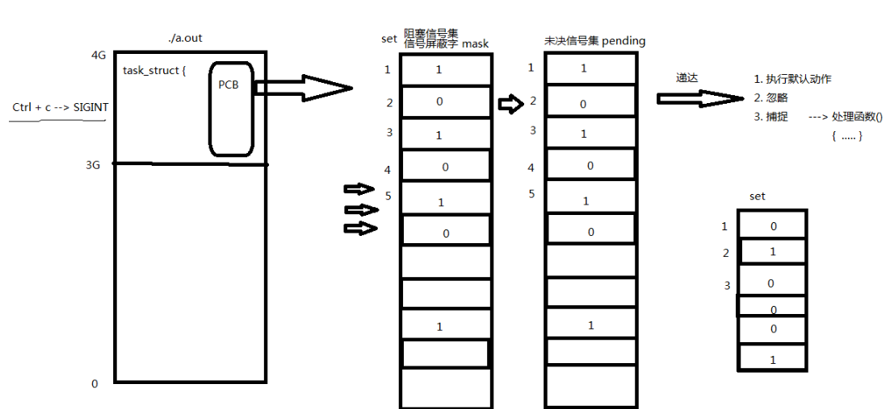

#### 信号的编号

> 可以使用kill –l命令查看当前系统可使用的信号有哪些。

```shell
1) SIGHUP	 2) SIGINT	 3) SIGQUIT	 4) SIGILL	 	5) SIGTRAP
6) SIGABRT	 7) SIGBUS	 8) SIGFPE	 9) SIGKILL	10) SIGUSR1
11) SIGSEGV	12) SIGUSR2	13) SIGPIPE	14) SIGALRM	15) SIGTERM
16) SIGSTKFLT	17) SIGCHLD	18) SIGCONT	19) SIGSTOP	20) SIGTSTP
21) SIGTTIN	22) SIGTTOU	23) SIGURG	24) SIGXCPU	25) SIGXFSZ
26) SIGVTALRM	27) SIGPROF	28) SIGWINCH	29) SIGIO	30) SIGPWR
31) SIGSYS	34) SIGRTMIN	35) SIGRTMIN+1	36) SIGRTMIN+2	37) SIGRTMIN+3
38) SIGRTMIN+4	39) SIGRTMIN+5	40) SIGRTMIN+6	41) SIGRTMIN+7	42) SIGRTMIN+8
43) SIGRTMIN+9	44) SIGRTMIN+10	45) SIGRTMIN+11	46) SIGRTMIN+12	47) SIGRTMIN+13
48) SIGRTMIN+14	49) SIGRTMIN+15	50) SIGRTMAX-14	51) SIGRTMAX-13	52) SIGRTMAX-12
53) SIGRTMAX-11	54) SIGRTMAX-10	55) SIGRTMAX-9	56) SIGRTMAX-8	57) SIGRTMAX-7
58) SIGRTMAX-6	59) SIGRTMAX-5	60) SIGRTMAX-4	61) SIGRTMAX-3	62) SIGRTMAX-2
63) SIGRTMAX-1	64) SIGRTMAX
```

> 不存在编号为0的信号。其中1-31号信号称之为常规信号（也叫普通信号或标准信号），34-64称之为实时信号，驱动编程与硬件相关。名字上区别不大。而前32个名字各不相同。

#### 信号4要素

与变量三要素类似的，每个信号也有其必备4要素，分别是：

1. 编号 

2. 名

3. 事件

4. 默认处理动作

> 可通过man 7 signal查看帮助文档获取。也可查看/usr/src/linux-headers-3.16.0-30/arch/s390/include/uapi/asm/signal.h

```shell
Signal     	Value     Action   Comment
────────────────────────────────────────────
SIGHUP     	 1       Term    Hangup detected on controlling terminal or death of controlling process
SIGINT       2       Term    Interrupt from keyboard
SIGQUIT      3       Core    Quit from keyboard
SIGILL       4       Core    Illegal Instruction
SIGFPE       8       Core    Floating point exception
SIGKILL      9       Term    Kill signal
SIGSEGV    	 11      Core    Invalid memory reference
SIGPIPE  	 13      Term    Broken pipe: write to pipe with no readers
SIGALRM   	 14      Term    Timer signal from alarm(2)
SIGTERM    	 15      Term    Termination signal
SIGUSR1   30,10,16    Term    User-defined signal 1
SIGUSR2   31,12,17    Term    User-defined signal 2
SIGCHLD   20,17,18    Ign     Child stopped or terminated
SIGCONT   19,18,25    Cont    Continue if stopped
SIGSTOP   17,19,23    Stop    Stop process
SIGTSTP   18,20,24    Stop    Stop typed at terminal
SIGTTIN   21,21,26    Stop    Terminal input for background process
SIGTTOU   22,22,27   Stop    Terminal output for background process
The signals SIGKILL and SIGSTOP cannot be caught, blocked, or ignored.   
```

> 在标准信号中，有一些信号是有三个“Value”，第一个值通常对alpha和sparc架构有效，中间值针对x86、arm和其他架构，最后一个应用于mips架构。一个‘-’表示在对应架构上尚未定义该信号。
>
> 不同的操作系统定义了不同的系统信号。因此有些信号出现在Unix系统内，也出现在Linux中，而有的信号出现在FreeBSD或Mac OS中却没有出现在Linux下。这里我们只研究Linux系统中的信号。

 默认动作：

```
Term：终止进程
Ign： 忽略信号 (默认即时对该种信号忽略操作)
Core：终止进程，生成Core文件。(查验进程死亡原因， 用于gdb调试)
Stop：停止（暂停）进程
Cont：继续运行进程
```

注意从man 7 signal帮助文档中可看到 : The signals SIGKILL and SIGSTOP cannot be caught, blocked, or ignored.

**9) SIGKILL 和19) SIGSTOP**信号，不允许忽略和捕捉，只能执行默认动作。甚至不能将其设置为阻塞。

**另外需清楚，只有每个信号所对应的事件发生了，该信号才会被递送(但不一定递达)，不应乱发信号！！**

#### Linux常规信号一览表

```shell
1) SIGHUP: 当用户退出shell时，由该shell启动的所有进程将收到这个信号，默认动作为终止进程
2) SIGINT：当用户按下了<Ctrl+C>组合键时，用户终端向正在运行中的由该终端启动的程序发出此信号。默认动
作为终止进程。
3) SIGQUIT：当用户按下<ctrl+\>组合键时产生该信号，用户终端向正在运行中的由该终端启动的程序发出些信
号。默认动作为终止进程。
4) SIGILL：CPU检测到某进程执行了非法指令。默认动作为终止进程并产生core文件
5) SIGTRAP：该信号由断点指令或其他 trap指令产生。默认动作为终止里程 并产生core文件。
6) SIGABRT: 调用abort函数时产生该信号。默认动作为终止进程并产生core文件。
7) SIGBUS：非法访问内存地址，包括内存对齐出错，默认动作为终止进程并产生core文件。
8) SIGFPE：在发生致命的运算错误时发出。不仅包括浮点运算错误，还包括溢出及除数为0等所有的算法错误。默认动作为终止进程并产生core文件。
9) SIGKILL：无条件终止进程。本信号不能被忽略，处理和阻塞。默认动作为终止进程。它向系统管理员提供了可以杀死任何进程的方法。
10) SIGUSE1：用户定义 的信号。即程序员可以在程序中定义并使用该信号。默认动作为终止进程。
11) SIGSEGV：指示进程进行了无效内存访问。默认动作为终止进程并产生core文件。
12) SIGUSR2：另外一个用户自定义信号，程序员可以在程序中定义并使用该信号。默认动作为终止进程。
13) SIGPIPE：Broken pipe向一个没有读端的管道写数据。默认动作为终止进程。
14) SIGALRM: 定时器超时，超时的时间 由系统调用alarm设置。默认动作为终止进程。
15) SIGTERM：程序结束信号，与SIGKILL不同的是，该信号可以被阻塞和终止。通常用来要示程序正常退出。执行shell命令Kill时，缺省产生这个信号。默认动作为终止进程。
16) SIGSTKFLT：Linux早期版本出现的信号，现仍保留向后兼容。默认动作为终止进程。
17) SIGCHLD：子进程结束时，父进程会收到这个信号。默认动作为忽略这个信号。
18) SIGCONT：如果进程已停止，则使其继续运行。默认动作为继续/忽略。
19) SIGSTOP：停止进程的执行。信号不能被忽略，处理和阻塞。默认动作为暂停进程。
20) SIGTSTP：停止终端交互进程的运行。按下<ctrl+z>组合键时发出这个信号。默认动作为暂停进程。
21) SIGTTIN：后台进程读终端控制台。默认动作为暂停进程。
22) SIGTTOU: 该信号类似于SIGTTIN，在后台进程要向终端输出数据时发生。默认动作为暂停进程。
23) SIGURG：套接字上有紧急数据时，向当前正在运行的进程发出些信号，报告有紧急数据到达。如网络带外数据到达，默认动作为忽略该信号。
24) SIGXCPU：进程执行时间超过了分配给该进程的CPU时间 ，系统产生该信号并发送给该进程。默认动作为终止进程。
25) SIGXFSZ：超过文件的最大长度设置。默认动作为终止进程。
26) SIGVTALRM：虚拟时钟超时时产生该信号。类似于SIGALRM，但是该信号只计算该进程占用CPU的使用时间。默认动作为终止进程。
27) SGIPROF：类似于SIGVTALRM，它不公包括该进程占用CPU时间还包括执行系统调用时间。默认动作为终止进程。
28) SIGWINCH：窗口变化大小时发出。默认动作为忽略该信号。
29) SIGIO：此信号向进程指示发出了一个异步IO事件。默认动作为忽略。
30) SIGPWR：关机。默认动作为终止进程。
31) SIGSYS：无效的系统调用。默认动作为终止进程并产生core文件。
34) SIGRTMIN ～ (64) SIGRTMAX：LINUX的实时信号，它们没有固定的含义（可以由用户自定义）。所有的实时信号的默认动作都为终止进程。
```

### 信号的产生

#### 终端按键产生信号

​    Ctrl + c  → 2) SIGINT（终止/中断）   "INT" ----Interrupt

​    Ctrl + z  → 20) SIGTSTP（暂停/停止）  "T" ----Terminal 终端。

​    Ctrl + \  → 3) SIGQUIT（退出） 

#### 硬件异常产生信号

​    除0操作   → 8) SIGFPE (浮点数例外)      "F" -----float 浮点数。

​    非法访问内存  → 11) SIGSEGV (段错误)

​    总线错误  → 7) SIGBUS       

#### kill函数/命令产生信号

kill命令产生信号：kill -SIGKILL pid

kill函数：给指定进程发送指定信号(不一定杀死)

```c
int kill(pid_t pid, int sig);  
//成功：0；失败：-1 (ID非法，信号非法，普通用户杀init进程等权级问题)，设置errno
sig：不推荐直接使用数字，应使用宏名，因为不同操作系统信号编号可能不同，但名称一致。
pid > 0:  发送信号给指定的进程。
pid = 0:  发送信号给 与调用kill函数进程属于同一进程组的所有进程。
pid < 0:  取|pid|发给对应进程组。可以给其他进程组发送信号
pid = -1：发送给进程有权限发送的系统中所有进程。
```

**进程组**：每个进程都属于一个进程组，进程组是一个或多个进程集合，他们相互关联，共同完成一个实体任务，每个进程组都有一个进程组长，默认进程组ID与进程组长ID相同。

**权限保护**：super用户(root)可以发送信号给任意用户，普通用户是不能向系统用户发送信号的。 kill -9 (root用户的pid)  是不可以的。同样，普通用户也不能向其他普通用户发送信号，终止其进程。 只能向自己创建的进程发送信号。普通用户基本规则是：发送者实际或有效用户ID == 接收者实际或有效用户ID

**raise和abort函数**

raise 函数：给当前进程发送指定信号(自己给自己发)     raise(signo) == kill(getpid(), signo);

```c
int raise(int sig); //成功：0，失败非0值
```

abort 函数：给自己发送异常终止信号 6) SIGABRT 信号，终止并产生core文件

```c
void abort(void); //该函数无返回
```

#### 软件条件产生信号  

##### alarm函数     

设置定时器(闹钟)。在指定seconds后，内核会给当前进程发送14）SIGALRM信号。进程收到该信号，**默认动作终止**。

**每个进程都有且只有唯一个定时器。**

```c
unsigned int alarm(unsigned int seconds); //返回0或剩余的秒数，无失败。
```

常用：取消定时器alarm(0)，返回旧闹钟余下秒数。

> 例：alarm(5) → 3sec → alarm(4) → 5sec → alarm(5) → alarm(0)

​    定时，与进程状态无关(自然定时法)！就绪、运行、挂起(阻塞、暂停)、终止、僵尸...无论进程处于何种状态，alarm都计时。

##### setitimer函数

设置定时器(闹钟)。 可代替alarm函数。精度微秒us，可以实现周期定时。

```c
int setitimer(int which, const struct itimerval *new_value, struct itimerval *old_value);     //成功：0；失败：-1，设置errno
```

>  参数：which：指定定时方式
>
> ① 自然定时：ITIMER_REAL → 14）SIGLARM            计算自然时间
>
> ② 虚拟空间计时(用户空间)：ITIMER_VIRTUAL → 26）SIGVTALRM     只计算进程占用cpu的时间
>
> ③ 运行时计时(用户+内核)：ITIMER_PROF → 27）SIGPROF            计算占用cpu及执行系统调用的时间

### 信号集操作函数

内核通过读取未决信号集来判断信号是否应被处理。信号屏蔽字mask可以影响未决信号集。而我们可以在应用程序中自定义set来改变mask。已达到屏蔽指定信号的目的。

#### 信号集设定

```c
sigset_t  set; // typedef unsigned long sigset_t; 
int sigemptyset(sigset_t *set);// 将某个信号集清0 成功：0；失败：-1
int sigfillset(sigset_t *set);//将某个信号集置1 成功：0；失败：-1
int sigaddset(sigset_t *set, int signum);//将某个信号加入信号集 成功：0；失败：-1
int sigdelset(sigset_t *set, int signum);//将某个信号清出信号集 成功：0；失败：-1
int sigismember(const sigset_t *set, int signum);//判断某个信号是否在信号集 ;返回值：在集合：1；不在：0；出错：-1  
```

> sigset_t类型的本质是位图。但不应该直接使用位操作，而应该使用上述函数，保证跨系统操作有效。

### sigprocmask函数

用来屏蔽信号、解除屏蔽也使用该函数。其本质，读取或修改进程的信号屏蔽字(PCB中)

**严格注意，屏蔽信号：只是将信号处理延后执行(延至解除屏蔽)；而忽略表示将信号丢处理。**

```c
int sigprocmask(int how, const sigset_t *set, sigset_t *oldset);//成功：0；失败：-1，设置errno
```

参数：

```c
set：传入参数，是一个位图，set中哪位置1，就表示当前进程屏蔽哪个信号。
oldset：传出参数，保存旧的信号屏蔽集。
how参数取值：假设当前的信号屏蔽字为mask
```

1. SIG_BLOCK: 当how设置为此值，set表示需要屏蔽的信号。相当于 mask = mask|set

2. SIG_UNBLOCK: 当how设置为此，set表示需要解除屏蔽的信号。相当于 mask = mask & ~set

3. SIG_SETMASK: 当how设置为此，set表示用于替代原始屏蔽及的新屏蔽集。相当于 mask = set若，调用sigprocmask解除了对当前若干个信号的阻塞，则在sigprocmask返回前，至少将其中一个信号递达。

### sigpending函数

读取当前进程的**未决**信号集

```c
int sigpending(sigset_t *set);//set传出参数。返回值：成功：0；失败：-1，设置errno
```

### 信号捕捉

#### signal函数

注册一个信号捕捉函数：

```c
typedef void (*sighandler_t)(int);//返回值为void，参数为int的函数
sighandler_t signal(int signum, sighandler_t handler);
```

> 该函数由ANSI定义，由于历史原因在不同版本的Unix和不同版本的Linux中可能有不同的行为。因此应该尽量避免使用它，取而代之使用sigaction函数。

```c
void (*signal(int signum, void (*sighandler_t)(int))) (int);
```

#### sigaction函数  

修改信号处理动作（通常在Linux用其来注册一个信号的捕捉函数）

```c
int sigaction(int signum, const struct sigaction *act, struct sigaction *oldact); // 成功：0；失败：-1，设置errno
```

参数：

act：传入参数，新的处理方式。

oldact：传出参数，旧的处理方式。

#### struct sigaction结构体

```c
struct sigaction {
    void     (*sa_handler)(int);
    void     (*sa_sigaction)(int, siginfo_t *, void *);
    sigset_t   sa_mask; 
    int       sa_flags; 
    void     (*sa_restorer)(void);
};
```

​         sa_restorer：该元素是过时的，不应该使用，POSIX.1标准将不指定该元素。(弃用)

​         sa_sigaction：当sa_flags被指定为SA_SIGINFO标志时，使用该信号处理程序。(很少使用)  

重点掌握：

​         ① sa_handler：指定信号捕捉后的处理函数名(即注册函数)。也可赋值为SIG_IGN表忽略 或 SIG_DFL表执行默认动作

​         ② sa_mask: 调用信号处理函数时，所要屏蔽的信号集合(信号屏蔽字)。注意：仅在处理函数被调用期间屏蔽生效，是临时性设置。

​         ③ sa_flags：通常设置为0，表使用默认属性。       

#### 信号捕捉特性

1. 进程正常运行时，默认PCB中有一个信号屏蔽字，假定为☆，它决定了进程自动屏蔽哪些信号。当注册了某个信号捕捉函数，捕捉到该信号以后，要调用该函数。而该函数有可能执行很长时间，在这期间所屏蔽的信号不由☆来指定。而是用sa_mask来指定。调用完信号处理函数，再恢复为☆。

2. XXX信号捕捉函数执行期间，XXX信号自动被屏蔽。

3. 阻塞的常规信号不支持排队，产生多次只记录一次。（未决信号集记录）（后32个实时信号支持排队）

#### 内核实现信号捕捉过程：

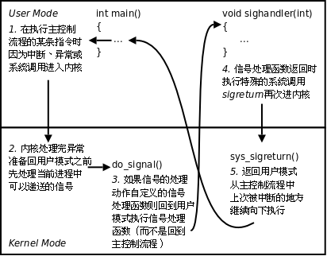

> 用户自定义了信号捕捉处理函数，当进程运行到某处时，此时出现了信号，进程进入内核态，内核态检查是否定义了函数捕捉函数，如果有，则会用户态调用捕捉处理函数（因为这个函数处理函数是在用户态定义的），回调结束后会到内核态，内核调用return函数再次返回用户态，从上次被中断的地方继续向下执行。

### 竞态条件(时序竞态)：   

#### pause函数

调用该函数可以造成进程主动挂起，等待信号唤醒。调用该系统调用的进程将处于阻塞状态(主动放弃cpu) 直到有信号递达将其唤醒。

```c
int pause(void);         返回值：-1 并设置errno为EINTR
```

 返回值：

① 如果信号的默认处理动作是终止进程，则进程终止，pause函数么有机会返回。

② 如果信号的默认处理动作是忽略，进程继续处于挂起状态，pause函数不返回。

③ 如果信号的处理动作是捕捉，则【调用完信号处理函数之后，pause返回-1】errno设置为EINTR，表示“被信号中断”。想想我们还有哪个函数只有出错返回值。

④ pause收到的信号不能被屏蔽，如果被屏蔽，那么pause就不能被唤醒。

#### 时序竞态

##### 前导例

> 设想如下场景：
>
> 欲睡觉，定闹钟10分钟，希望10分钟后闹铃将自己唤醒。
>
> 正常：定时，睡觉，10分钟后被闹钟唤醒。
>
> 异常：闹钟定好后，被唤走，外出劳动，20分钟后劳动结束。回来继续睡觉计划，但劳动期间闹钟已经响过，不会再将我唤醒。

##### 时序问题分析

回顾，借助pause和alarm实现的mysleep函数。设想如下时序：

1. 注册SIGALRM信号处理函数  （sigaction...)

2. 调用alarm(1) 函数设定闹钟1秒。

3. 函数调用刚结束，开始倒计时1秒。当前进程失去cpu，内核调度优先级高的进程(有多个)取代当前进程。当前进程无法获得cpu，进入就绪态等待cpu。

4. 1秒后，闹钟超时，内核向当前进程发送SIGALRM信号(自然定时法，与进程状态无关)，高优先级进程尚未执行完，当前进程仍处于就绪态，信号无法处理(未决)

5. 优先级高的进程执行完，当前进程获得cpu资源，内核调度回当前进程执行。SIGALRM信号递达，信号设置捕捉，执行处理函数sig_alarm。

6. 信号处理函数执行结束，返回当前进程主控流程，pause()被调用挂起等待。（欲等待alarm函数发送的SIGALRM信号将自己唤醒）

7. SIGALRM信号已经处理完毕，pause不会等到。

##### 解决时序问题

可以通过设置屏蔽SIGALRM的方法来控制程序执行逻辑，但无论如何设置，程序都有可能在“解除信号屏蔽”与“挂起等待信号”这个两个操作间隙失去cpu资源。除非将这两步骤合并成一个“原子操作”。sigsuspend函数具备这个功能。在对时序要求严格的场合下都应该使用sigsuspend替换pause。          

```c
int sigsuspend(const sigset_t *mask);//挂起等待信号。
```

sigsuspend函数调用期间，进程信号屏蔽字由其**参数mask**指定。

可将某个信号（如SIGALRM）从临时信号屏蔽字mask中删除，这样在调用sigsuspend时将解除对该信号的屏蔽，然后挂起等待，当sigsuspend返回时，进程的信号屏蔽字恢复为原来的值。如果原来对该信号是屏蔽态，sigsuspend函数返回后仍然屏蔽该信号。

##### 总结

竞态条件，跟系统负载有很紧密的关系，体现出信号的不可靠性。系统负载越严重，信号不可靠性越强。

不可靠由其实现原理所致。信号是通过软件方式实现(跟内核调度高度依赖，延时性强)，每次系统调用结束后，或中断处理处理结束后，需通过扫描PCB中的未决信号集，来判断是否应处理某个信号。当系统负载过重时，会出现时序混乱。

这种意外情况只能在编写程序过程中，提早预见，主动规避，而无法通过gdb程序调试等其他手段弥补。且由于该错误不具规律性，后期捕捉和重现十分困难。

#### 可/不可重入函数

>  一个函数在被调用执行期间(尚未调用结束)，由于某种时序又被重复调用，称之为“重入”。根据函数实现的方法可分为“可重入函数”和“不可重入函数”两种。看如下时序。

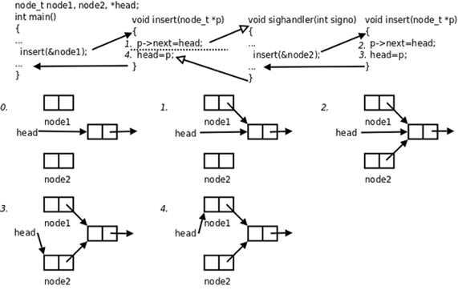

显然，insert函数是不可重入函数，重入调用，会导致意外结果呈现。究其原因，是该函数内部实现使用了全局变量。

##### 注意事项

1. 定义可重入函数，函数内不能含有全局变量及static变量，不能使用malloc、free

2. 信号捕捉函数应设计为可重入函数

3. 信号处理程序可以调用的可重入函数可参阅man 7 signal 

4. 没有包含在上述列表中的函数大多是不可重入的，其原因为：
   1. 使用静态数据结构
   2. 调用了malloc或free
   3. 是标准I/O函数

### 中断系统调用

系统调用可分为两类：慢速系统调用和其他系统调用。

1. 慢速系统调用：可能会使进程永远阻塞的一类。如果在阻塞期间收到一个信号，该系统调用就被中断,不再继续执行(早期)；也可以设定系统调用是否重启。如，read、write、pause、wait...

2. 其他系统调用：getpid、getppid、fork...

## 一些概念

### 终端：

在UNIX系统中，用户通过终端登录系统后得到一个Shell进程，这个终端成为Shell进程的控制终端（Controlling Terminal），进程中，控制终端是保存在PCB中的信息，而fork会复制PCB中的信息，因此由Shell进程启动的其它进程的控制终端也是这个终端。默认情况下（没有重定向），每个进程的标准输入、标准输出和标准错误输出都指向控制终端，进程从标准输入读也就是读用户的键盘输入，进程往标准输出或标准错误输出写也就是输出到显示器上。信号中还讲过，在控制终端输入一些特殊的控制键可以给前台进程发信号，例如Ctrl-C表示SIGINT，Ctrl-\表示SIGQUIT。

Alt + Ctrl + F1、F2、F3、F4、F5、F6    字符终端   pts (pseudo terminal slave) 指伪终端。

Alt + F7              图形终端

SSH、Telnet...          网络终端


#### 终端的启动流程：

文件与I/O中讲过，每个进程都可以通过一个特殊的设备文件/dev/tty访问它的控制终端。事实上每个终端设备都对应一个不同的设备文件，/dev/tty提供了一个通用的接口，一个进程要访问它的控制终端既可以通过/dev/tty也可以通过该终端设备所对应的设备文件来访问。ttyname函数可以由文件描述符查出对应的文件名，该文件描述符必须指向一个终端设备而不能是任意文件。

简单来说，一个Linux系统启动，大致经历如下的步骤：

​         init --> fork --> exec --> getty --> 用户输入帐号 --> login --> 输入密码 --> exec --> bash

硬件驱动程序负责读写实际的硬件设备，比如从键盘读入字符和把字符输出到显示器，**线路规程**像一个过滤器，对于某些特殊字符并不是让它直接通过，而是做特殊处理，比如在键盘上按下Ctrl-z，对应的字符并不会被用户程序的read读到，而是被线路规程截获，解释成SIGTSTP信号发给前台进程，通常会使该进程停止。线路规程应该过滤哪些字符和做哪些特殊处理是可以配置的。

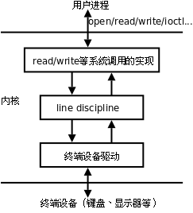

line disciline: 线路规程，用来过滤键盘输入的内容。

#### ttyname函数

由文件描述符查出对应的文件名

```c
char *ttyname(int fd);     成功：终端名；失败：NULL，设置errno   
```

下面我们借助ttyname函数，通过实验看一下各种不同的终端所对应的设备文件名。

```c
#include <unistd.h>
#include <stdio.h>
int main(void)
{
    printf("fd 0: %s\n", ttyname(0));
    printf("fd 1: %s\n", ttyname(1));
    printf("fd 2: %s\n", ttyname(2));
    return 0;
}
```

#### 网络终端

虚拟终端或串口终端的数目是有限的，虚拟终端(字符控制终端)一般就是/dev/tty1∼/dev/tty6六个，串口终端的数目也不超过串口的数目。然而网络终端或图形终端窗口的数目却是不受限制的，这是通过伪终端（Pseudo TTY）实现的。一套伪终端由一个**主设备**（PTY Master）和一个**从设备**（PTY Slave）组成。主设备在概念上相当于键盘和显示器，只不过它不是真正的硬件而是一个内核模块，操作它的也不是用户而是另外一个进程。从设备和上面介绍的/dev/tty1这样的终端设备模块类似，只不过它的底层驱动程序不是访问硬件而是访问主设备。网络终端或图形终端窗口的Shell进程以及它启动的其它进程都会认为自己的控制终端是伪终端从设备，例如/dev/pts/0、/dev/pts/1等。下面以telnet为例说明网络登录和使用伪终端的过程。

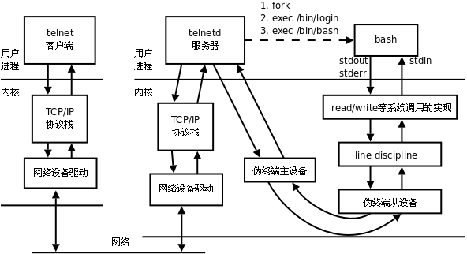

> TCP/IP协议栈：在数据包上添加报头。
>
> 如果telnet客户端和服务器之间的网络延迟较大，我们会观察到按下一个键之后要过几秒钟才能回显到屏幕上。这说明我们每按一个键telnet客户端都会立刻把该字符发送给服务器，然后这个字符经过伪终端主设备和从设备之后被Shell进程读取，同时回显到伪终端从设备，回显的字符再经过伪终端主设备、telnetd服务器和网络发回给telnet客户端，显示给用户看。也许你会觉得吃惊，但真的是这样：每按一个键都要在网络上走个来回！

#### 扩展

1. tty(终端设备的统称)
2. pty（虚拟终端)(pseudo-tty)
3. pts/ptmx(pts/ptmx结合使用，进而实现pty)

在Linux系统的设备特殊文件目录/dev/下，终端特殊设备文件一般有以下几种：

1. 串行端口终端(/dev/ttySn)

2. 伪终端(/dev/pty/)

3. 控制终端(/dev/tty)

4. 控制台终端(/dev/ttyn, /dev/console)

5. 虚拟终端(/dev/pts/n)

[分类来自博客](http://blog.chinaunix.net/uid-25256412-id-91256.html)

### 进程组

#### 概念和特性

进程组，也称之为作业。BSD于1980年前后向Unix中增加的一个新特性。代表一个或多个进程的集合。每个进程都属于一个进程组。在waitpid函数和kill函数的参数中都曾使用到。操作系统设计的进程组的概念，是为了简化对多个进程的管理。

当父进程，创建子进程的时候，默认子进程与父进程属于同一进程组。进程组ID==第一个进程ID(组长进程)。所以，组长进程标识：其进程组ID==其进程ID 

可以使用kill -SIGKILL -进程组ID(负的)来将整个进程组内的进程全部杀死。                           【kill_multprocess.c】

组长进程可以创建一个进程组，创建该进程组中的进程，然后终止。只要进程组中有一个进程存在，进程组就存在，与组长进程是否终止无关。

进程组生存期：进程组创建到最后一个进程离开(终止或转移到另一个进程组)。

一个进程可以为自己或子进程设置进程组ID

#### 进程组操作函数

##### getpgrp函数

获取当前进程的进程组ID

​         pid_t getpgrp(void); 总是返回调用者的进程组ID

##### getpgid函数  

获取指定进程的进程组ID

​         pid_t getpgid(pid_t pid);  成功：0；失败：-1，设置errno

如果pid = 0，那么该函数作用和getpgrp一样。

##### setpgid函数

改变进程默认所属的进程组。通常可用来加入一个现有的进程组或创建一个新进程组。

​         int setpgid(pid_t pid, pid_t pgid);  成功：0；失败：-1，设置errno

将参1对应的进程，加入参2对应的进程组中。

​         注意： 

1. 如改变子进程为新的组，应fork后，exec前。 

2. 权级问题。非root进程只能改变自己创建的子进程，或有权限操作的进程

### 会话

#### 创建会话

创建一个会话需要注意以下6点注意事项：

1. 调用进程不能是进程组组长，该进程变成新会话首进程(session header)

2. 该进程成为一个新进程组的组长进程。

3. 需有root权限(ubuntu不需要)

4. 新会话丢弃原有的控制终端，该会话没有控制终端

5. 该调用进程是组长进程，则出错返回

6. 建立新会话时，先调用fork, 父进程终止，子进程调用setsid

##### getsid函数

获取进程所属的会话ID

```c
pid_t getsid(pid_t pid);// 成功：返回调用进程的会话ID；失败：-1，设置errno
```

> pid为0表示察看当前进程session ID

> ps ajx命令查看系统中的进程。参数a表示不仅列当前用户的进程，也列出所有其他用户的进程，参数x表示不仅列有控制终端的进程，也列出所有无控制终端的进程，参数j表示列出与作业控制相关的信息。

组长进程不能成为新会话首进程，新会话首进程必定会成为组长进程。

##### setsid函数

创建一个会话，并以自己的ID设置进程组ID，同时也是新会话的ID。

```c
pid_t setsid(void); // 成功：返回调用进程的会话ID；失败：-1，设置errno
```

> 调用了setsid函数的进程，既是新的会长，也是新的组长。                                                                   


### 守护进程

Daemon(精灵)进程，是Linux中的后台服务进程，通常独立于控制终端并且周期性地执行某种任务或等待处理某些发生的事件。一般采用以d结尾的名字。

Linux后台的一些系统服务进程，没有控制终端，不能直接和用户交互。不受用户登录、注销的影响，一直在运行着，他们都是守护进程。如：预读入缓输出机制的实现；ftp服务器；nfs服务器等。

创建守护进程，最关键的一步是调用setsid函数创建一个新的Session，并成为Session Leader。

### 创建守护进程模型

1. 创建子进程，父进程退出

所有工作在子进程中进行形式上脱离了控制终端

2. 在子进程中创建新会话

   > setsid()函数
   >
   > 使子进程完全独立出来，脱离控制

3. 改变当前目录为根目录

   > chdir()函数
   >
   > 防止占用可卸载的文件系统
   >
   > 也可以换成其它路径

4. 重设文件权限掩码

   > umask()函数
   >
   > 防止继承的文件创建屏蔽字拒绝某些权限
   >
   > 增加守护进程灵活性

5. 关闭文件描述符

   > 继承的打开文件不会用到，浪费系统资源，无法卸载

6. 开始执行守护进程核心工作

7. 守护进程退出处理程序模型

## 线程

### 线程概念

#### 什么是线程

LWP：light weight process 轻量级的进程，本质仍是进程(在Linux环境下)

进程：独立地址空间，拥有PCB
线程：也有PCB，但没有独立的地址空间(共享)
区别：在于是否共享地址空间。         独居(进程)；合租(线程)。
Linux下：线程：最小的执行单位(CPU为线程为单位分配执行资源)
进程：最小分配资源单位，可看成是只有一个线程的进程。

#### Linux内核线程实现原理

类Unix系统中，早期是没有“线程”概念的，80年代才引入，借助进程机制实现出了线程的概念。因此在这类系统中，进程和线程关系密切。

1. 轻量级进程(light-weight process)，也有PCB，创建线程使用的底层函数和进程一样，都是**clone**

2. 从内核里看进程和线程是一样的，都有各自不同的PCB，但是PCB中指向内存资源的三级页表是相同的

3. 进程可以蜕变成线程

4. 线程可看做寄存器和栈的集合

5. 在linux下，线程最是小的执行单位；进程是最小的分配资源单位

```shell
#察看LWP号：
ps –Lf pid #查看指定线程的lwp号。
```

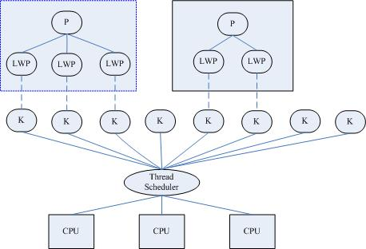

三级映射：进程PCB --> 页目录(可看成数组，首地址位于PCB中) --> 页表 --> 物理页面 --> 内存单元

对于进程来说，相同的地址(同一个虚拟地址)在不同的进程中，反复使用而不冲突。原因是他们虽虚拟址一样，但，页目录、页表、物理页面各不相同。相同的虚拟址，映射到不同的物理页面内存单元，最终访问不同的物理页面。

但！线程不同！两个线程具有各自独立的PCB，但共享同一个页目录，也就共享同一个页表和物理页面。所以两个PCB共享一个地址空间。

实际上，无论是创建进程的fork，还是创建线程的pthread_create，底层实现都是调用同一个内核函数clone。

如果复制对方的地址空间，那么就产出一个“进程”；如果共享对方的地址空间，就产生一个“线程”。

因此：Linux内核是不区分进程和线程的。只在用户层面上进行区分。所以，线程所有操作函数 pthread_* 是库函数，而非系统调用。

#### 线程共享资源

1. 文件描述符表

2. 每种信号的处理方式

3. 当前工作目录

4. 用户ID和组ID

5. 内存地址空间 (.text/.data/.bss/heap/共享库)

#### 线程非共享资源

1. 线程id

2. 处理器现场和栈指针(内核栈)

3. 独立的栈空间(用户空间栈)

4. errno变量

5. 信号屏蔽字

6. 调度优先级

#### 线程优、缺点

优点：

1. 提高程序并发性        
2.  开销小        
3. 数据通信、共享数据方便

缺点：     

1. 库函数，不稳定        
2. 调试、编写困难、gdb不支持          
3. 对信号支持不好

> 优点相对突出，缺点均不是硬伤。Linux下由于实现方法导致进程、线程差别不是很大。

### 线程控制原语

#### pthread_self函数

获取线程ID。其作用对应进程中 getpid() 函数。

```c
pthread_t pthread_self(void);// 返回值：成功：0；       失败：无！
```

线程ID：pthread_t类型，本质：在Linux下为无符号整数(%lu)，其他系统中可能是结构体实现

线程ID是进程内部，识别标志。(两个进程间，线程ID允许相同)

注意：不应使用全局变量 pthread_t tid，在子线程中通过pthread_create传出参数来获取线程ID，而应使用pthread_self。

#### pthread_create函数

创建一个新线程。其作用，对应进程中fork() 函数。

```c
int pthread_create(pthread_t *thread, const pthread_attr_t *attr, void *(*start_routine) (void *), void *arg);
```

返回值：成功：0；失败：错误号

> Linux环境下，所有线程特点，失败均直接返回错误号。

参数：     

pthread_t：当前Linux中可理解为：typedef  unsigned long int  pthread_t;

参数1：传出参数，保存系统为我们分配好的线程ID

参数2：通常传NULL，表示使用线程默认属性。若想使用具体属性也可以修改该参数。

参数3：函数指针，指向线程主函数(线程体)，该函数运行结束，则线程结束。

参数4：线程主函数执行期间所使用的参数。

在一个线程中调用pthread_create()创建新的线程后，当前线程从pthread_create()返回继续往下执行，而新的线程所执行的代码由我们传给pthread_create的函数指针start_routine决定。start_routine函数接收一个参数，是通过pthread_create的arg参数传递给它的，该参数的类型为void *，这个指针按什么类型解释由调用者自己定义。start_routine的返回值类型也是void *，这个指针的含义同样由调用者自己定义。start_routine返回时，这个线程就退出了，其它线程可以调用pthread_join得到start_routine的返回值，类似于父进程调用wait(2)得到子进程的退出状态。

pthread_create成功返回后，新创建的线程的id被填写到thread参数所指向的内存单元。我们知道进程id的类型是pid_t，每个进程的id在整个系统中是唯一的，调用getpid(2)可以获得当前进程的id，是一个正整数值。线程id的类型是thread_t，它只在当前进程中保证是唯一的，在不同的系统中thread_t这个类型有不同的实现，它可能是一个整数值，也可能是一个结构体，也可能是一个地址，所以不能简单地当成整数用printf打印，调用pthread_self(3)可以获得当前线程的id。

attr参数表示线程属性，本节不深入讨论线程属性，所有代码例子都传NULL给attr参数，表示线程属性取缺省值。

##### 线程与共享

**线程间共享全局变量！**

#### pthread_exit函数

将单个线程退出

```c
 void pthread_exit(void *retval);//参数：retval表示线程退出状态，通常传NULL
```

> 线程中，禁止使用exit函数，会导致进程内所有线程全部退出。所以，多线程环境中，应尽量少用，或者不使用exit函数，取而代之使用pthread_exit函数，将单个线程退出。任何线程里exit导致进程退出，其他线程未工作结束，主控线程退出时不能return或exit。
>
> 另注意，pthread_exit或者return返回的指针所指向的内存单元必须是全局的或者是用malloc分配的，不能在线程函数的栈上分配，因为当其它线程得到这个返回指针时线程函数已经退出了。

#### pthread_join函数

阻塞等待线程退出，获取线程退出状态,其作用，对应进程中 waitpid() 函数。

```c
int pthread_join(pthread_t thread, void **retval);// 成功：0；失败：错误号
```

参数：thread：线程ID （【注意】：不是指针）；retval：存储线程结束状态。

对比记忆：

​	进程中：main返回值、exit参数-->int；等待子进程结束 wait 函数参数-->int *

​	线程中：线程主函数返回值、pthread_exit-->void *；等待线程结束 pthread_join 函数参数->void **

#### pthread_detach函数

实现线程分离

```c
int pthread_detach(pthread_t thread); // 成功：0；失败：错误号
```

线程分离状态：指定该状态，线程主动与主控线程断开关系。线程结束后，其退出状态不由其他线程获取，而直接自己自动释放。网络、多线程服务器常用。

进程若有该机制，将不会产生僵尸进程。僵尸进程的产生主要由于进程死后，大部分资源被释放，一点残留资源仍存于系统中，导致内核认为该进程仍存在。

也可使用函数参线程属性来设置线程分离。

#### pthread_cancel函数

杀死(取消)线程,其作用，对应进程中 kill() 函数。

```c
 int pthread_cancel(pthread_t thread);  // 成功：0；失败：错误号
```

【注意】：线程的取消并不是实时的，而有一定的延时。需要等待线程到达某个取消点(检查点)。

类似于玩游戏存档，必须到达指定的场所(存档点，如：客栈、仓库、城里等)才能存储进度。杀死线程也不是立刻就能完成，必须要到达取消点。

 取消点：是线程检查是否被取消，并按请求进行动作的一个位置。通常是一些系统调用creat，open，pause，close，read，write..... 执行命令man 7 pthreads可以查看具备这些取消点的系统调用列表。也可参阅 APUE.12.7 取消选项小节。

可粗略认为一个系统调用(进入内核)即为一个取消点。如线程中没有取消点，可以通过调用pthreestcancel函数自行设置一个取消点。

被取消的线程，退出值定义在Linux的pthread库中。常数PTHREAD_CANCELED的值是-1。可在头文件pthread.h中找到它的定义：**#define PTHREAD_CANCELED ((void \*) -1)****。**因此当我们对一个已经被取消的线程使用pthread_join回收时，得到的返回值为-1。

#### pthread_equal函数

比较两个线程ID是否相等。

```c
int pthread_equal(pthread_t t1, pthread_t t2);
```

有可能Linux在未来线程ID pthread_t 类型被修改为结构体实现。

#### 控制原语对比

​     进程                            线程

​     fork                    pthread_create

​     exit                     pthread_exit

​     wait                    pthread_join

​     kill                       pthread_cancel

​     getpid                 pthread_self              命名空间

### 线程属性

本节作为指引性介绍，linux下线程的属性是可以根据实际项目需要，进行设置，之前我们讨论的线程都是采用线程的默认属性，默认属性已经可以解决绝大多数开发时遇到的问题。如我们对程序的性能提出更高的要求那么需要设置线程属性，比如可以通过设置线程栈的大小来降低内存的使用，增加最大线程个数。

```c
typedef struct
{
    int etachstate;      //线程的分离状态
    int schedpolicy;   //线程调度策略
    struct sched_param schedparam;  //线程的调度参数
    int inheritsched;  //线程的继承性
    int scope;              //线程的作用域
    size_t guardsize;        //线程栈末尾的警戒缓冲区大小
    int stackaddr_set; //线程的栈设置
    void* stackaddr;       //线程栈的位置
    size_t stacksize;         //线程栈的大小
} pthread_attr_t; 
```

主要结构体成员：

1. 线程分离状态

2. 线程栈大小（默认平均分配）

3. 线程栈警戒缓冲区大小（位于栈末尾） 参 APUE.12.3 线程属性

属性值不能直接设置，须使用相关函数进行操作，初始化的函数为pthread_attr_init，这个函数必须在pthread_create函数之前调用。之后须用pthread_attr_destroy函数来释放资源。

线程属性主要包括如下属性：作用域（scope）、栈尺寸（stack size）、栈地址（stack address）、优先级（priority）、分离的状态（detached state）、调度策略和参数（scheduling policy and parameters）。默认的属性为非绑定、非分离、缺省的堆栈、与父进程同样级别的优先级。

#### 线程属性初始化

注意：应先初始化线程属性，再pthread_create创建线程

初始化线程属性

```c
int pthread_attr_init(pthread_attr_t *attr); //成功：0；失败：错误号
```

销毁线程属性所占用的资源

```c
int pthread_attr_destroy(pthread_attr_t *attr); //成功：0；失败：错误号
```

#### 线程的分离状态

线程的分离状态决定一个线程以什么样的方式来终止自己。

非分离状态：线程的默认属性是非分离状态，这种情况下，原有的线程等待创建的线程结束。只有当pthread_join()函数返回时，创建的线程才算终止，才能释放自己占用的系统资源。

分离状态：分离线程没有被其他的线程所等待，自己运行结束了，线程也就终止了，马上释放系统资源。应该根据自己的需要，选择适当的分离状态。

线程分离状态的函数：

设置线程属性，分离or非分离

```c
int pthread_attr_setdetachstate(pthread_attr_t *attr, int detachstate); 
```

获取程属性，分离or非分离

```c
int pthread_attr_getdetachstate(pthread_attr_t *attr, int *detachstate); 
```

参数：     attr：已初始化的线程属性

detachstate： PTHREAD_CREATE_DETACHED（分离线程）

PTHREAD _CREATE_JOINABLE（非分离线程）

这里要注意的一点是，如果设置一个线程为分离线程，而这个线程运行又非常快，它很可能在pthread_create函数返回之前就终止了，它终止以后就可能将线程号和系统资源移交给其他的线程使用，这样调用pthread_create的线程就得到了错误的线程号。要避免这种情况可以采取一定的同步措施，最简单的方法之一是可以在被创建的线程里调用pthread_cond_timedwait函数，让这个线程等待一会儿，留出足够的时间让函数pthread_create返回。设置一段等待时间，是在多线程编程里常用的方法。但是注意不要使用诸如wait()之类的函数，它们是使整个进程睡眠，并不能解决线程同步的问题。

#### 线程的栈地址

POSIX.1定义了两个常量_POSIX_THREAD_ATTR_STACKADDR 和_POSIX_THREAD_ATTR_STACKSIZE检测系统是否支持栈属性。也可以给sysconf函数传递_SC_THREAD_ATTR_STACKADDR或 _SC_THREAD_ATTR_STACKSIZE来进行检测。

当进程栈地址空间不够用时，指定新建线程使用由malloc分配的空间作为自己的栈空间。通过pthread_attr_setstack和pthread_attr_getstack两个函数分别设置和获取线程的栈地址。

int pthread_attr_setstack(pthread_attr_t *attr, void *stackaddr, size_t stacksize); 成功：0；失败：错误号

int pthread_attr_getstack(pthread_attr_t *attr, void **stackaddr, size_t *stacksize); 成功：0；失败：错误号

参数：     attr：指向一个线程属性的指针

stackaddr：返回获取的栈地址

stacksize：返回获取的栈大小

#### 线程的栈大小

当系统中有很多线程时，可能需要减小每个线程栈的默认大小，防止进程的地址空间不够用，当线程调用的函数会分配很大的局部变量或者函数调用层次很深时，可能需要增大线程栈的默认大小。

函数pthread_attr_getstacksize和 pthread_attr_setstacksize提供设置。

```c
int pthread_attr_setstacksize(pthread_attr_t *attr, size_t stacksize); 成功：0；失败：错误号
int pthread_attr_getstacksize(pthread_attr_t *attr, size_t *stacksize); 成功：0；失败：错误号
```

参数：     attr：指向一个线程属性的指针

stacksize：返回线程的堆栈大小

#### 线程属性控制示例

```c
#include <pthread.h>

#define SIZE 0x100000
void *th_fun(void *arg)
{
	while (1) 
		sleep(1);
}
int main(void)
{
	pthread_t tid;
	int err, detachstate, i = 1;
	pthread_attr_t attr;
	size_t stacksize;
	void *stackaddr;

	pthread_attr_init(&attr);		
	pthread_attr_getstack(&attr, &stackaddr, &stacksize);
	pthread_attr_getdetachstate(&attr, &detachstate);

	if (detachstate == PTHREAD_CREATE_DETACHED)
		printf("thread detached\n");
	else if (detachstate == PTHREAD_CREATE_JOINABLE)
		printf("thread join\n");
	else
		printf("thread unknown\n");

	pthread_attr_setdetachstate(&attr, PTHREAD_CREATE_DETACHED);

	while (1) {
		stackaddr = malloc(SIZE);
		if (stackaddr == NULL) {
			perror("malloc");
			exit(1);
		}
		stacksize = SIZE;
		pthread_attr_setstack(&attr, stackaddr, stacksize);
		err = pthread_create(&tid, &attr, th_fun, NULL);
		if (err != 0) {
			printf("%s\n", strerror(err));
			exit(1);
		}
		printf("%d\n", i++);
	}
	pthread_attr_destroy(&attr);
	return 0;
}	

```

### NPTL

1.察看当前pthread库版本getconf GNU_LIBPTHREAD_VERSION

2.NPTL实现机制(POSIX)，Native POSIX Thread Library

3.使用线程库时gcc指定 –lpthread

### 线程使用注意事项

1. 主线程退出其他线程不退出，主线程应调用pthread_exit

2. 避免僵尸线程

pthread_join

pthread_detach

pthread_create指定分离属性

被join线程可能在join函数返回前就释放完自己的所有内存资源，所以不应当返回被回收线程栈中的值;

3. malloc和mmap申请的内存可以被其他线程释放 

4. 应避免在多线程模型中调用fork除非，马上exec，子进程中只有调用fork的线程存在，其他线程在子进程中均pthread_exit

信号的复杂语义很难和多线程共存，应避免在多线程引入信号机制

