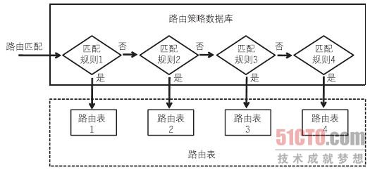

# Linux路由


## 默认路由

### 查看路由信息

```
ip route
```


### 添加路由

```
ip route add 192.168.0.0/24 via 192.168.0.1

ip route add 192.168.0.1 dev 192.168.0.1

ip route add default via 192.168.0.1 dev eth0
```

dev： 出口网关，物理设备名称

via：出口网关IP地址

### 删除路由

```
ip route del 192.168.0.0/24 via 192.168.0.1
ip route del default  # 删除默认路由
```


### 永久配置路由

debian系统中，修改文件`etc/network/interfaces` ：

```
iface eth0 inet dhcp
    post-up dhclient -v
    post-up ip route del default
    post-up ip route add default via 100.64.0.1 dev eth1 >> /root/eth1.log
```


## 策略路由


Linux系统可以同时存在256(0-255)个路由表，而且每个路由表都各自独立，互不相关。数据包在传输时是根据RPDB(路由策略数据库)内的策略决定数据包应该用哪个路由表传输的。



### 显示策略路由

```
ip rule show
```

```
0:	from all lookup local
32764:	from all fwmark 0xc9 lookup 201
32765:	from all fwmark 0xd7 lookup 215
32766:	from all lookup main
32767:	from all lookup default
```

第一段：冒号之前的数字，表示该路由表被匹配的优先顺序，数字越小，越早被匹配。这个优先级别范围是0~4亿多。默认0、32766、32767三个优先级别已被占用。如果在添加规则时没有定义优先级别，那么默认的优先级别会从32766开始递减，可以通过prio ID参数在设置路由表时添加优先级。

  第二段：from关键字，这里显示的是匹配规则，当前表示的是从哪里来的数据包，除了from关键字外，还有to、tos、fwmark、dev等等。

  第三段：loacl/main/default 这些都是路由表名称，表示数据包要从那个路由表送出去。local表包含本机路由及广播信息，main表就是我们route -n看到的内容，default表，默认为空。


在添加规则时，需要先定义好优先级、条件及路由表ID，然后才可以添加规则。如下例：


```
#根据源地址决定路由表
ip rule add from 192.168.10.0/24  table 100
ip rule add from 192.168.20.20    table 110

#根据目的地址决定路由表
ip rule add to   192.168.30.0/24  table 120
ip rule add to   192.168.40.0/24  table 130

#根据网卡设备决定路由表
ip rule add dev  eth0  table 140
ip rule add dev  eth1  table 150

#此外还可以根据其他条件进行设置，例如tos等等
```

> 上面的路由表都是用100、110、120、130等数字表示的，时间一久难免自己也会忘记该路由表的作用，不过iproute提供了一个路由表和名称的对应表(/etc/iproute2/rt_tables)，可以手动修改该表。


ip rule show查看的只是有哪些路由表，要查看路由表里面的具体路由，则可以使用ip `route show/list table ID/name`，默认的ip route show查看的是main表的路由条目。

