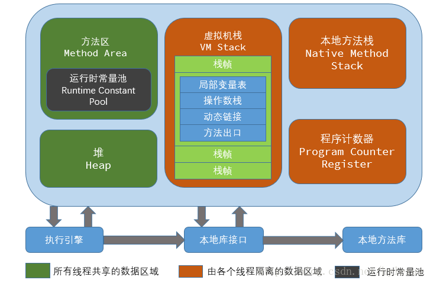
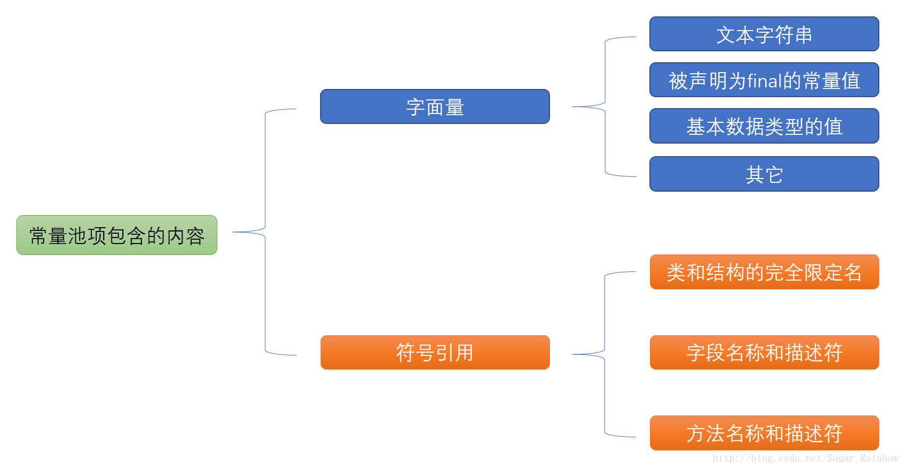

## java内存模型

如图

而运行、静态常量池是属于方法区的一部分，一般我通常说的是运行时的常量区，他跟静态常量区区别是什么？

个人认为，静态常量池是针对每个被加载进入内存的class文件解析后，存放各个字面量值，符号引用的数据，而运行时常量区就是把所有的静态常量的数据汇总到一起（模糊来说）。

更底层到汇编层面来说，内存中的各个数据没有类这个概念，每次都是一个类一个方法的调用，就是相当于寄存器的相对变址寻址过程

