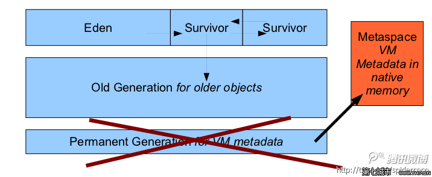
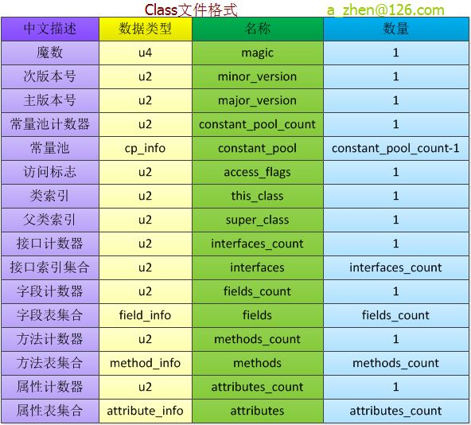
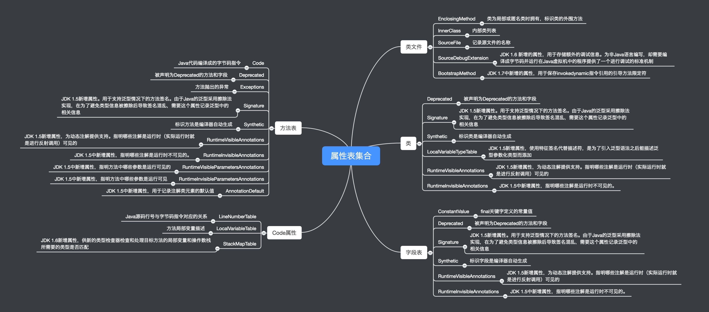

# JVM

> 熟悉JVM架构与GC垃圾回收机制以及相应的堆参调优，有过在linux进行系统调优的经验

## 一、JVM组成结构谈谈

.jpg)

JVM是运行在操作系统之上的，他与硬件没有直接的交互。

## 二、JVM体系结构概览

.jpg)

1. Class Loader类加载器

   负责加载class文件，class文件在文件开头有特定的文件标示，并且ClassLoader只负责class文件的加载，值与他是否可以允许，则由Execution Engine决定

2. Execution Engine执行引擎 负责解释命令，提交操作系统执行

3. Native Interface 本地接口

   Java语言本身不能对操作系统底层进行访问和操作，但是可以通过JNI接口调用其他语言来实现对底层的访问。

4. Native Method Stack 本地方法栈

   java在内存中专门开辟了一块区域处理标记为native的代码，他的具体做法是Native Method Stack中登记native方法，在Execution Engine执行时加载native libraies。

5. Runtime Data Area 运行数据区

6. Method Area方法区

   方法去是被所有线程共享，所有字段和方法字节码、以及一些特殊方法如构造函数，接口代码也在此定义。简单说，所有定义的方法的信息都保存在该区域，==此区属于共享区间==。用来保存装载的类的元结构信息。

   ==静态变量+常量+类信息+运行时常量池存放在**方法区**==

   ==实例变量存在**堆内存**中==

7. PC Register 程序计数器

   每个线程都有一个程序计数器，就是一个指针，指向方法区中的方法字节码（下一个将要执行的指令代码），有执行引擎读取下一条指令，是一个非常小的内存空间，可以忽略不记

   **==栈管运行，堆管存储==**

8. **Java Stack 栈**

   栈也叫栈内存，主管Java程序的运行，是在线程创建时创建，它的生命期是跟随线程的生命期，线程结束栈内存也就释放，**对于栈来说不存在垃圾回收问题**，只要线程一结束该栈就Over，生命周期和线程一致，是线程私有的。**基本类型的变量、实例方法、引用类型变量都是在函数的栈内存中分配**

> **栈管运行，堆管存储**

## 三、栈（Stak）

栈也叫栈内存，主管Java程序的运行，是在线程创建时创建，它的生命期是跟随线程的生命期，线程结束栈内存也就释放，**对于栈来说不存在垃圾回收问题**，只要线程一结束该栈就Over，生命周期和线程一致，是线程私有的。**基本类型的变量、实例方法、引用类型变量都是在函数的栈内存中分配**

### 3.1 栈存储什么

**先进后出，后进先出即为栈**

栈帧中主要保存3类数据

- 本地变量（Local Variables）：输入参数和输出参数以及方法内的变量；
- 栈操作（Operand Stack）：记录出栈、入栈的操作；
- 栈帧数据（Frame Data）：包括类文件、方法等。

### 3.2 栈运行原理

栈中的数据都是以栈帧（Stack Frame）的格式存在，栈帧是一个内存去块，是一个数据集，是一个有关方法（Method）和运行期数据的数据集，

当一个方法A被调用时就产生一个栈帧F1，并被压入到栈中，

A方法调用了B方法，于是产生栈帧F2也被压入到栈，

B方法调用了C方法，于是产生栈帧F3也被压入到栈。。。

执行完毕后，先弹出F3，再弹出F2，再弹出F1.。。。

遵循“先进后出/后进先出”的原则。

.jpg)

图示在一个栈中有两个栈：

栈2是最先被调用的方法，先入栈，

然后方法2调用了方法1，栈帧1处于栈顶的位置，

栈帧2处于栈底，执行完毕后，依次弹出栈帧1和栈帧2，

线程结束，栈释放。

**每执行一个方法都会产生一个栈帧，保存到栈（后进先出）的顶部，顶部栈就是当前的方法，该方法执行完毕后会自动将此栈帧出栈。**

### 3.3 判断JVM优化是哪里

主要时优化堆

### 3.4 三种JVM

1. Sun公司的HotSpot
2. BEA公司的JRockit
3. IBM公司的 J9 VM

## 四、堆（Heap）

### 4.1 堆内存示意图

.jpg)

### 4.2 新生代

新生区是类的诞生、成长、消亡的区域，一个类再这里产生，应用，最后被垃圾回收器收集，结束生命。新生去又分欸两部分：伊甸区（Eden Space）和幸存者区（Survivor Space），所有的类都是再伊甸区被new出来。幸存区又连个：0区和1区。当伊甸园的空间用完是，程序有需要创建对象，JVM的垃圾回收器将对伊甸园区进行垃圾回收（Minor GC），将伊甸园区中的不再被其他对象所引用的对象进行销毁。然后将伊甸园区中的生于对象移动到幸存0区，若幸存0区也满了，再对该区进行垃圾回收，然后移动到1区。如果1区也满了，再移动到养老区。若养老区也满了，那么这时候将产生MajorGC（FullGC），进行养老区的内存清理。若养老区执行了FullGC后发现依然无法进行对象保存，就会产生OOM异常（OutOfMemoryError）。

- 如果出现`java.lang.OutOfMemoryError:Java heap space`异常，说明java虚拟机的堆内存不够。原因有二：

  1. Java虚拟机的对内存设置不够，可以通过参数-Xms、-Xmx来调整

     默认最大内存是机器的四分之一大小

  1. 代码中创建了大量大对象，并且长时间不能被垃圾收集器收集（存在被引用）

**==JDK1.8之后，永久代取消了，由元空间取代==**

#### 4.2.1元空间

> 从JDK8之后，元空间替换了永久代
>
> 

意味着java.lang.OutOfMemoryError: PermGen的空间问题将不复存在，但是， java.lang.OutOfMemoryError: Metadata space出现了

**元空间（Metaspace）内存分配模型**。现在大多数的类元数据分配在**本地化内存**中。我们用来描述类的元数据的klasses已经被移除。 

**元空间的容量** 默认情况下，类元数据分配受到可用的本机内存容量的限制（容量依然取决于你使用32位JVM还是64位操作系统的虚拟内存的可用性）。 

一个新的参数 (MaxMetaspaceSize)可以使用。允许你来限制用于类元数据的本地内存。如果没有特别指定，元空间将会根据应用程序在运行时的需求动态设置大小。 

  元空间的特点：

- 充分利用了Java语言规范中的好处：类及相关的元数据的生命周期与类加载器的一致。
- 每个加载器有专门的存储空间
- 只进行线性分配
- 不会单独回收某个类
- 省掉了GC扫描及压缩的时间
- 元空间里的对象的位置是固定的
- 如果GC发现某个类加载器不再存活了，会把相关的空间整个回收掉

元空间的内存分配模型

- **绝大多数的类元数据的空间都从本地内存中分配**
- 用来描述类元数据的类也被删除了
- 分元数据分配了多个虚拟内存空间
- 给每个类加载器分配一个内存块的列表。块的大小取决于类加载器的类型; sun/反射/代理对应的类加载器的块会小一些
- 归还内存块，释放内存块列表
- 一旦元空间的数据被清空了，虚拟内存的空间会被回收掉
- 减少碎片的策略  

[这里还涉及到了指针压缩等等](https://blog.csdn.net/moshenglv/article/details/72793441)

### 4.3 老年代

养老区用于保存从新生区筛选出来的JAVA对象，一般池对象都在这个区域活跃。

### 4.4 永久区

永久存储区是一个常驻内存区域，用于存放JDK滋生所携带的Class，Interface的元数据，也就是说它存储的是运行环境必须的类信息，被装载进此区域的数据是不会被垃圾回收器回收掉的，关闭JVM才会释放此区域所占用的内存。

**永久代 和 方法区** 

> 用于存储已经被JVM加载的类信息,常量,静态变量等.虽然JVM规范把方法区描述为堆的一个逻辑部分,但是他却有另外的一个别名叫做Non-Heap(非堆),目的是个JVM的方法区分开来.很多人吧方法区称为永久代,但是两者其实并不等价.**永久代只是来实现方法区而已**,这样HotSpot可以像管理java的堆内存一样管理这部分的内存,能够省去专门为方法区编写内存代码管理的工作.我觉得读完这段话,应该能明白方法区和永久代的关系.我认为方法区使用的是JVM的堆内存,但是JVM团队想区分开来,所以有重新起名叫做方法区,那么方法区和永久代到底是很么关系,上面的一段话其实已经说明了,方法区和永久代本质上不是等号的,永久代只是为了实现方法区,使得JVM可以通过像管理堆内存一样去实现管理方法区的GC机制

- 如果出现`java.lang.OutOfMemoryError:PermGen space`，说明是Java虚拟机对永久带Perm内存设置不够，一般出现这种情况，都是程序启动需要加载大量的第三方jar包。例如在一个Tomcat下部署了太多的应用。或者大量动态反射生成的类不断被加载，最终导致Perm区被沾满。
  - Jdk1.6之前：有永久代，常量值1.6在方法区
  - Jdk1.7：有永久代，但已经逐步“去永久代”，常量池1.7在堆
  - Jdk1.8之后：无永久代，常量池1.8在元空间

### 常用参数

通过上图可以直观的查看各个区域的参数设置。

常见的如下：

- `-Xms64m` 最小堆内存 `64m`.
- `-Xmx128m` 最大堆内存 `128m`.
- `-XX:NewSize=30m` 新生代初始化大小为`30m`.
- `-XX:MaxNewSize=40m` 新生代最大大小为`40m`.
- `-Xss=256k` 线程栈大小。
- `-XX:+PrintHeapAtGC` 当发生 GC 时打印内存布局。
- `-XX:+HeapDumpOnOutOfMemoryError` 发送内存溢出时 dump 内存。

新生代和老年代的默认比例为 `1:2`，也就是说新生代占用 `1/3`的堆内存，而老年代占用 `2/3` 的堆内存。

可以通过参数 `-XX:NewRatio=2` 来设置老年代/新生代的比例。通过上图可以直观的查看各个区域的参数设置。

常见的如下：

- `-Xms64m` 最小堆内存 `64m`.
- `-Xmx128m` 最大堆内存 `128m`.
- `-XX:NewSize=30m` 新生代初始化大小为`30m`.
- `-XX:MaxNewSize=40m` 新生代最大大小为`40m`.
- `-Xss=256k` 线程栈大小。
- `-XX:+PrintHeapAtGC` 当发生 GC 时打印内存布局。
- `-XX:+HeapDumpOnOutOfMemoryError` 发送内存溢出时 dump 内存。

新生代和老年代的默认比例为 `1:2`，也就是说新生代占用 `1/3`的堆内存，而老年代占用 `2/3` 的堆内存。

可以通过参数 `-XX:NewRatio=2` 来设置老年代/新生代的比例。

### 4.5 小总结

逻辑上堆由新生代、养老代、元空间构成、实际上堆只有新生和养老代；方法区就是永久代，永久代是方法区的实现

- 方法去（Method Area）和堆一样，是各个线程共享的内存区域，它用于存储虚拟机加载的类信息、普通常量、静态常量、编译器编译后的代码等，虽然JVM规范将方法去描述为堆的一个逻辑部分，但他却还有一个别名叫做Non-Heap（非堆），目的就是要和堆分开。
- 对于HotSpot虚拟机，很多开发者习惯将方法区成为“永久代”，但严格本质上说两者不同，或者说使用永久代来实现方法区而已，永久代是方法区（相当于一个接口Interface）的一个实现，JDK1.7的版本中，已经将原本放在永久代的字符串常量池移走。
- 常量池（Constant Pool）是方法区的一部分，Class文件除了有类的版本、字段、方法、接口等描述信息外，还有一项信息就是常量池，这部分内容将在类加载后进入方法区的运行时常量池中存放

## 五、JVM垃圾收集（Java Garbage Collection）

.jpg)

.jpg)

### 5.1 堆内存调优简介

| -Xms                | 设置初始分配大小，默认为物理内存的“1/64” |
| ------------------- | ---------------------------------------- |
| -Xmx                | 最大分配内存，默认为物理内存的“1/4”      |
| -XX:+PrintGCDetails | 输出详细的GC处理日志                     |

## 七、GC三大算法

### 7.1 GC算法总体概述

JVM在进行GC时，并非每次都对上面三个内存区域一起回收的，大部分时候回收的都是指新生代。

因此GC按照回收的区域又分了两种类型，一种是普通GC（MinorGC），一种时全局GC（FullGC）

- 普通GC：只针对新生代区域的GC
- 全局GC：针对年老代的GC，偶尔伴随对新生代的GC以及堆永久代的GC。

### 7.2 复制算法：MinorGC（普通GC)

新生代使用的MinorGC，这种GC算法采用的是复制算法（Copying），频繁使用

复制-->清空-->互换

#### 7.2.1 原理

MinorGC会把Eden中的所有或的对象都移到Survivor区域中，如果Survivor区中放不下，那么剩下的活的对象就被移到Old Generation中，也即一旦收集后，Eden区就变成空的了。

当对象在Eden（包括一个Survivor区域，这里假设是from区域）出生后，在经过一次MinorGC后，如果对象还存活，并且能够被另外一块Survivor区域所容纳（上面已经假设为from区域，这里应为to区域，即to区域又足够的内存空间来存储Eden和from区域中存活的对象），则使用复制算法将这些仍然还存活的对象复制到另外一块Survivor区域（即to区）中，然后清理所有使用过的Eden以及Survivor区域（即from区），并且讲这些对象的年龄设置为1，以后对象在Survivor区没熬过一次MinorGC，就将对象的年龄+1，当对象的年龄达到某个值时（默认15，通过`-XX：MaxTenuringThreshold`来设定参数），这些对象就会成为老年代。

==-XX：MaxTenuringThreshold设置对象在新生代中存活的次数==

#### 7.2.2 解释

HotSpot JVM把年轻代分为了三部分：1个Eden区和两个Survivor区，默认比例是8:1:1，一般情况下，新创建的对象都会被分配到Eden区，这些对象经过第一次的MinorGC后，如果仍然存活，将会被移到Survivor区。对象Survivor区中每熬过一次MinorGC，年龄就增加一岁，当他的年龄增加到一定程度时，就会被移动到年老代中。因为年轻代中的对象基本都是朝生夕死（80%以上），所以在年轻代的垃圾回收算法使用的是复制算法，复制算法的基本思想就是将内存分为两块，每次只用其中一块，当这一块内存用完，就将活着的对象复制到另外一块上面。复制算法不会产生内存碎片。

==复制要交换，谁空谁是to==

#### 7.3.3 劣势

复制算法弥补了标记清除算法中，内存布局混乱的缺点。

1. 浪费了一半的内存，太要命了
2. 如果对象的存活率很高，我们可以极端一点，假设是100%存活率，那么我们需要将所有对象都复制一遍，并将所有引用地址重置一遍。复制这一工作所花费的时间，在对象存活率达到一定程度是，将会变的不可忽视。所以从以上描述不难看出，复制算法想要使用，最起码对象的存活率要非常低才行，而且最重要的是，我们必须要客服50%的内存的浪费

### 7.3 标记清除/标记整理算法：FullGC又叫MajorGC（全局GC)

老年代一般是由标记清除或者是标记清除与标记整理的混合实现

#### 7.3.1 标记清除（Mark-Sweep)

##### 7.3.1.1 原理

1. 标记（mark）

   从根集合开始扫描，对存活的对象进行标记

   > gc root :虚拟机（JVM）栈中引用对象,方法区中的类静态属性引用对象,方法区中常量引用的对象（final 的常量值）本地方法栈JNI的引用对象

2. 清除（Sweep）

   扫描整个内存空间，回收未被标记的对象，使用free-list记录可以区域。

##### 7.3.1.2 劣势

1. 效率低（递归与全堆对象遍历），而且在进行GC的时候，需要停止应用程序，这会导致用户体验非常差劲
2. **清理出来的空闲内存不是连续的**，我们的死亡对象都是随机的出现在内存的各个角落，限制把他们清除之后，内存的布局自然会乱七八糟，而为了应付这一点，JVM不得不维持一个内存的空闲列表，这又是一种开销，而且在分配数组对象的时候，寻找连续的内存空间会不太好找。

#### 7.3.2 标记整理（Mark-Compact)

##### 7.3.2.1 原理

1. 标记

   与标记-清除一样

2. 压缩整理

   再次扫描，并往一段滑动存活对象

##### 7.3.2.2 劣势

效率不高，不仅要标记所有存活对象，还要整理所有存活对象的引用地址。从效率上说，效率要低于复制算法

### 7.3.5分配空间担保

　　在发生Minor GC之前，虚拟机会检查老年代最大可用的连续空间是否大于新生代所有对象的总和，如果这个条件成立，那么MInor GC是安全的。如果不成立，虚拟机会查看HandlePromotionFailure设置值是否允许担保失败。如果允许，那么会继续检查老年代最大可用的连续空间是否大于历次晋升到老年代对象的平均大小，如果大于，将尝试进行一次Minor GC，尽管这次Minor GC是有风险的；如果小于，或者HandlePromotionFailure设置不允许冒险，那么这时会改为进行一次Full GC。如果HandlePromotionFailure允许冒险，并且失败，那失败后会重新发起一次Full GC。

　　**JDK 6 Update 24后**，HandlePromotionFailure不再会影响空间分配担保策略，OpenJDK代码看已经不使用这个值了，JDK 6 Update 24后规则变为只有老年代的连续空间大于**新生代对象总大小或者历次晋升的平均大小**就会进行Minor GC，否则进行Full GC

### 7.4 小总结

- **内存效率**：复制算法>标记清除算法>标记整理算法
- **内存整齐度**：复制算法=标记整理算法>标记清除算法
- **内存利用率**：标记整理算法=标记清除算法>复制算法

分代收集算法

引用计数法：

- 缺点：每次对对象赋值时均要维护引用计数器，且计数器本身也有一定的消耗
- 较难处理循环引用

## 八、class文件结构

## 九、GC面试题

1. StackOverFlowError和OutOfMemoryError，谈谈你的理解

   > **StackOverFlowError**抛出这个错误是因为递归太深.其实真正的原因是因为Java线程操作是基于栈的，当调用方法内部方法也就是进行一次递归的时候就会把当前方法压入栈直到方法内部的方法执行完全之后，就会返回上一个方法，也就是出栈操作执行上一个方法 **OutOfMemoryError**因为内存溢出,JVM不能分配给对象的创建空间.并且GC也不能够回收足够的空间.当你创建对象的速度快于JVM回收空间的时候就会发生空间不足这个问题

2. 一般什么时候会发生GC？如何处理？

   答：Java中的GC回有两种回收：年轻带的MinorGC，老年代的FullGC；新对象创建时如果伊甸园空间不足会触发MinorGC，如果此时老年代的内存空间不足会触发FullGC，如果空间都不足抛出OutOfMemoryError。

3. GC回收策略，谈谈你的理解

   答：年轻代（伊甸园区+两个幸存区），GC回收策略为“复制”；老年区的保存空间一般比较大，GC回收策略为“整理压缩”。

4. GC是什么

   频繁收集Young区，较少收集Old区，基本不动Perm区

5. JVM内存模型以及分区，需要详细到每个区放什么

6. 堆里面的分区：Eden,suirival from to,老年代，各自特点

7. GC的三种收集方法：标记清除、标记整理、复制算法的原理特点

8. MinorGC和Full GC分别在什么时候发生