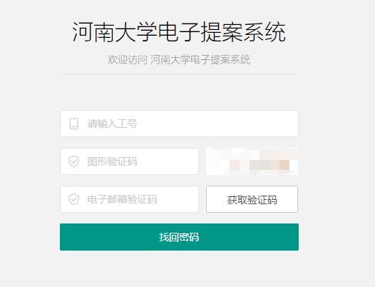
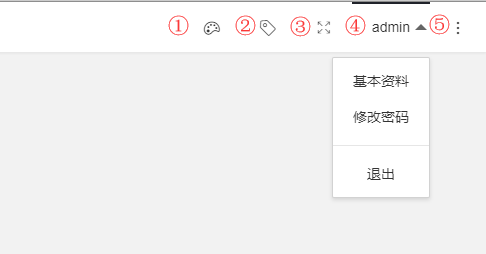
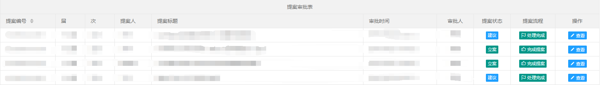
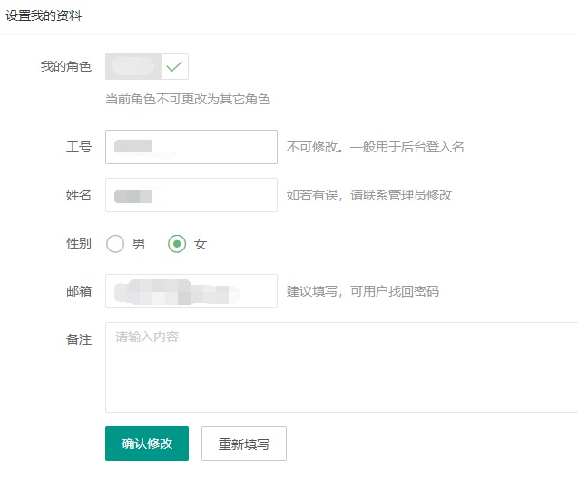

# 电子提案系统使用说明

## 登录

新版系统保留了原系统的登录账户和密码，您可以使用原来的账户（您的工号）和密码（默认为  0  ） 登录系统。

### 忘记密码

点击忘记密码，进入密码重置界面，您需要输入工号和您在系统中预留的邮箱，如果您没有预留邮箱，将无法通过此方式进行密码重置。十分建议您登录系统后设置邮箱，以免日后忘记密码能很方便的找回。

输入工号后点击获取验证码，稍等片刻后，您将得到以下两种可能的回复：

1. 该账户没有设置邮箱

   > 这说明您并没有在系统中预留邮箱或者邮箱格式有误

2. 获取邮箱验证码成功

   > 您需要检查自己邮箱里的邮件，将会看到一封包含验证码的邮件，将验证码输入到`电子邮箱验证码` 一栏，点击找回密码

在之后的密码输入栏中输入您重置的密码，点击按钮确定即可重置密码

## 界面一览

成功登陆系统后，您将看到全新的提案系统UI，首先让我来为你介绍顶部一些使用小技巧

您可以在右上角看到如上图界面，图中的数字标记处分别对应以下功能：

1. 提案系统主题设置

   > 点击右侧会弹出窗口，您可以选择自己喜欢的配色方案，此方案只会在您的设备上有效

2. 便签

   > 点击后正如您看到的那样，您可以在上面记录一些容易忘记的信息，当然，此信息只有您自己能看到

3. 全屏

   > 点击后进入全屏状态，抛开其他一切阻挠，专心办公

4. 个人信息

   > 这是修改个人基本资料和密码的快捷入口哦，您可以在这里选择退出系统

5. 其他信息

   > 点击拉出右侧窗口，显示此网站的一些其它信息，虽然您可能不会关注这些

右侧菜单将会展示您能操作的一些功能，例如：审批提案

由于进入的操作不同，您可能会看到与上图的表略不一样的地方，但不会差很多，这里主要解释两个地方，即最右侧三个按钮

* 提案状态

  > 这不是一个按钮，点击了也不会有任何反应，它只代表此提案的一种状态，状态分为如下三种：
  >
  > 1. 待审核：这是刚刚发出提案没有经过委员会审批的提案
  > 2. 建议：委员会审核为建议提案
  > 3. 立案：委员会审核为建议立案
  > 4. 无效：委员会审核为建议无效

* 提案流程

  > 这里分为六个流程，指示提案到达了某一阶段
  >
  > 1. 提出提案：提案刚刚提出，还没有进入下一个阶段
  > 2. 审批完成：经过委员会主任审批后，确定提案状态（立案、建议、无效）后的提案
  > 3. 签发完成：签发后的提案，指派了处理单位
  > 4. 审核完成：经过校领导的审核的提案
  > 5. 处理完成：相关负责单位处理完成并回复结果后的提案
  > 6. 完成提案：提案人评价完成后，提案流程就此完结

* 操作

  > 这里您可以查看或者删除提案（如果您有对应的权限），点击查看按钮，将会弹出提案窗口，您可以像操作Windows那样最大化，最小化窗口，鼠标移动到右下角可以改变窗口大小，拖动窗口顶部标题栏可以移动位置。
  >
  > 窗口中显示了提案内容相关的信息，此外，您一定看到了最下方的导出提案按钮，不妨试试看，点击导出提案。
  >
  > 另外，如果可以，您将会看到其他操作按钮，这将取决于您在系统中的身份，通过点击按钮您可以完成提案审批等一些列操作

### 发布提案

如果您的身份是代表，您一定可以看到右侧菜单有`发布提案` 的选项，点击进入后，您可以看到本届您发布的提案，在提案进入下一个流程之前，您都有权对您发布的提案进行修改。

如果你想提出新的提案，请点击`提出提案`按钮。

## 个人信息修改

这里您不能修改工号和姓名，作为关键信息如果有错误，建议您联系管理员进行更正。

### 设置预留邮箱

设置预留邮箱，将帮助您通过次邮箱找回密码哦

备注信息并不会出现在提案中，但是如果您有任何想留下的（签名，座右铭等）都可以在写在这里

### 修改密码

如果您想修改密码，那么点击右侧菜单  用户---->  修改密码，这里密码不会有任何限制，您可以修改成任何长度的密码，哪怕只有一个 `0` 