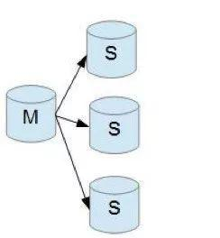
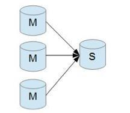
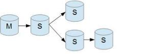
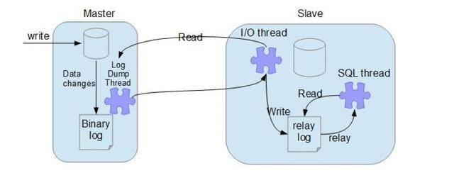
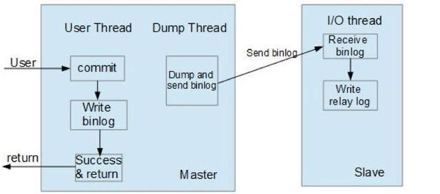
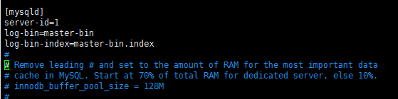
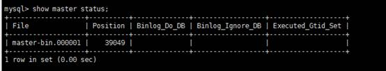

## MySQL主从同步

### 概念

MySQL 主从复制是指数据可以从一个MySQL数据库服务器主节点复制到一个或多个从节点。MySQL 默认采用异步复制方式，这样从节点不用一直访问主服务器来更新自己的数据，数据的更新可以在远程连接上进行，从节点可以复制主数据库中的所有数据库或者特定的数据库，或者特定的表。

### 主要用途

* **读写分离**

  > 在开发工作中，有时候会遇见某个sql 语句需要锁表，导致暂时不能使用读的服务，这样就会影响现有业务，使用主从复制，让主库负责写，从库负责读，这样，即使主库出现了锁表的情景，通过读从库也可以保证业务的正常运作。

* 数据实时备份

  > 出现某个节点故障，可以进行故障切换

* 高可用

* 结构扩展

  > 随着系统中业务访问量的增大，如果是单机部署数据库，就会导致I/O访问频率过高。有了主从复制，增加多个数据存储节点，将负载分布在多个从节点上，降低单机磁盘I/O访问的频率，提高单个机器的I/O性能。

### 主从形式

* 一主一从

  > 提高读性能
  >
  > 

* 多主一从

  > 从 5.7开始支持
  >
  > 
  >
  > 

* 双主复制

  > 双主复制，也就是互做主从复制，每个master既是master，又是另外一台服务器的slave。这样任何一方所做的变更，都会通过复制应用到另外一方的数据库中。

* 级联复制

  > 级联复制模式下，部分slave的数据同步不连接主节点，而是连接从节点。因为如果主节点有太多的从节点，就会损耗一部分性能用于replication，那么我们可以让3~5个从节点连接主节点，其它从节点作为二级或者三级与从节点连接，这样不仅可以缓解主节点的压力，并且对数据一致性没有负面影响。
  >
  > 


### 主从复制原理

MySQL会将增删改写入到binlog日志中

MySQL主从复制涉及到三个线程，一个运行在主节点（log dump thread），其余两个(I/O thread, SQL thread)运行在从节点，如下图所示:



#### 主节点 binary log dump 线程

当从节点连接主节点时，主节点会创建一个log dump 线程，用于发送bin-log的内容。在读取bin-log中的操作时，此线程会对主节点上的bin-log加锁，当读取完成，甚至在发动给从节点之前，锁会被释放。

#### 从节点I/O线程

当从节点上执行`start slave`命令之后，从节点会创建一个I/O线程用来连接主节点，请求主库中更新的bin-log。I/O线程接收到主节点binlog dump 进程发来的更新之后，保存在本地relay-log中。

#### 从节点SQL线程

SQL线程负责读取relay log中的内容，解析成具体的操作并执行，最终保证主从数据的一致性。


> 要实施复制，首先必须打开Master 端的binary log（bin-log）功能，否则无法实现。

```
对于每一个主从连接，都需要三个进程来完成。当主节点有多个从节点时，主节点会为每一个当前连接的从节点建一个binary log dump 进程，而每个从节点都有自己的I/O进程，SQL进程。从节点用两个线程将从主库拉取更新和执行分成独立的任务，这样在执行同步数据任务的时候，不会降低读操作的性能。比如，如果从节点没有运行，此时I/O进程可以很快从主节点获取更新，尽管SQL进程还没有执行。如果在SQL进程执行之前从节点服务停止，至少I/O进程已经从主节点拉取到了最新的变更并且保存在本地relay日志中，当服务再次起来之后，就可以完成数据的同步。
```

#### 复制的基本过程

* 从节点上的I/O 进程连接主节点，并请求从指定日志文件的指定位置（或者从最开始的日志）之后的日志内容；
* 主节点接收到来自从节点的I/O请求后，通过负责复制的I/O进程根据请求信息读取指定日志指定位置之后的日志信息，返回给从节点。返回信息中除了日志所包含的信息之外，还包括本次返回的信息的bin-log file 的以及bin-log position；从节点的I/O进程接收到内容后，将接收到的日志内容更新到本机的**relay log**中，并将读取到的**binary log**文件名和位置保存到master-info 文件中，以便在下一次读取的时候能够清楚的告诉Master“我需要从某个bin-log 的哪个位置开始往后的日志内容，请发给我”；
* Slave 的 SQL线程检测到relay-log 中新增加了内容后，会将relay-log的内容解析成在祝节点上实际执行过的操作，并在本数据库中执行。

### 主从复制模式

#### 异步模式

> 异步模式如下图所示，这种模式下，主节点不会主动push bin log到从节点，这样有可能导致failover的情况下，也许从节点没有即时地将最新的bin log同步到本地。

```
数据库Failover：FailOver中文为故障切换
我的理解是：失败跳转，当主数据库GG了，马上从服务器切换成master，此时丢失备用数据库的所有能力，而且不可恢复
```




#### 半同步模式

> 对于用户的事务操作，这种模式下主节点只需要接收到其中一台从节点的返回信息，就会commit；否则需要等待直到超时时间然后切换成异步模式再提交；这样做的目的可以使主从数据库的数据延迟缩小，可以提高数据安全性，确保了事务提交后，binlog至少传输到了一个从节点上，不能保证从节点将此事务更新到db中。性能上会有一定的降低，响应时间会变长。如下图所示：


> 半同步模式不是mysql内置的，从mysql 5.5开始集成，需要master 和slave 安装插件开启半同步模式。

####  全同步模式

> 全同步模式是指主节点和从节点全部执行了commit并确认才会向客户端返回成功。

#### binlog记录格式

> 三种：基于SQL语句的复制（statement-based replication，SBR），基于行的复制（row-based replication，RBR)，混合模式复制（mixed-based replication,MBR)。对应的binlog文件的格式也有三种：STATEMENT,ROW,MIXED。

* Statement-base Replication (SBR)就是记录sql语句在bin log中，Mysql 5.1.4 及之前的版本都是使用的这种复制格式。优点是只需要记录会修改数据的sql语句到binlog中，减少了binlog日质量，节约I/O，提高性能。缺点是在某些情况下，会导致主从节点中数据不一致（比如sleep(),now()等）。

* Row-based Relication(RBR)是mysql master将SQL语句分解为基于Row更改的语句并记录在bin log中，也就是只记录哪条数据被修改了，修改成什么样。优点是不会出现某些特定情况下的存储过程、或者函数、或者trigger的调用或者触发无法被正确复制的问题。缺点是会产生大量的日志，尤其是修改table的时候会让日志暴增,同时增加bin log同步时间。也不能通过bin log解析获取执行过的sql语句，只能看到发生的data变更。

* Mixed-format Replication(MBR)，MySQL NDB cluster 7.3 和7.4 使用的MBR。是以上两种模式的混合，对于一般的复制使用STATEMENT模式保存到binlog，对于STATEMENT模式无法复制的操作则使用ROW模式来保存，MySQL会根据执行的SQL语句选择日志保存方式。

### 其他

**GTID复制模式**

@ 在传统的复制里面，当发生故障，需要主从切换，需要找到binlog和pos点，然后将主节点指向新的主节点，相对来说比较麻烦，也容易出错。在MySQL 5.6里面，不用再找binlog和pos点，我们只需要知道主节点的ip，端口，以及账号密码就行，因为复制是自动的，MySQL会通过内部机制GTID自动找点同步。

@ 多线程复制（基于库），在MySQL 5.6以前的版本，slave的复制是单线程的。一个事件一个事件的读取应用。而master是并发写入的，所以延时是避免不了的。唯一有效的方法是把多个库放在多台slave，这样又有点浪费服务器。在MySQL 5.6里面，我们可以把多个表放在多个库，这样就可以使用多线程复制。

**基于GTID复制实现的工作原理**

* 主节点更新数据时，会在事务前产生GTID，一起记录到binlog日志中。
* 从节点的I/O线程将变更的bin log，写入到本地的relay log中。
* SQL线程从relay log中获取GTID，然后对比本地binlog是否有记录（所以MySQL从节点必须要开启binary log）。
* 如果有记录，说明该GTID的事务已经执行，从节点会忽略。
* 如果没有记录，从节点就会从relay log中执行该GTID的事务，并记录到bin log。
* 在解析过程中会判断是否有主键，如果没有就用二级索引，如果有就用全部扫描。

### 参考

[blog](https://baijiahao.baidu.com/s?id=1617888740370098866&wfr=spider&for=pc)

### 配置

**主服务器**

* 设置server-id

* 打开二进制日志  log-bin  和 log-bin-index

  

* 重启数据库

> show master status 查看状态 position  
>
> 


* 主服务器建立一个账号

```sql
Create user rep
```

* 授予权限

```sql
grant replication slave on *.* to ‘rep’@‘192.168.1.%’ identified by '123456';
```

* 刷新权限

```sql
Flush privilages;
```

**从服务器设置**

* server-id
* relay-log 和 relay-log-index 
* 重启数据库

* 连接两个数据库

```sql
Change master to 
master_host="203.195.171.244",
master_port=3306,
master_user="repl",
master_password="445247721",
master_log_file="master-bin.000001",
master_log_pos=120;
```

* 开始主从同步

```sql
start slave;
```

> 关闭 同步 stop slave

查看从状态

```sql
Show slave status \G;
\G 表示竖向显示
```

查看用户

```sql
select user,host from mysql.user;
```

### 代码实现

利用动态代理，对于数据库的增删改操作，用master的配置，查 用slave的配置