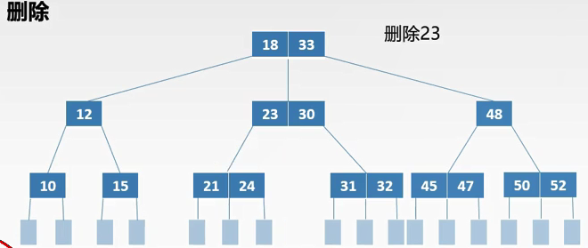

# B树 & B+树

> 为什么要有B 树：众所周知，ＩＯ操作的效率很低，那么，当在大量数据存储中，查询时我们不能一下子将所有数据加载到内存中，只能逐一加载磁盘页，每个磁盘页对应树的节点。造成大量磁盘ＩＯ操作（最坏情况下为树的高度）。平衡二叉树由于树深度过大而造成磁盘IO读写过于频繁，进而导致效率低下。 
> 　　所以，我们为了减少磁盘ＩＯ的次数，就你必须降低树的深度，将“瘦高”的树变得“矮胖”。一个基本的想法就是： 
>
>   * 每个节点存储多个元素 
> * 摒弃二叉树结构，采用多叉树
>
> ###### 　　这样就引出来了一个新的查找树结构 ——多路查找

## B 


### B树的特征

```
1.根结点至少有两个子女。
2.每个中间节点都包含k-1个元素和k个孩子，其中 ceil（m/2） ≤ k ≤ m
3.每一个叶子节点都包含k-1个元素，其中 ceil（m/2） ≤ k ≤ m
4.所有的叶子结点都位于同一层。
5.每个节点中的元素从小到大排列，节点当中k-1个元素正好是k个孩子包含的元素的值域划分
6.每个结点的结构为：（n，A0，K1，A1，K2，A2，…  ，Kn，An）
    其中，Ki(1≤i≤n)为关键字，且Ki<Ki+1(1≤i≤n-1)。
Ai(0≤i≤n)为指向子树根结点的指针。且Ai所指子树所有结点中的关键字均小于Ki+1。
n为结点中关键字的个数，满足ceil(m/2)-1≤n≤m-1。
```

> 也有说B 树的最下层有一个没有值的叶子结点，仅作为查找失败的标志性元素
>
> 


### B树查找


### B树插入

* 先找到插入的位置，即最底层的叶子结点
* 判断是否破坏了B树的结构
  * 如果不破坏，直接插入
  * 反之进行分裂操作：将插入后节点的中间节点并入父亲节点，左侧节点保存，右侧节点独立成新的节点。
  * 如果父节点依然满了，重复执行上述操作

例如：


插入后


### B树删除

1. 删除的是叶子结点

* 直接删除

* 兄弟够借

  * 若被删除的节点关键字总数=ceil(m/2)-1,且于此节点的关键字个数>ceil(m/2)，则需要从兄弟节点借一个关键字

  

  

  * 兄弟不够借 ；删除关键字后，和一个不够借的兄弟节点和双亲节点中力两兄弟字数中间的关键字合并，如果合并后双亲节点不合符B数定义，则继续执行上述操作

  

  

2. 删除非叶子节点

类似于 删除平衡二叉树中的思想，找到删除节点中 前驱最大值，或者后驱最小值进行替换，然后执行删除替换原点的操作

  

  

* 如果删除节点的两个字数节点都为1 ，则进行合并

  

  

## B+树

### B+树特征

```
1.有k个子树的中间节点包含有k个元素（B树中是k-1个元素），每个元素不保存数据，只用来索引，所有数据都保存在叶子节点。
2.所有的叶子结点中包含了全部元素的信息，及指向含这些元素记录的指针，且叶子结点本身依关键字的大小自小而大顺序链接。
3.所有的中间节点元素都同时存在于子节点，在子节点元素中是最大（或最小）元素。

```


> B+树通常有两个指针，一个指向根结点，另一个指向关键字最小的叶子结点。因些，对于B+树进行查找两种运算：一种是从最小关键字起顺序查找，另一种是从根结点开始，进行随机查找。

### B+树查找

> 首先，Ｂ＋树的查找和Ｂ树一样，类似于二叉查找树。起始于根节点，自顶向下遍历树，选择其分离值在要查找值的任意一边的子指针。在节点内部典型的使用是二分查找来确定这个位置。 


1. 不同的是，Ｂ＋树中间节点没有卫星数据（索引元素所指向的数据记录），只有索引，而Ｂ树每个结点中的每个关键字都有卫星数据；这就意味着同样的大小的磁盘页可以容纳更多节点元素，在相同的数据量下，Ｂ＋树更加“矮胖”，ＩＯ操作更少 

   > 需要补充的是，在数据库的聚集索引（Clustered Index）中，叶子节点直接包含卫星数据。在非聚集索引（NonClustered Index）中，叶子节点带有指向卫星数据的指针。

2. 其次，因为卫星数据的不同，导致查询过程也不同；Ｂ树的查找只需找到匹配元素即可，最好情况下查找到根节点，最坏情况下查找到叶子结点，所说性能很不稳定，而Ｂ＋树每次必须查找到叶子结点，性能稳定 
3. 在范围查询方面，B+树的优势更加明显 
　　B树的范围查找需要不断依赖中序遍历。首先二分查找到范围下限，在不断通过中序遍历，知道查找到范围的上限即可。整个过程比较耗时。 

### B+ 树插入

 B+树的插入与B树的插入过程类似。不同的是B+树在叶结点上进行，如果叶结点中的关键码个数超过m，就必须分裂成关键码数目大致相同的两个结点，并保证上层结点中有这两个结点的最大关键码。

### B+ 树删除

B+树中的关键码在叶结点层删除后，其在上层的复本可以保留，作为一个”分解关键码”存在，如果因为删除而造成结点中关键码数小于ceil(m/2)，其处理过程与B-树的处理一样

## B树和B+树的区别

* 在B+树种，具有n个关键字的节点含有n个子树，而B树种n个关键字对应n+1颗子树
* B+树中，叶节点包含信息，所有的非叶节点都起到索引作用，非叶子节点中每个索引只含有叶子节点的最大值和指向该叶子节点的指针
* 在B+树种，叶节点包含全部的关键字，即在非叶节点中出现的关键字也会出现在叶子节点中，B树中，叶节点包含的关键字和其他节点包含的关键字数不重复的

### B+ 树 相比B树的优势

1. 单一节点存储更多的元素，使得查询的IO次数更少； 
2. 所有查询都要查找到叶子节点，查询性能稳定； 
3. 所有叶子节点形成有序链表，便于范围查询。

