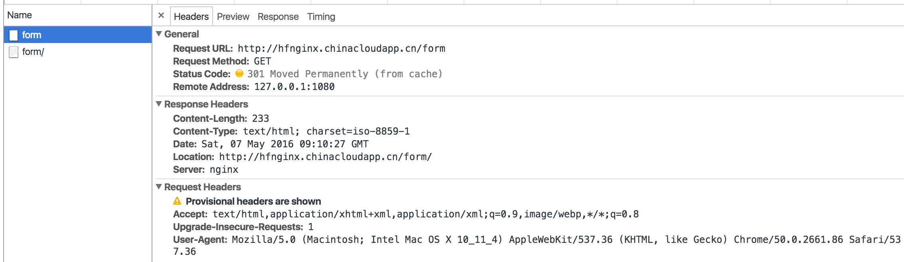
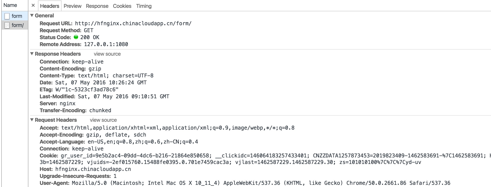
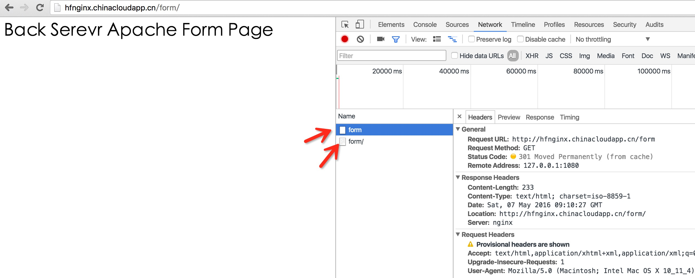
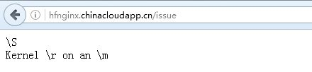
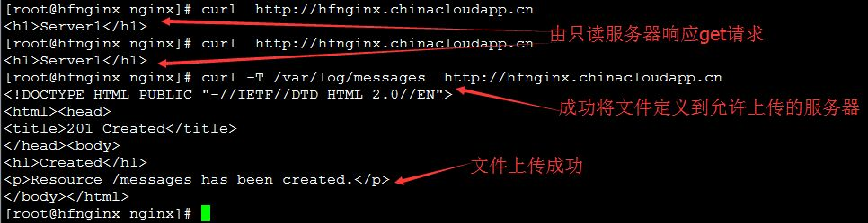

## 一：Nginx 后端服务器组的配置：

### 1、upstream：

用于设置后端服务器组的主要指令，upstream类似于之前的server块或http块，用法如下：
```nginx
upstreame  Myserver{ 
   #ip_hash;
　　#least_conn；
　　#fair;
　　
　　#hash $request_uri;
　　#hash_method crc32;
　　server 192.168.0.2:8080 #weight 2 max_fails 3 fail_timeout 60;
　　192.168.0.3:8080 backup;
　　192.168.0.4:8080 down; 
　　　　}    
 #Myserver是后端服务器组的名称，在大括号里面填写后端服务器的IP和端口信息，默认情况下服务器组被调用以后会使用轮询调度的方式调用组内的后端服务器。
 #keepalived_timeout; #保持的空闲会话的时常，在此时间内客户端不进行操作，服务器将断开与客户端的连接。此数值不能太大，Nginx从1.1.4开始支持。
 #ip_hash; 实现会话保持功能，即将某个客户端的请求定向到组内的同一台服务器，保证客户端与服务器之间建立稳定的会话，只有服务器处于无效状态时，会话才会被转发给组内其他的服务器。
 #server 用于定义一台后端服务器。
 #192.168.0.2:8080 是后端服务器的IP，端口是8080。
 #weight = number; #配置权重，与ip_hash有冲突，因为ip_hash是将请求固定在同一个后端服务器的，而weight是根据权重轮训的，因此不能同时配置在一个upstream内。
 #max_fails = number #设置一个失败的请求次数，在一定时间内超过这个次数就认为服务器是无效的，如可以设置为3。
 #在失败3次以后的60秒将不再将请求分发给失效的server也不在检查此server的状态，默认时间是10秒。
 #backup; #将一台服务器标记为备份服务器，只有当所有正常服务器全部不可用的时候才会使用备份的服务器。
 #down  #将一台服务器标记为永久不可用的状态，通常与ip_hash配合使用。

```
###  2、nginx 的 upstream支持的集中调度算法：

 ```nginx
1、轮询（默认） 
   每个请求按时间顺序逐一分配到不同的后端服务器，如果后端服务器down掉，能自动删除。 
2、weight 
   指定轮询几率，weight和访问比率成正比，用于后端服务器性能不均的情况。 
3、ip_hash 
   每个请求按访问ip的hash结果分配，这样每个访客固定访问一个后端服务器，可以解决session 保持的问题。  
4、fair（第三方） 
   可以依据页面大小和加载时间长短智能地进行负载均衡，也就是根据后端服务器的响应时间来分配请求，响应时间短的优先分配,Nginx本身默认是不支持fair的，如果需要使用这种调度算法，必须下载Nginx的upstream_fair模块。
5、url_hash（第三方）
　　按访问url的hash结果来分配请求，使每个url定向到同一个后端服务器，可以进一步提高后端缓存服务器的效率，Nginx本身默认是不支持url_hash的，如果需要这种高度算法，必须安装Nginx的hash软件包。
6、least_conn 
　　根据后端服务器的连接状况进行分配客户请求，连接最少的服务器将被有限分配客户端请求。

 ```
## 二：Nginx服务器的rewrite功能介绍：

 Nginx服务器利用ngx_http_rewrite_module 模块解析和处理rewrite请求，所以说此功能依靠 PCRE(perl compatible regularexpression)，因此编译之前要安装PCRE库，rewrite功能时nginx服务器的基本功能之一，用于实现URL的重写，URL的重写是非常有用的功能，比如它可以在我们改变网站结构之后，不需要客户端修改原来的书签，也无需其他网站修改我们的链接，就可以设置为访问，另外还可以在一定程度上提高网站的安全性。

### 1、地址重写与地址转发：

地址重写和地址转发是两个不同的概念，地址重写是实际上是为了实现址标准化，就像访问www.baidu.cn 可以出现www.baidu.com 的首页，服务器会把www.baidu.cn 重写成  www.baidu.com ，浏览器的地址栏也会显示 www.baidu.com， 而转发指的是将一个域名指向另一个已有站点的过程，地址栏的地址保持不变，因此地址转发和地址重写的大致区别如下：
```nginx
地址转发后客户端浏览器地址栏中的地址显示是不变的，而地址重写后地址栏中的地址会变成正确的地址。
在一次地址转发过程中只会产生一次网络请求，而一次地址重写产生两次请求。
地址转发一般发生在同一站点项目内，而地址重写则没有限制。
地址转发到的页面可以不用全路径名表示，而地址重写到的页面必须使用完全的路径名表示。
地址转发过程中，可以将客户端请求的request范围内的属性传递给新的页面，但地址重写不可以。
地址转发的速度比地址重写的速度快。
```

### 2、if指令：

2.1:用于条件判断，并根据条件判断结果选择不同的Nginx配置，可以配置在server或location块中进行配置，用法如下：

```nginx
if （$变量） { 
　　action
}
```
注： 如果$变量的值为空字符串或是以0开头的任意字符串，则if指令认为该条件为false，其他条件为true。

2.2:使用“=”（等于）和“！=”（不等于）比较变量和字符串是否相等，相等时if指令认为该条件为true，反之为false。
```
if ($request_method = POST) {
      return 405;  
} #条件里的字符串不需要加引号
```

2.3:使用正则表达式对变量进行匹配，匹配成功时if指令认为条件为true，否则认为false，变量与表达式之间使用以下符号链接：

双目测试：运算所需变量为两个的运算符叫做双目运算符，如下几个运算符：
```nginx
~： #表示在匹配过程中区分大小写字符，（可以通过正则表达式匹配），满足匹配条件为真，不满足为假。
~*: #表示在匹配过程中不区分大小写字符，（可以通过正则表达式匹配），满足匹配条件为真，不满足问假。
!~：#区分大小写不匹配，不满足为真，满足为假，不满足为真。
!~*:#为不区分大小写不匹配，满足为假，不满足为真。
^~ :#如果把这个前缀用于一个常规字符串,那么告诉nginx 如果路径匹配那么不测试正则表达式。
```
注意：使用~和~！在匹配成功时if指令认为条件为true，匹配失败为false，使用!~和!~*匹配失败时if指令认为条件为true，否则为false，在正则表达式中，可以使用小括号对变量进行截取，在大括号中使用$!...$9引用截取的值，如下：

 

```nginx
if ($http_user_agent ~ MSIE) {  #if语句尽量用在location当中，尽量不要在http或server中使用，会出现莫名的错误。
     #判断客户端的浏览器中是否含有MSIE的字符串，如果包含则为true  
}
#########################################
if ($http_cookie ~* "id="([^;]+)(?:;)") {
    #Nginx配置，可以使用$!和$2获取截取到的值，如：
set $id $1; 将截取到的id的值赋值给$id变量以备后用  
}
注意：整个正则表达式一般不需要加引号，但是如果含有右大括号"}"或者分分号";"的时候，就必须要给整个正则表达式加上引号""
```


### 3、文件和目录测试：

单目测试，判断文件或者目录是否存在

3.1 -f和! -f:判断请求的文件是否存在和是否不存在

 

```nginx
-f 表示如果请求的文件存在，则if指令为true，如果请求的文件不存在，则if指令为false。使用! -f的时候，如果请求的文件不存在但是目录存在，if指令认为条件为true，如果请求的文件和目录都不存在，则if指令认为条件为false，如果请求的文件存在，也为false，如下：
if (-f $request_filename) {
    #判断请求的文件是否存在
}

if (! -f $request_filename) {
   #判断请求的文件是否不存在
}
```


3.2 -d和! -d: #判断请求的目录是否存在和是否不存在。

```nginx
使用-d时，如果请求的目录存在，则if指令认为条件为true，如果请求的目录不存在，则认为条件为false，当使用! -d的时候，如果请求的目录不存在但是目录的上级存在，if指令认为条件为true，如果该目录和他的上级都不存在，则为false，如果请求的目录存在也未false，和of和! -f基本一致。
```


3.3 -e和! -e: #判断请求的文件或目录是否存在和是否不存在。

```nginx
判断文件或目录是否存在，相当于-f和-d的功能合体，当使用-e时，如果请求的文件或目录存在则if指令认为条件为true，否则为false，当使用! -e时，如果请求的文件或目录以及该文件的上级都不存在，则为false，否则为true。
```


3.4 -x和 ! -x: #判断文件是否可执行和是否不可执行。

```nginx
使用-x如果文件可执行则返回true，否则为fasle，使用! -x的时候如果文件不可执行返回true，否则为false。
```

### 4、break指令：

用于中断当前相同作用域中的其他Nginx配置，与该指令处于同一作用域的Nginx配置中，位于它前面的配置生效，位于后面的指令配置就不再生效了，Nginx服务器在根据配置处理请求的过程中遇到该指令的时候，回到上一层作用域继续向下读取配置，该指令可以在server块和location块以及if块中使用，使用语法如下：

```nginx
location /test {
        root   html;
        index  index.html index.htm;　　
　　　　　break;  #return之后的将不再执行，之前的可以执行
　　　　　　}
```

###  5、return指令：

用于完成对请求的处理，并直接向客户端返回响应状态码，处于此指令后的所有配置都将不被执行，return可以在server、if和location块进行配置，用法如下：

```nginx
return (text); #返回给客户端的响应体内容，可以调用变量
return code; #返回给客户端HTTP状态码，范围为0-999
return URL； #返回给客户端的URL地址
```


注意：从nginx 0.8.42开始，当code使用301时表示永久重定向，302为临时重定向。303表示当前的响应可以在另一个URL找到，307表示请求的资源临时从不同的URL响应

### 6、rewrite指令：

通过正则表达式的匹配来改变URI，可以同时存在一个或多个指令，按照顺序依次对URI进行匹配。

```nginx
URI(universal resource identifier)：通用资源标识符，用于对网络中各种资源进行标示，有存放资源的主机名、片段标识符和相对URL三部分组成，存放资源的主机名一把由传输协议（scheme）、主机和资源路径三部分组成，片段标识符执行资源内容的具体元素，相对URL标示主机上的相对路径，一般格式为：scheme:[//] [[用户名[:密码]@]主机名:[端口号]][/资源路径名]，如http://www.a.com:8080/path/file/index.html，Nginx就是对其中的URI /path/file这部分进行处理和匹配，但是不能处理http://www.a.com，因为Nginx接受到的URL不包含http://www.a.com。
URL(uniform resource location):统一资源定位符，是用于在Internet中描述资源的字符串，是URL的子集，主要包括传世协议(scheme)、主机(IP、端口号或者域名)和资源具体地址(目录和文件名)等三部分，一般格式为 scheme://主机名[:端口号][/资源路径],如：http://www.a.com:8080/path/file/index.html就是一个URL路径
URI就是一种资源定位机制，它是比较笼统地定位了资源，并不局限于客户端和服务器，而URL就定位了网上的一切资源，只要是网上的资源，都有唯一的URL。
```


注：rewrite指令接收到的URI为 /path/file,不包含参数，如/path/file/arg1=value1&argv2=value2，只会接收到/path/file，不包含arg1=value1&argv2=value2，但是我们可以使用nginx内置的全局变量$request_uri来匹配用户的uri，在$request_uri后面要添加问号，replacement支持nginx全局变量的使用，常用的还要$uri和$args等，如：

```nginx
rewrite www.a.com  http://www.b.com$request_uri? permanent;
注意：replacement是匹配成功后用于替换URL中被截取内容的字符串，默认情况下，如果该字符串是有http://或者https://开头的，则不会继续向下进行其他处理，而且直接将重写后的URL返回给客户端。
```

### 7、flag：

用来设置rewrite对URI处理的行为或动作，可以为一下四个当中的一个：

7.1、last：终止继续在本location块中处理接受到的URL，并将在本location中重新的URL作为一个新的URL，继续使用后面的各location块进行处理，该标志将重写后的URL重新再server块中执行，为重写后的URI转入到其他location块并继续处理的机制，nginx服务器的last处理超过10次循环之后将返回错误代码500，使用方法如下：

```
location / {
    rewrite ^(/test/.*)/msie(.*)\..*$  $1/test/mp3/$2.html break;
    rewrite ^(/test/.*)/other(.*)\.*$ $1/test/other/$2.html break;    
}
```


注：如果URI在第二行被匹配成功并处理，Nginx服务器不会继续使用第三行的配置和匹配处理新的URL，而是让所有的location快重新匹配和处理新的URI，即一旦在本location中匹配成功一行，就跳出本location并在下一个location匹配，直到在下一个location匹配成功后再跳出下一个location继续下下一个，直到最后一个为止。

7.3、break：将你的URI作为一个新的URI，在本快中继续进行处理，该标志将重写后的地址在当前的location快中执行，不会将新的URI转向其他的location模块，如下：

```
注意：如果第二行被匹配并处理成功，Nginx服务器将新的URI继续在本location块中使用第三行匹配和处理，新的URI始终在一个location之内匹配和处理，直到本location最后一个匹配条件。last一般写在server和if中，而break一般使用在location中
1、last一般写在server和if中，而break一般使用在location中
2、last不终止重写后的url匹配，即新的url会再从server走一遍匹配流程，而break终止重写后的匹配
3、break和last都会继续执行后面的rewrite指令，只是last会终止本location的匹配跳转到其他location，而break只会在当前location继续匹配，直到最后一条匹配结果为止，不会跳转到其他location。
```


7.4、redirect：将重写后的URI返回给客户端，状态码为302，指明是临时重定向URI，主要用在replacement变量不是以http或https开头的情况下。

7.5、permanent：将重写后的URI返回给客户端，代码为301，注明是永久重定向。

注意：在使用flag的时候，

### 8、rewrite_log：

用于配置是否开启URL重写日志的输出功能，用法如下：

```
rewrite_log on|off; #默认为off。，如果设置为开启，URL的相关日志将以notice级别的输出到error_log配置的文件当中。
```

### 9、set：

用于设置一个新的变量，其用法结构为：

```nginx
set  variable value；  #variable为变量的名称，要使用$作为变量的第一个字符，且变量名不能与nginx服务器预设的全局变量相同
value：为变量的值，可以是字符串、其他变量和变量组合等。
```

10、uninitialized_variable_warn:用于配置使用未初始化的变量时，是否记录告警日志，用法如下：

```nginx
uninitialized_variable_warn on|off;
```


 4、root和alias：

root：指定web的家目录，在定义location的时候，文件的绝对路径等于 root+location，如：

```nginx
location /bbs {
    root   html;  #必须要在html目录中创建一个bbs目录才可以访问，否则报错。
    index  index.html;
}
```

alias：定义路径别名，会把访问的路径重新定义到其指定的路径，如：

```nginx
 location /newweb { 
 #当访问newweb的时候，会显示alias定义的/usr/local/nginx/html/newweb/里面的内容。
        alias  /usr/local/nginx/html/newweb/;
}
```

注:alias后面必须要用“/”结束，否则会找不到文件,而root要结合location，要么都有/，要么都没有/，如果一个有一个没有在访问的时候会出错。

## 三、Rewrite常用的全局变量：

1.Nginx服务器内置了很多预先定义好的内置变量，就要方便获取很多相关的服务器信息以及与请求相关的指令、参数当信息，可以更加方便的用户进行自定义的功能定义等，具体变量如下如下：

1.1、$args：变量中存放了URL中的指令，比如http://mobile.weathercn.com/index.do?id=101290101&partner=中的id=101290101&partner=，而且可以有多个指令。

1.2、$content_length:保存了请求报文头部中的content-lenght字段。

1.3、$content_type:保存了请求头部中的content-type字段。

1.4、$document_root:保存了针对当前资源的请求的系统根目录。

1.5、$document_uri：保存了当前请求中不包含指令的URI，主注意是不包含请求的指令，比如http://hfnginx.chinacloudapp.cn/index.do?id=101060101&partner=会被定义为/index.do。

1.6、$host:存放了请求的服务器名称。

1.7、$http_user_agent：客户端浏览器的详细信息，如使用chrome和Firefox访问则显示如下：

```scheme
Mozilla/5.0 (Windows NT 6.1; WOW64) AppleWebKit/537.36 (KHTML, like Gecko) Chrome/50.0.2661.87 Safari/537.36 #chrome的浏览器信息
Mozilla/5.0 (Windows NT 6.1; WOW64; rv:46.0) Gecko/20100101 Firefox/46.0  #Firefox的浏览器信息
```


1.8、$http_cookie:客户端的cookie信息。

1.9、$limit_rate：如果nginx服务器使用limit_rate配置了显示网络速率，则会显示，如果没有设置， 则显示0。

1.2.0：$remote_addr:存放了客户端的地址，注意是客户端的公网IP，也就是一家人访问一个网站，则会显示为路由器的公网IP

1.2.1：$remote_port:客户端请求Nginx服务器时随机打开的端口，这是每个客户端自己的端口。

1.2.2：$remote_user:已经经过Auth Basic Module验证的用户名。

1.2.3：$request_body_file:做反向代理时发给后端服务器的本地资源的名称。

1.2.4：$request_method:请求资源的方式，GET/PUT/DELETE等

1.2.5：$request_filename:当前请求的资源文件的路径名称，由root或alias指令与URI请求生成。

```uri
/usr/local/nginx//html/web/
```


1.2.6：$request_uri：包含请求参数的原始URI，不包含主机名，如：”/index.do?id=101020100&partner=”。

```
/web/
```


1.2.7：$squery_string:保存了URL请求的指令，与 $args相同。

1.2.8：$scheme:请求的协议，如ftp，https，http等。

1.2.9：$server_protocpl：保存了客户端请求资源使用的协议的版本，如HTTP/1.0，HTTP/1.1，HTTP/2.0等。

1.3.0：$server_addr:保存了服务器的IP地址。

1.3.1：$server_name:服务器的主机名。

1.3.2：$server_port:服务器的端口号。

1.3.3：$uri：与$document_uri相同,是一个不包含指令的uri地址。

```
如访问：hfnginx.chinacloudapp.cn/index.do?id=101020100&partner=，uri如下：
/index.do
```

## 四：rewrite 功能的具体使用： 

nginx rewrite功能使用模块ngx_http_rewrite_module，rewrite是nginx服务器的重要模块之一，它一方面实现了URL的重写功能，另一方面为Nginx服务器提供反向代理服务器的支持，使用如下：

1、proxy_pass:反向代理，将用户的请求代理至后端服务器：

```
server {
        server_name  hfnginx.chinacloudapp.cn;
        #access_log  logs/host.access.log  main;
        location / {
            root   html/hfnginx;
            index  index.html index.htm;
        }
        location /form/ {  #匹配一个访问的目录
            proxy_pass  http://192.168.0.201/bbs/;  #/form后面的斜杠要和http://192.168.0.201/bbs后面的斜杠要么都有要么都没有，否则访问匹配会出现错误。
  } }
```


1.1访问结果：



 1.2访问过程第一次是一个301（页面永久重定向）如下：


1.3访问过程第二次,返回页面的内容：

 

2.使用正则匹配访问页面：

```nginx
server {
        server_name  hfnginx.chinacloudapp.cn;
        #access_log  logs/host.access.log  main;
        location / {
            root   html/hfnginx;
            index  index.html index.htm;
        }
        location ~* ^/form {
            proxy_pass  http://192.168.0.201;  
            #使用正则的话，http://192.168.0.201后面不支持加目录，否则语法错误，后端服务器Web的目录要和location设置的/form同名，否则报404页面找不到错误。 
} }
```

2.1：后端服务器的web目录：

```sh
[root@Server1 html]# ls
bbs
[root@Server1 html]# mv bbs form #将上一个例子中的bbs目录重命名成form，form对应locati的名称
[root@Server1 html]# ls
form
```

2.2：访问测试，步骤也是两次，一次301，一次正常页面：



 2.3:配置Nginx转发客户端IP：

        location ~* ^/form {
            proxy_pass  http://192.168.0.201;
            proxy_set_header X-Real-IP $remote_addr;
        }
2.4：http默认无法记录这个变量，因此要手动设置apache的日志格式：

```
[root@Server1 httpd]# vim /etc/httpd/conf/httpd.conf 
更改配置文件中日志格式的一行：
LogFormat "%{X-Real-IP}i %l %u %t \"%r\" %>s %b \"%{Referer}i\" \"%{User-Agent}i\"" combined  #%{X-Real-IP}i表示是头部报文中某个变量的值，i是取值，取得是报文中X-Real-IP对应的值。这个值就是客户端的真实IP
```

2.5：重新访问并查看apache日志：

```
[root@Server1 httpd]# tail -n 1 /var/log/httpd/access_log 
47.88.87.169 - - [07/May/2016:19:39:43 +0800] "GET /form/ HTTP/1.0" 200 38 "-" "Mozilla/5.0 (Macintosh; Intel Mac OS X 10_11_4) AppleWebKit/537.36 (KHTML, like Gecko) Chrome/50.0.2661.86 Safari/537.36"
```

## 五：临时重定向与永久重定向：

1.防盗链：

referer是记录打开一个页面之前记录是从哪个页面跳转过来的，如果别人只链接了自己网站图片或某个单独的资源，而不是网站的页面，这就是盗链，

```properties
location /image {
            valid_referers none blocked www.baidu.com;
　　　　if ($invalid_referer) {
    　　　　　　return 403;
} #none是用户正常在浏览器输入地址访问的请求连接 #blocked 类似于防火墙法则，只要不符合给定条件的就认定是不合法的，就拒绝访问。
```

2.通过rewrite完成地址重写：

301:永久重定向，一般资源都在服务器内部，客户端请求一次即可完成数据的返回。

302：临时重定向，当nginx作为代理服务器，并使用rewrite重写用户请求的URL的到其他服务器的时候，就是临时重定向。

```
server {
        server_name  hfnginx.chinacloudapp.cn;
        location / {
            root   html;  #定义存放web的目录
            index  index.html;
            #rewrite ^/bbs/(.*)$  http://www.weather.com.cn/$1;  #将请求转发给其他服务器处理，是临时重定向，客户端需要在服务器返回报文中头部中查找到location字段并根据其中的路径到新服务器发送请求。
            rewrite ^/bbs/(.*)$   /web/$1;  #/web是在html目录下，也就是这里的跟就是html目录，将请求在服务器内存处理并返回给用户，是永久重定向的方式
        } 
}
```

2.1临时重定向请求过程如下：


2.2：永久重定向如下：


## 六：rewrite后面的四个flag：

1. last:本次重写完成之后，重启下一轮检查，大多数情况下使用last，但是如果匹配写的有问题，会导致出现循环匹配，直到十次之后出错。

2. break:本次完成重写之后，直接执行后续数据操作，不再进行其他的条件匹配，在非跟location使用rewrite匹配的时候要使用break，避免导致循环。

3. redirect:返回302临时重定向，如果替换字段用http://开头则被使用。

4. permanent:返回301永久重定向。

 

## 七：对Apache实现上传下载分离：

 1.确认模块当中有dav模块：

```
LoadModule dav_module modules/mod_dav.so
LoadModule dav_fs_module modules/mod_dav_fs.so
LoadModule dav_lock_module modules/mod_dav_lock.so
```


2、打开dav功能：

```
<Directory "/var/www/html">
Dav on #加一行
```


3、重启httpd：

```sh
[root@Server1 html]# systemctl  restart  httpd
```

4、将www目录改为apache权限，并使用curl -T命令测试上传：

```sh
[root@Server1 html]# chown  apache:apache /var/www/html/ -R  #更改属主属组
[root@Server1 html]# curl -T  /etc/issue http://192.168.0.202  #上传一个文件
```

```html
<!DOCTYPE HTML PUBLIC "-//IETF//DTD HTML 2.0//EN">
<html><head>
<title>201 Created</title>
</head><body>
<h1>Created</h1>
<p>Resource /issue has been created.</p>  #返回上传成功
</body></html>
```

验证：
　[root@Server1 html]# ls /var/www/html/
    form index.html issue

 

5、客户端使用浏览器访问测试：




6、通过Nginx实现下载和上传的分离：

 

```
server {
        server_name  hfnginx.chinacloudapp.cn;
        location / {
            #root   html;
            index  index.html;
            proxy_pass  http://192.168.0.201;
            if ($request_method = "PUT"){  #假如请求的方法是上传
                proxy_pass  http://192.168.0.202;
                }
        }
}
```


7、测试上传是否生效：



8、服务器验证上传的文件：


##  八：几个代表性的例子：

1.location匹配定义的目录

```nginx
location = / {  #精确匹配，/后面不能加任何字符串，符合此条件就直接返回数据，不再像下匹配。
    if (-d $request_filename) {
         root /usr/local/nginx/html/;  #当用户访问newweb的时候，则显示此目录的内容，除此之外访问其他的任何目录都不匹配。
　　[动作A]
}

location  / {

# 因为所有的地址都以/开头，所以这条规则将匹配到所有请求，但是非精确匹配会采取正则和最长字符串会优先匹配，因此还会向下继续匹配，比如当访问/bbs的时候，还需要看下面是否更精确的匹配。

  [ 动作B] 
}

location /documents/ {

# 匹配任何以 /documents/ 开头的地址，匹配符合以后，还要继续往下搜索

# 如果后面的正则表达式都没有匹配到，就匹配这一条

  [动作C] 
}

location ^~ /images/ {   #匹配任何以/images/ 开头的任何请求并且停止搜索，后面任何正则表达式将不会被测试。

# 匹配任何以 /images/ 开头的地址，匹配符合以后，停止往下搜索正则，采用这一条。

  [动作D] 
}

location ~* \.(gif|jpg|jpeg)$ {  #~*为不区分大小写

# 匹配所有以 gif,jpg或jpeg 结尾的请求

# 然而，所有请求/images/下的图片会被动作D匹配处理，因为动作D有^~会优先匹配并终止匹配，所以到达不了这一条正则

  [动作E] 
}

location /images/ {

# 字符匹配到 /images/，继续往下，会发现 ^~ 存在，如果动作D存在，则这一条就不生效。

  [动作F] 
}

location /images/abc {
  #最长字符匹配到 /images/abc，继续往下，会发现 ^~ 存在，如果D存在，则这一条就不生效。
  #F与G的放置顺序是没有关系的
  [动作G] 
}

location ~ /images/abc/ {

# 动作D存在，这一条不生效，如果注销动作D，则会优先最长匹配 动作G 开头的地址，然后向下匹配，到这一条的时候就会匹配并生效。
[ configuration H ] 
}
 匹配优先级，顺序 no优先级：
(location =) > (location 完整路径) > (location ^~ 路径) > (location ~,~* 正则顺序) > (location 部分起始路径) > (/)

上面的匹配结果
按照上面的location写法，以下的匹配示例成立：

/ -> config A
精确完全匹配，即使/index.html也匹配不了

/downloads/download.html -> config B
匹配B以后，往下没有任何匹配，采用B

/images/1.gif -> configuration D
匹配到F，往下匹配到D，停止往下

/images/abc/def -> config D
最长匹配到G，往下匹配D，停止往下
你可以看到 任何以/images/开头的都会匹配到D并停止，FG写在这里是没有任何意义的，H是永远轮不到的，这里只是为了说明匹配顺序

/documents/document.html -> config C
匹配到C，往下没有任何匹配，采用C

/documents/1.jpg -> configuration E
匹配到C，往下正则匹配到E

/documents/Abc.jpg -> config CC
最长匹配到C，往下正则顺序匹配到CC，不会往下到E
```


2.if判断语句：

 ```nginx
if ($http_user_agent ~ MSIE) { #如果客户端是微软的IE浏览器，就将请求rewrite到msie目录下。
    rewrite ^(.*)$ /msie/$1 break;
} 

if ($http_cookie ~* "id=([^;]+)(?:;|$)") { # 如果cookie匹配正则，就设置变量$id等于正则引用部分
    set $id $1; 设置$id等于正则第一个括号内匹配的部分
 } 

if ($request_method = POST) { #如果提交方法为POST，则返回状态405（Method not allowed）。return不能返回301,302
    return 405;
} 

if ($slow) { #限速，$slow可以通过 set 指令设置
    limit_rate 10k;
} 

if (!-f $request_filename){ #如果请求的文件名不存在，则反向代理到localhost 。这里的break也是停止rewrite检查
    break;
    proxy_pass  http://127.0.0.1; 
} 

if ($args ~ post=140){ #如果query string中包含"post=140"，永久重定向到example.com
    rewrite ^ http://example.com/ permanent;
} 
 ```


3、关于防盗链：

```nginx
location ~* \.(gif|jpg|png|swf|flv)$ { # 防盗链设置,对于后缀是gif、jgp等格式的生效
    valid_referers none blocked  a.com  *.a.com; #定义允许访问的请求链接
    if ($invalid_referer) {
        return 404;
    }
}

none：在浏览器输入网站域名直接访问的请求，需要允许访问的
blocked：有referer首部，但是referer首部被清除了，一般是防火墙改过的请求
server_name:带服务器名称的，一般是本机或其他服务器的请求，a.com和*.a.com是本公司的域名，要允许访问于是要先允许本机的访问，再禁止其他服务器的访问
```

4.实际使用建议：

 ```nginx
实际使用中，个人觉得至少有三个匹配规则定义，如下：
#直接匹配网站根，通过域名访问网站首页比较频繁，使用这个会加速处理，官网如是说。
#这里是直接转发给后端应用服务器了，也可以是一个静态首页

# 第一个必选规则

location = / {
    proxy_pass http://tomcat:8080/index
}

# 第二个必选规则是处理静态文件请求，这是nginx作为http服务器的强项

# 有两种配置模式，目录匹配或后缀匹配,任选其一或搭配使用

location ^~ /static/ {
    root /webroot/static/;
}
location ~* \.(gif|jpg|jpeg|png|css|js|ico)$ {
    root /webroot/res/;
}
#第三个规则就是通用规则，用来转发动态请求到后端应用服务器
#非静态文件请求就默认是动态请求，自己根据实际把握
#毕竟目前的一些框架的流行，带.php,.jsp后缀的情况很少了
location / {
    proxy_pass http://tomcat:8080/
}

#如果其他可以精确匹配的路径，也可以精确匹配，这样会加快Nginx处理请求。
 ```

5、常用的正则匹配：

```nginx
. ： 匹配除换行符以外的任意字符
? ： 重复0次或1次
+ ： 重复1次或更多次
* ： 重复0次或更多次
\d ：匹配数字
^ ： 匹配字符串的开始
$ ： 匹配字符串的介绍
{n} ： 重复n次
{n,} ： 重复n次或更多次
[c] ： 匹配单个字符c
[a-z] ： 匹配a-z小写字母的任意一个
小括号()之间匹配的内容，可以在后面通过$1来引用，$2表示的是前面第二个()里的内容。正则里面容易让人困惑的是\转义特殊字符。
```

6、根据图片尺寸rewrite请求链接：

```nginx
rewrite ^/images/(.*)_(\d+)x(\d+)\.(png|jpg|gif)$ /resizer/$1.$4?width=$2&height=$3? last;

#将/images/bla_500x400.jpg的文件请求，重写到/resizer/bla.jpg?width=500&height=400地址，并会继续尝试匹配location。
```

7、域名重写：

```nginx
server {
        server_name  hfnginx.chinacloudapp.cn; #凡是访问hfnginx.chinacloudapp.cn都会重定向到http://www.baidu.com
        location / {
        root   html;
        index  index.html;
        rewrite  ^/  http://www.baidu.com;
    } 
}
```

8、完整的例子引用：

```nginx
http {
    # 定义image日志格式
    log_format imagelog '[$time_local] ' $image_file ' ' $image_type ' ' $body_bytes_sent ' ' $status;
    # 开启重写日志
    rewrite_log on;
	server {
    	root /home/www;
 
    	location / {
            # 重写规则信息
            error_log logs/rewrite.log notice; 
            # 注意这里要用‘’单引号引起来，避免{}
            rewrite '^/images/([a-z]{2})/([a-z0-9]{5})/(.*)\.(png|jpg|gif)$' /data?file=$3.$4;
            # 注意不能在上面这条规则后面加上“last”参数，否则下面的set指令不会执行
            set $image_file $3;
            set $image_type $4;
    	}
 
    	location /data {
                # 指定针对图片的日志格式，来分析图片类型和大小
                access_log logs/images.log mian;
                root /data/images;
                # 应用前面定义的变量。判断首先文件在不在，不在再判断目录在不在，如果还不在就跳转到最后一个url里
                try_files /$arg_file /image404.html;
        }
        location = /image404.html {
                # 图片不存在返回特定的信息
                return 404 "image not found\n";
        }
}
```

[原文链接：](https://blog.csdn.net/fujiakai/article/details/82888437)