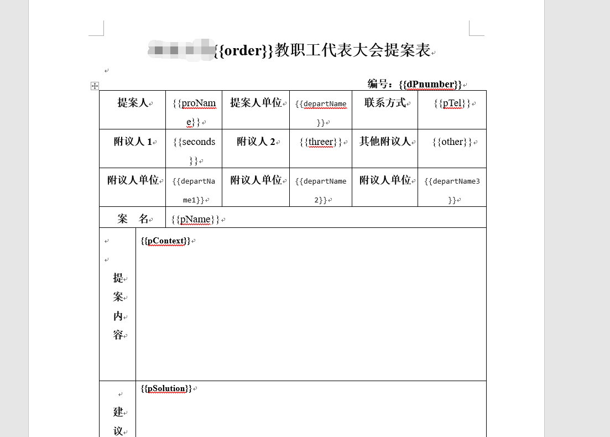
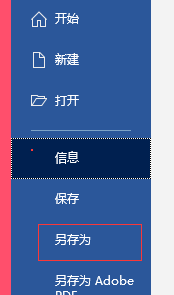
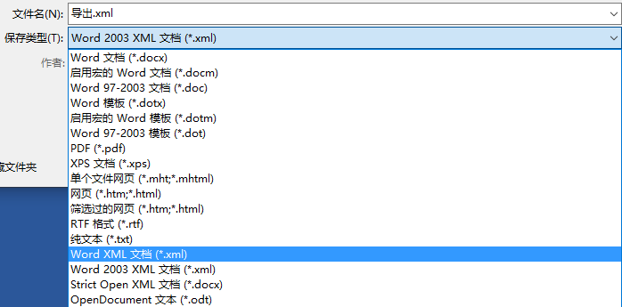
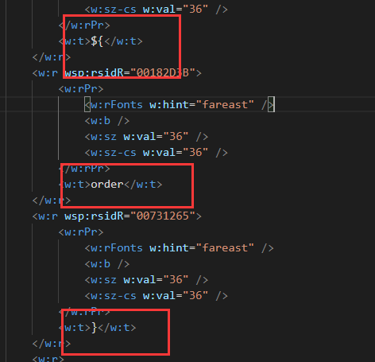
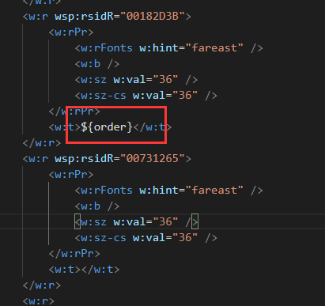
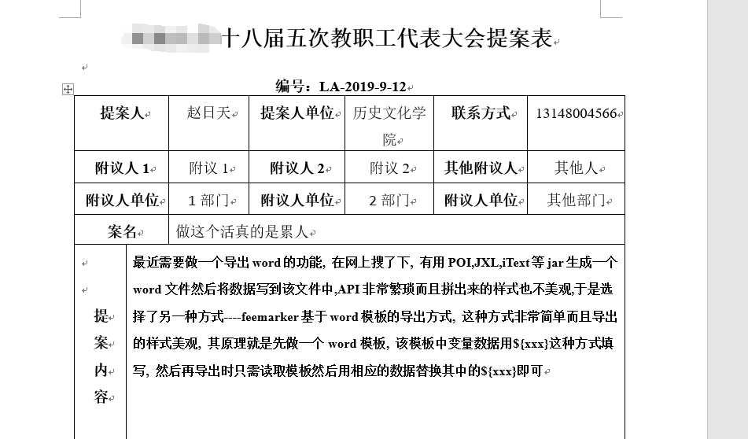

## 关于导出提案到文件处理方法

### 修改word模板

这里用到了freemarker这个框架，当然这只是此框架的微不足道的一个功能

原理很简单，就是此框像很多web模板框架一样，根据预先定义的标志位(`   ${ID}  `) ,然后将键为`ID`的 字符串填充进去。

你需要先将你的模板word文件处理一下，修改想要自动填充的位置为freemarker的标志位+id的形式



### 导出为XML

首先将work导出成纯字符的文件，在offce2019 中导出步骤如下：

**开始**> **另存为** > **xml格式**

 




这样就能看到xml中自定义的标志位内容了

### 导出XML格式问题

但是....你会看到如下图的情况:



你会发现你定义的标志位`${ID}`被五马分尸了,这样freemarker是识别不出来的，这可能是由于office 导出成xml的时候为了兼容性做的一下处理，解决方式很简单，只要手动的将其还原成freemarker认识的格式就行了，如下图：



如果一个文件中就几处需要替换，手动修改也就没什么问题，但是，如果你的文件中很多标志位，那么修改起来就略显蛋疼了。

### 编程处理格式问题

那么我们只能借助程序来解决了，在这里，我写了个极其丑陋的Demo.java 用来处理这个问题足够了，代码如下:

```java
public class XMLProcess {
    //要处理文件的路径
    public static String path = "C:\\Users\\44524\\Desktop\\电子提案系统\\电子提案系统文档材料\\word\\";
    public static void main(String[] args) throws IOException {
        //格式错误的文件名称
        File oldFile = new File(path+ "提案表导出FM格式版.xml");
        //导出的文件名称，后缀这里直接改成ftl了
        File newFile = new File(path + "newFile.ftl");

        FileReader fr = new FileReader(oldFile);
        char[] chars = new char[1024];
        int len ;
        StringBuffer sb = new StringBuffer();
        StringBuffer inner = new StringBuffer();
        int f = 0;
        int b = 0;
        while ((len = fr.read(chars)) != -1) {
            for (int i = 0; i < len; i++) {
                if (chars[i] == '<') {
                    f = 1;
                    sb.append(chars[i]);
                    continue;
                } else if (chars[i] == '>') {
                    f = 0;
                    sb.append(chars[i]);
                    continue;
                }
                if(f == 1){
                    sb.append(chars[i]);
                }
                //xml 内部内容
                if (f == 0) {
                    if (chars[i] == '$') {
                        b = 1;
                        inner.append(chars[i]);
                        continue;
                    }
                    if (chars[i] == '}' && b == 1) {
                        b = 0;
                        inner.append(chars[i]);
                        sb.append(inner.toString());
                        //重建 sb
                        inner = new StringBuffer();
                        continue;
                    }
                    if (b == 1) {
                        inner.append(chars[i]);
                        continue;
                    }
                    sb.append(chars[i]);
                }
            }
        }

        System.out.println("处理完成，正在写出。。。。。");
        FileWriter fw = new FileWriter(newFile);
        fw.write(sb.toString());
        fw.flush();
        fw.close();
        fr.close();

    }
}
```

这样导出的文件就没有问题啦  

### 修改后缀

由于freemarker需要文件后缀为ftl，所以需要将xml文件改成ftl的。

可以看到我在程序中直接导出成ftl了

### java导出word

最最重要的一步，就是用java程序将我么写好的模板文件导出成word了

代码很简单:

```java

public class demo {
    public static void main(String[] args) {
        Map<String,Object> dataMap = new HashMap<String, Object>();
        try {
            dataMap.put("order","十八届五次");
            dataMap.put("dPnumber","LA-2019-9-12");
            dataMap.put("proName", "赵日天");

            dataMap.put("departName", "历史文化学院");

            dataMap.put("pTel", "13148004566");
            dataMap.put("seconds", "附议1");
            dataMap.put("threer", "附议2");
            dataMap.put("other", "其他人");
            dataMap.put("departName1", "1部门");
            dataMap.put("departName2", "2部门");
            dataMap.put("departName3", "其他部门");


            dataMap.put("pName","做这个活真的是累人");

            dataMap.put("pContext", "最近需要做一个导出word的功能, 在网上搜了下, 有用POI,JXL,iText等jar生成一个word文件然后将数据写到该文件中,API非常繁琐而且拼出来的样式也不美观,于是选择了另一种方式----feemarker基于word模板的导出方式, 这种方式非常简单而且导出的样式美观, 其原理就是先做一个word模板, 该模板中变量数据用${xxx}这种方式填写, 然后再导出时只需读取模板然后用相应的数据替换其中的${xxx}即可");

            dataMap.put("pSolution", " 2, 将该word文件另存为xml格式(注意是另存为,不是直接改扩展名) \n" +
                    "         3, 将xml文件的扩展名直接改为ftl \n" +
                    "         4, 用java代码完成导出(需要导入freemarker.jar) ");

            dataMap.put("disProName","委主任");
            dataMap.put("disY","2019");
            dataMap.put("disM","4");
            dataMap.put("disD","5");

            dataMap.put("auDepartName","主办方");
            dataMap.put("auDepartName2","协办方");
            dataMap.put("ausProName","党办主任");
            dataMap.put("ausY","2017");
            dataMap.put("ausM","2");
            dataMap.put("ausD","22");


            dataMap.put("avIdea","校领导说：我觉得阔以!");
            dataMap.put("appProName","单世涛");
            dataMap.put("appY","2020");
            dataMap.put("appM","2");
            dataMap.put("appD","4");
            dataMap.put("excEpIdea","pringBoot自带监控功能Actuator，可以帮助实现对程序内部运行情况监控，" +
                    "比如监控状况、Bean加载情况、环境变量、日志信息、线程信息等");

            dataMap.put("departLeader","单位负责人");
            dataMap.put("epY","2030");
            dataMap.put("epM","2");
            dataMap.put("epD","5");


            dataMap.put("csIdeclear","很满意，那是不可能的，处理的慢死了");
            dataMap.put("csiY","2040");
            dataMap.put("csiM","2");
            dataMap.put("csiD","6");

            //Configuration 用于读取ftl文件
            Configuration configuration = new Configuration(new Version("2.3.23"));
            configuration.setDefaultEncoding("utf-8");

            /**
             * 以下是两种指定ftl文件所在目录路径的方式，注意这两种方式都是
             * 指定ftl文件所在目录的路径，而不是ftl文件的路径
             */
            //指定路径的第一种方式（根据某个类的相对路径指定）
//                configuration.setClassForTemplateLoading(this.getClass(), "");

            //指定路径的第二种方式，我的路径是C：/a.ftl
            configuration.setDirectoryForTemplateLoading(new File(XMLProcess.path));

            //输出文档路径及名称
            File outFile = new File(XMLProcess.path +"导出.doc");

            //以utf-8的编码读取ftl文件
            Template template = configuration.getTemplate("newFile.ftl", "utf-8");
            Writer out = new BufferedWriter(new OutputStreamWriter(new FileOutputStream(outFile), "utf-8"), 10240);
            template.process(dataMap, out);
            out.close();
        } catch (Exception e) {
            e.printStackTrace();
        }
    }

}

```

### 导出完成

好啦，去看看文件导出效果吧:



