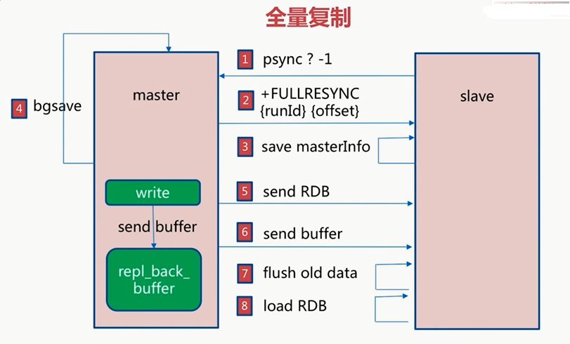
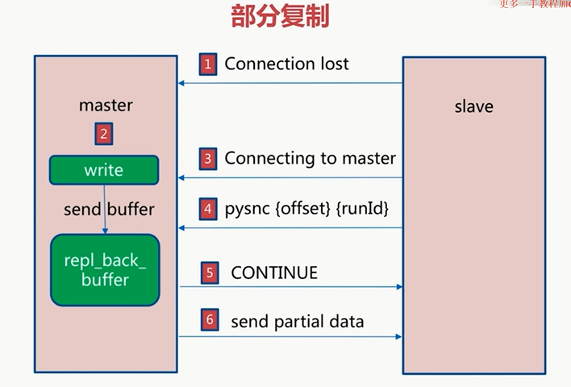

## Redis

### 主从复制

#### 概念

如果一个Redis故障，短时间无法修复，那就GG了

所以就有了高可用Redis ，通常就是配置Redis主从复制


#### 配置

slaveof  命令

```sh
> slaveof IP PORT
#ok
```

取消从节点 ： `slaveof no one` 数据不会清除

 slaveof ip port 

slave-read-only yes  从节点值做读的操作


查看命令：

```sh
# 6380是从节点
> redis-cli -p 6380 info replication
```

主节点日志信息会显示：

```sh
slave IP:PORT asks for synchronization
Full resync requested by slave IP:PORT
Starting BGSAVE for SYNC with target:disk
。。。。。
Run_id:4h32kj4h2j3h4k2j342
```


#### 全量|部分复制

将RDB文件先同步给从服务，在比较偏移量，将同步期间的数据同步到从服务器



1. 刚开始主不知道从服务器的runId，所以就发了个问号进行询问
2. 从把自己的id和偏移量发给主
3. 并保存主服务器的信息
4. 主服务器进行bgsave
5. 把生成的Rdb文件发给从
6. 而且把期间的缓存区发给从做同步
7. 从节点清楚自己的所有数据
8. 加载收到的rdb文件

**开销：**

bgsave开销

传输rdb文件开销

节点清空数据

加载rdb开销

如果开启了AOF，可能AOF重写

**可能的问题：**

网络抖动问题，master会从新复制（2.8之前） 之后，就将通过偏移量进行恢复



1. 网络抖动
2. master期间会把数据写入buffer中
3. 网络恢复后，从服务重新请求主服务
4. 发送自己的偏移量，runid
5. 如果主服务发现，对方偏移量在自己的buffer范围内，就发送continue
6. 并且发送部分补充数据，做到完全同步

#### 故障处理

> 比如有一夫二妻

从服务崩了：

没啥问题，还有其他从呢

master崩了

master去找一个从来充当主

这里会有Redis自动处理的方法

#### 运维问题

> 一般备份都是在从上

**读写分离**

流量分摊到从节点

，并且master把读的业务分给slave（可能会有数据复制延迟问题，一般通过偏移量监控这个问题）

读到过期数据，

删除过期数据：懒惰性，数据非常多的时候，会导致很多数据没删除，这就导致slave读到删除数据（slave不能修改数据）

从节点故障：优化就完了

**主从不一致**

配置不一致问题，

**避免全量复制**

第一次：

小主节点（数据分片）低峰 

主节点ID变化（重启）


**复制风暴**

主重启后，要将所有节点进行复制

解决：更换拓扑结构，让主复制给一个从，让这个从再复制给其他的主

### Redis sentinel

> 默认26379端口

#### 主从个复制高可用

* 手动故障转移

  

* 写能力和存储能力受限（只能主写）


#### 架构说明

主死了，让其中一个从slave of no one，另一个slave转移，虽然可以用脚本实现这一操作，但是是很麻烦的，考虑问题很多，所以sentinel就出现了

每个从都连接sentinel（sentinel也可以配集群），由sentinel来决定谁知主，如果当前主gg了，那么sentinel就会进行一次选举，选出一个新的slave作为master，并通知客户端谁是新的master，如果master由回光返照，那他也只能委屈的成为一个slave了，另外sentinel可以做多个系统的“蜻蜓队长”


#### 安装配置

> sentinel 是特殊的Redis

主节点配置

```sj
port 
daemonize yes
pidfile
logfile
dir
```

从：解释配一下slave of 。。。


sentinel配置

```sh
port
dir
logfile
sentinel monitor mymaster IP PORT 2
# 2 就是有几个队长判断有问题，就决定处理
sentinel down-after-millliseconds mymaster 30000
# 多久ping不通就有问题

sentinel parllel-syncs mymaster 1
# 并发还是
sentinel failover-timeout mymaster 180000
#?
```

 


#### 客户端连接

 //TODO 待续


#### 实现原理


#### 常见问题


### 集群

#### 集群完整性

cluster-require-full-carvarage  为yes

只有16284个节点都可用才对外提供服务，正常 情况下是设置为no的


#### 带宽消耗

> 官方建议节点数目不超过一千个

如果节点过多，会在心跳检测，ping、pong的时候会消耗带宽

pub/sub的开销也很大，因为public消息会在整个集群中进行传播

redis-cli-bigkeys 查找大hash键

