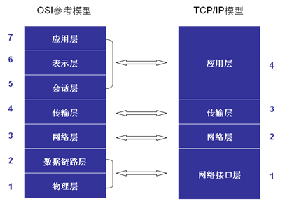
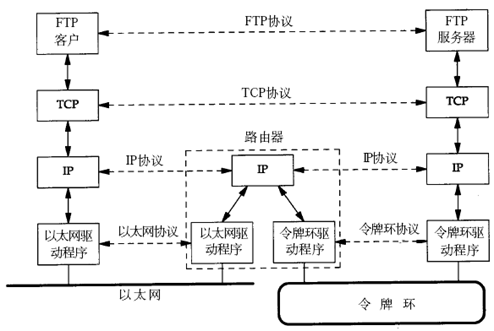
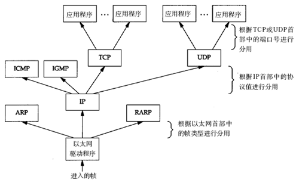
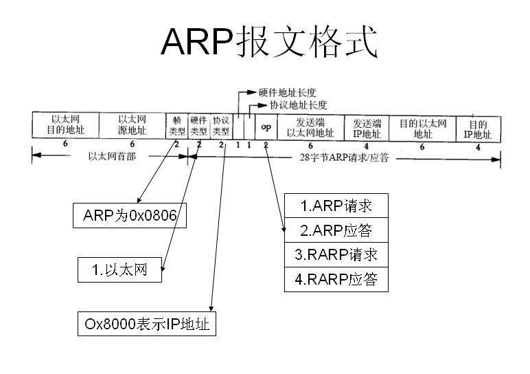
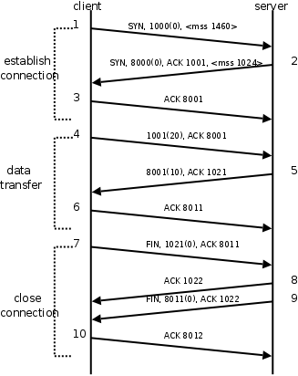
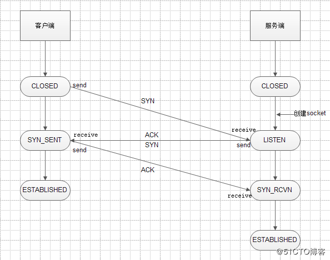
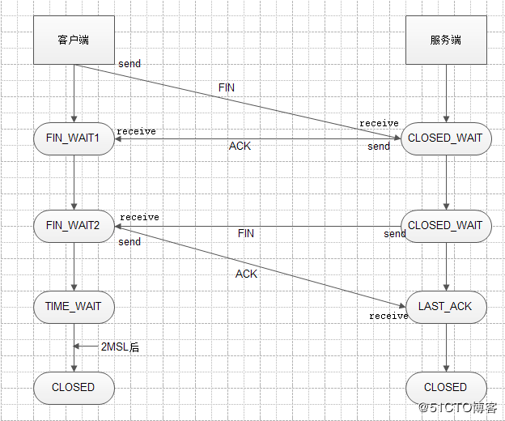
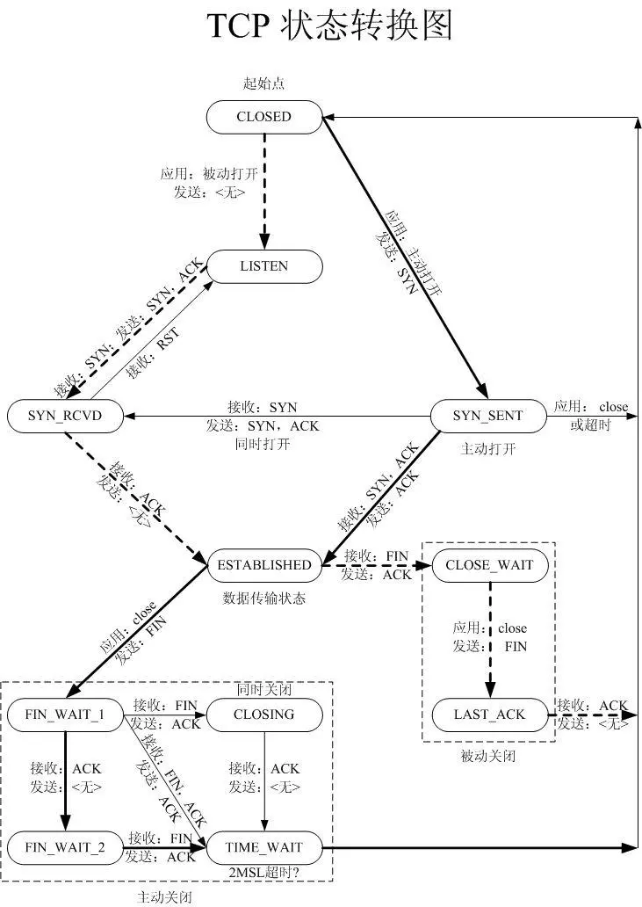
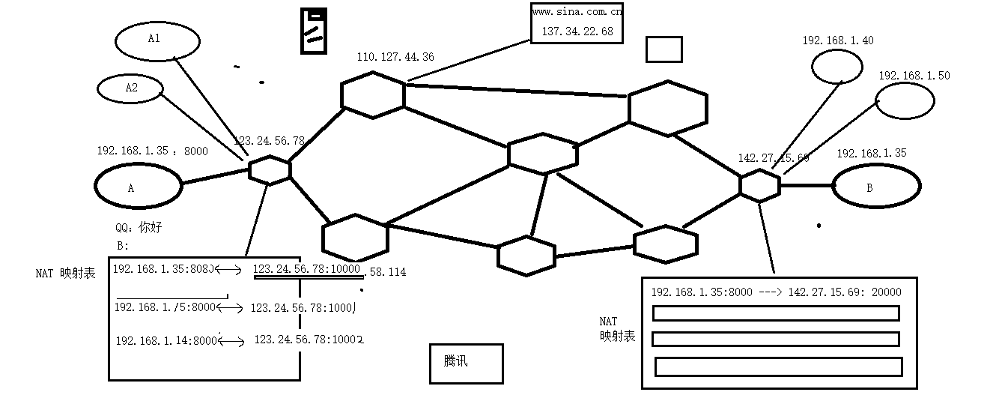

# 网络编程

## 协议

### 协议的概念

#### 什么是协议

从应用的角度出发，协议可理解为“规则”，是数据传输和数据的解释的规则。

> 假设，A、B双方欲传输文件。规定：
> 第一次，传输文件名，接收方接收到文件名，应答OK给传输方；
> 第二次，发送文件的尺寸，接收方接收到该数据再次应答一个OK；
> 第三次，传输文件内容。同样，接收方接收数据完成后应答OK表示文件内容接收成功。
> 由此，无论A、B之间传递何种文件，都是通过三次数据传输来完成。A、B之间形成了一个最简单的数据传输规则。双方都按此规则发送、接收数据。A、B之间达成的这个相互遵守的规则即为协议。

这种仅在A、B之间被遵守的协议称之为**原始协议**。当此协议被更多的人采用，不断的增加、改进、维护、完善。最终形成一个稳定的、完整的文件传输协议，被广泛应用于各种文件传输过程中。该协议就成为一个**标准协议**。最早的ftp协议就是由此衍生而来。

TCP协议注重数据的传输。http协议着重于数据的解释。

#### 典型协议

* 传输层 常见协议有TCP/UDP协议。

* 应用层 常见的协议有HTTP协议，FTP协议。

* 网络层 常见协议有IP协议、ICMP协议、IGMP协议。

* 网络接口层 常见协议有ARP协议、RARP协议。

* TCP[传输控制协议](http://baike.baidu.com/view/544903.htm)（Transmission Control Protocol）是一种面向连接的、可靠的、基于字节流的[传输层](http://baike.baidu.com/view/239605.htm)通信协议。

* UDP用户数据报协议（User Datagram Protocol）是[OSI](http://baike.baidu.com/view/113948.htm)参考模型中一种无连接的[传输层](http://baike.baidu.com/view/239605.htm)协议，提供面向事务的简单不可靠信息传送服务。

* HTTP[超文本传输协议](http://baike.baidu.com/view/468465.htm)（Hyper Text Transfer Protocol）是[互联网](http://baike.baidu.com/view/6825.htm)上应用最为广泛的一种[网络协议](http://baike.baidu.com/view/16603.htm)。

* FTP文件传输协议（File Transfer Protocol）

* IP协议是[因特网](http://baike.baidu.com/view/1706.htm)互联协议（Internet Protocol）

* ICMP协议是Internet控制[报文](http://baike.baidu.com/view/175122.htm)协议（Internet Control Message Protocol）它是[TCP/IP协议族](http://baike.baidu.com/view/2221037.htm)的一个子协议，用于在IP[主机](http://baike.baidu.com/view/23880.htm)、[路由](http://baike.baidu.com/view/18655.htm)器之间传递控制消息。

* IGMP协议是 Internet 组管理协议（Internet Group Management Protocol），是因特网协议家族中的一个组播协议。该协议运行在主机和组播路由器之间。

* [ARP](http://baike.baidu.com/view/32698.htm)协议是正向[地址解析协议](http://baike.baidu.com/view/149421.htm)（Address Resolution Protocol），通过已知的IP，寻找对应主机的[MAC地址](http://baike.baidu.com/view/69334.htm)。

* [RARP](http://baike.baidu.com/view/32772.htm)是反向地址转换协议，通过MAC地址确定IP地址。

### 网络应用程序设计模式

#### C/S模式

​         传统的网络应用设计模式，客户机(client)/服务器(server)模式。需要在通讯两端各自部署客户机和服务器来完成数据通信。

#### B/S模式

浏览器()/服务器(server)模式。只需在一端部署服务器，而另外一端使用每台PC都默认配置的浏览器即可完成数据的传输。

#### 优缺点

​         对于C/S模式来说，其优点明显。客户端位于目标主机上可以保证性能，将数据缓存至客户端本地，从而**提高数据传输效率**。且，一般来说客户端和服务器程序由一个开发团队创作，所以他们之间**所采用的协议相对灵活**。可以在标准协议的基础上根据需求裁剪及定制。例如，腾讯公司所采用的通信协议，即为ftp协议的修改剪裁版。

​         因此，传统的网络应用程序及较大型的网络应用程序都首选C/S模式进行开发。如，知名的网络游戏魔兽世界。3D画面，数据量庞大，使用C/S模式可以提前在本地进行大量数据的缓存处理，从而提高观感。

​         C/S模式的缺点也较突出。由于客户端和服务器都需要有一个开发团队来完成开发。**工作量**将成倍提升，开发周期较长。另外，从用户角度出发，需要将客户端安插至用户主机上，对用户主机的**安全性构成威胁**。这也是很多用户不愿使用C/S模式应用程序的重要原因。

 

​         B/S模式相比C/S模式而言，由于它没有独立的客户端，使用标准浏览器作为客户端，其工作**开发量较小**。只需开发服务器端即可。另外由于其采用浏览器显示数据，因此移植性非常好，**不受平台限制**。如早期的偷菜游戏，在各个平台上都可以完美运行。

​         B/S模式的缺点也较明显。由于使用第三方浏览器，因此**网络应用支持受限**。另外，没有客户端放到对方主机上，**缓存数据不尽如人意**，从而传输数据量受到限制。应用的观感大打折扣。第三，必须与浏览器一样，采用标准http协议进行通信，**协议选择不灵活**。

​         因此在开发过程中，模式的选择由上述各自的特点决定。根据实际需求选择应用程序设计模式。

### 分层模型

#### OSI七层模型



1.   **物理层**：主要定义物理设备标准，如网线的接口类型、光纤的接口类型、各种传输介质的传输速率等。它的主要作用是传输比特流（就是由1、0转化为电流强弱来进行传输，到达目的地后再转化为1、0，也就是我们常说的数模转换与模数转换）。这一层的数据叫做比特。

2.       **数据链路层**：定义了如何让格式化数据以帧为单位进行传输，以及如何让控制对物理介质的访问。这一层通常还提供错误检测和纠正，以确保数据的可靠传输。如：串口通信中使用到的115200、8、N、1

3.       **网络层**：在位于不同地理位置的网络中的两个主机系统之间提供连接和路径选择。Internet的发展使得从世界各站点访问信息的用户数大大增加，而网络层正是管理这种连接的层。

4.       **传输层**：定义了一些传输数据的协议和端口号（WWW端口80等），如：TCP（传输控制协议，传输效率低，可靠性强，用于传输可靠性要求高，数据量大的数据），UDP（用户数据报协议，与TCP特性恰恰相反，用于传输可靠性要求不高，数据量小的数据，如QQ聊天数据就是通过这种方式传输的）。 主要是将从下层接收的数据进行分段和传输，到达目的地址后再进行重组。常常把这一层数据叫做段。

5.       **会话层**：通过传输层(端口号：传输端口与接收端口)建立数据传输的通路。主要在你的系统之间发起会话或者接受会话请求（设备之间需要互相认识可以是IP也可以是MAC或者是主机名）。

6.       **表示层**：可确保一个系统的应用层所发送的信息可以被另一个系统的应用层读取。例如，PC程序与另一台计算机进行通信，其中一台计算机使用扩展二一十进制交换码(EBCDIC)，而另一台则使用美国信息交换标准码（ASCII）来表示相同的字符。如有必要，表示层会通过使用一种通格式来实现多种数据格式之间的转换。

7.       **应用层**：是最靠近用户的OSI层。这一层为用户的应用程序（例如电子邮件、文件传输和终端仿真）提供网络服务。

#### TCP/IP四层模型

TCP/IP网络协议栈分为应用层（Application）、传输层（Transport）、网络层（Network）和链路层（Link）四层

### 通信过程

两台计算机通过TCP/IP协议通讯的过程如下所示：


上图对应两台计算机在同一网段中的情况，如果两台计算机在不同的网段中，那么数据从一台计算机到另一台计算机传输过程中要经过一个或多个路由器，如下图所示：



链路层有以太网、令牌环网等标准，链路层负责网卡设备的驱动、帧同步（即从网线上检测到什么信号算作新帧的开始）、冲突检测（如果检测到冲突就自动重发）、**数据差错**校验等工作。交换机是工作在链路层的网络设备，可以在不同的链路层网络之间转发数据帧（比如十兆以太网和百兆以太网之间、以太网和令牌环网之间），由于不同链路层的帧格式不同，交换机要将进来的数据包拆掉链路层首部重新封装之后再转发。

网络层的IP协议是构成Internet的基础。Internet上的主机通过IP地址来标识，Inter-net上有大量路由器负责根据IP地址选择合适的路径转发数据包，数据包从Internet上的源主机到目的主机往往要经过十多个路由器。路由器是工作在第三层的网络设备，**同时兼有交换机的功能**，可以在不同的链路层接口之间转发数据包，因此**路由器需要将进来的数据包拆掉网络层和链路层两层首部并重新封装**。IP协议不保证传输的可靠性，数据包在传输过程中可能丢失，可靠性可以在上层协议或应用程序中提供支持。

**网络层负责点到点**（ptop，point-to-point）的传输（这里的“点”指主机或路由器），而传**输层负责端到端**（etoe，end-to-end）的传输（这里的“端”指源主机和目的主机）。传输层可选择TCP或UDP协议。

TCP是一种面向连接的、可靠的协议，TCP传输的双方需要首先建立连接，之后由TCP协议保证数据收发的**可靠性，丢失的数据包自动重发**，上层应用程序收到的总是可靠的数据流，通讯之后关闭连接。

UDP是**无连接**的传输协议，**不保证可靠性**，使用UDP协议的应用程序需要自己完成丢包重发、消息排序等工作。

目的主机收到数据包后，如何经过各层协议栈最后到达应用程序呢？其过程如下图所示：



以太网驱动程序首先根据以太网首部中的“上层协议”字段确定该数据帧的有效载荷（payload，指除去协议首部之外实际传输的数据）是IP、ARP还是RARP协议的数据报，然后交给相应的协议处理。假如是IP数据报，IP协议再根据IP首部中的“上层协议”字段确定该数据报的有效载荷是TCP、UDP、ICMP还是IGMP，然后交给相应的协议处理。假如是TCP段或UDP段，TCP或UDP协议再根据TCP首部或UDP首部的“端口号”字段确定应该将应用层数据交给哪个用户进程。IP地址是标识网络中不同主机的地址，而端口号就是同一台主机上标识不同进程的地址，IP地址和端口号合起来标识网络中唯一的进程。

虽然IP、ARP和RARP数据报都需要以太网驱动程序来封装成帧，但是从功能上划分，**ARP和RARP属于链路层，IP属于网络层**。虽然ICMP、IGMP、TCP、UDP的数据都需要IP协议来封装成数据报，但是从功能上划分，**ICMP、IGMP与IP同属于网络层**，TCP和UDP属于传输层。

### 协议格式

#### 数据包封装

传输层及其以下的机制由内核提供，应用层由用户进程提供，应用程序对通讯数据的含义进行解释，而传输层及其以下处理通讯的细节，将数据从一台计算机通过一定的路径发送到另一台计算机。应用层数据通过协议栈发到网络上时，每层协议都要加上一个数据首部（header），称为封装（Encapsulation），如下图所示：


> 不同的协议层对数据包有不同的称谓，在传输层叫做段（segment），在网络层叫做数据报（datagram），在链路层叫做帧（frame）。数据封装成帧后发到传输介质上，到达目的主机后每层协议再剥掉相应的首部，最后将应用层数据交给应用程序处理。

#### 以太网帧格式


其中的源地址和目的地址是指网卡的硬件地址（也叫MAC地址），长度是48位，是在网卡出厂时固化的。*可在shell中使用ifconfig命令查看*，“HWaddr 00:15:F2:14:9E:3F”部分就是硬件地址。协议字段有三种值，分别对应IP、ARP、RARP。**帧尾是CRC校验码。**

以太网帧中的数据长度规定**最小46字节，最大1500字节**，ARP和RARP数据包的长度不够46字节，要在后面补填**充位**。**最大值1500称为以太网的最大传输单元（MTU） **，不同的网络类型有不同的MTU，如果一个数据包从以太网路由到拨号链路上，数据包长度大于拨号链路的MTU，则需要对数据包进行分片（fragmentation）。ifconfig命令输出中也有“MTU:1500”。注意，MTU这个概念指数据帧中有效载荷的最大长度，**不包括帧头长度**。

#### ARP数据报格式

在网络通讯时，源主机的应用程序知道目的主机的IP地址和端口号，却不知道目的主机的硬件地址，而数据包首先是被网卡接收到再去处理上层协议的，如果接收到的数据包的硬件地址与本机不符，则直接丢弃。因此在通讯前必须获得目的主机的硬件地址。ARP协议就起到这个作用。源主机发出ARP请求，询问“IP地址是192.168.0.1的主机的硬件地址是多少”，并将这个请求广播到本地网段（以太网帧首部的硬件地址填FF:FF:FF:FF:FF:FF表示广播），目的主机接收到广播的ARP请求，发现其中的IP地址与本机相符，则发送一个ARP应答数据包给源主机，将自己的硬件地址填写在应答包中。

每台主机都维护一个ARP缓存表，**可以用arp -a命令查看**。缓存表中的表项有过期时间（一般为20分钟），如果20分钟内没有再次使用某个表项，则该表项失效，下次还要发ARP请求来获得目的主机的硬件地址。想一想，为什么表项要有过期时间而不是一直有效？

ARP数据报的格式如下所示：



源MAC地址、目的MAC地址在以太网首部和ARP请求中各出现一次，对于链路层为以太网的情况是多余的，但如果链路层是其它类型的网络则有可能是必要的。硬件类型指链路层网络类型，1为以太网，协议类型指要转换的地址类型，0x0800为IP地址，后面两个地址长度对于以太网地址和IP地址分别为6和4（字节），op字段为1表示ARP请求，op字段为2表示ARP应答。

```
看一个具体的例子。
请求帧如下（为了清晰在每行的前面加了字节计数，每行16个字节）：
以太网首部（14字节）
0000: ff ff ff ff ff ff 00 05 5d 61 58 a8 08 06
ARP帧（28字节）
0000: 00 01
0010: 08 00 06 04 00 01 00 05 5d 61 58 a8 c0 a8 00 37
0020: 00 00 00 00 00 00 c0 a8 00 02
填充位（18字节）
0020: 00 77 31 d2 50 10
0030: fd 78 41 d3 00 00 00 00 00 00 00 00
以太网首部：目的主机采用广播地址，源主机的MAC地址是00:05:5d:61:58:a8，上层协议类型0x0806表示ARP。
ARP帧：硬件类型0x0001表示以太网，协议类型0x0800表示IP协议，硬件地址（MAC地址）长度为6，协议地址（IP地址）长度为4，op为0x0001表示请求目的主机的MAC地址，源主机MAC地址为00:05:5d:61:58:a8，源主机IP地址为c0 a8 00 37（192.168.0.55），目的主机MAC地址全0待填写，目的主机IP地址为c0 a8 00 02（192.168.0.2）。
由于以太网规定最小数据长度为46字节，ARP帧长度只有28字节，因此有18字节填充位，填充位的内容没有定义，与具体实现相关。

应答帧如下：
以太网首部
0000: 00 05 5d 61 58 a8 00 05 5d a1 b8 40 08 06
ARP帧
0000: 00 01
0010: 08 00 06 04 00 02 00 05 5d a1 b8 40 c0 a8 00 02
0020: 00 05 5d 61 58 a8 c0 a8 00 37
填充位
0020: 00 77 31 d2 50 10
0030: fd 78 41 d3 00 00 00 00 00 00 00 00
以太网首部：目的主机的MAC地址是00:05:5d:61:58:a8，源主机的MAC地址是00:05:5d:a1:b8:40，上层协议类型0x0806表示ARP。
ARP帧：硬件类型0x0001表示以太网，协议类型0x0800表示IP协议，硬件地址（MAC地址）长度为6，协议地址（IP地址）长度为4，op为0x0002表示应答，源主机MAC地址为00:05:5d:a1:b8:40，源主机IP地址为c0 a8 00 02（192.168.0.2），目的主机MAC地址为00:05:5d:61:58:a8，目的主机IP地址为c0 a8 00 37（192.168.0.55）。
```

#### IP段格式


IP数据报的首部长度和数据长度都是可变长的，但总是4字节的整数倍。对于IPv4，4位版本字段是4。4位首部长度的数值是以4字节为单位的，最小值为5，也就是说首部长度最小是4x5=20字节，也就是不带任何选项的IP首部，4位能表示的最大值是15，也就是说**首部长度最大是60字节**。8位TOS字段有3个位用来指定IP数据报的优先级（目前已经废弃不用），还有4个位表示可选的服务类型（最小延迟、最大吞吐量、最大可靠性、最小成本），还有一个位总是0。总长度是整个数据报（包括IP首部和IP层payload）的字节数。每传一个IP数据报，**16位的标识**加1，可用于分片和重新组装数据报。**3位标志和13位片偏移用于分片**。TTL（Time to live)是这样用的：源主机为数据包设定一个生存时间，比如64，每过一个路由器就把该值减1，如果减到0就表示路由已经太长了仍然找不到目的主机的网络，就丢弃该包，因此这个生存时间的单位不是秒，而是跳（hop）。协议字段指示上层协议是TCP、UDP、ICMP还是IGMP。然后是校验和，只校验IP首部，数据的校验由更高层协议负责。IPv4的IP地址长度为32位。

> （一）IP分片的原理：
>
> ​     分片和重新组装的过程对传输层是透明的，其原因是当IP数据报进行分片之后，只有当它到达下一站时，才可进行重新组装，且它是由目的端的IP层来完成的。分片之后的数据报根据需要也可以再次进行分片。
> ​    IP分片和完整IP报文差不多拥有相同的IP头，ID域对于每个分片都是一致的，这样才能在重新组装的时候识别出来自同一个IP报文的分片。在IP头里面，16位识别号唯一记录了一个IP包的ID（ipid），具有同一个ID的IP分片将会重新组装；而13位片偏移则记录了某IP片相对整个包的位置；而这两个表中间的3位标志则标志着该分片后面是否还有新的分片。这三个域就组成了IP分片的所有信息， 接受方就可以利用这些信息对IP数据进行重新组织。
> ​    1、标志字段的作用
> ​    标志字段在分片数据报中起了很大作用，在数据报分片时把它的值复制到每片中。标志字段的其中一个比特称作“不分片”位，用其中一个比特来表示“更多的片”。除了最后一片外，其他每个组成数据报的片都要把该比特置1。片偏移字段指的是该片偏移原始数据报开始处的位置。另外，当数据报被分片后，每个片的总长度值要改为该片的长度值。如果将标志字段的"不分片"比特置1，则IP将不对数据报进行分片。相反把数据报丢弃并发送一个I C M P差错报文并通知源主机废弃的原因。如果不是特殊需要，则不应该置1；最右比特置1表示该报文不是最后一个IP分片。
>
> [ip分片，MTU，MSS](https://blog.51cto.com/gdutcxh/1950189)

#### UDP数据报格式


```
下面分析一帧基于UDP的TFTP协议帧。
以太网首部
0000: 00 05 5d 67 d0 b1 00 05 5d 61 58 a8 08 00
IP首部
0000: 45 00
0010: 00 53 93 25 00 00 80 11 25 ec c0 a8 00 37 c0 a8
0020: 00 01
UDP首部
0020： 05 d4 00 45 00 3f ac 40
TFTP协议
0020: 00 01 'c'':''\''q'
0030: 'w''e''r''q''.''q''w''e'00 'n''e''t''a''s''c''i'
0040: 'i'00 'b''l''k''s''i''z''e'00 '5''1''2'00 't''i'
0050: 'm''e''o''u''t'00 '1''0'00 't''s''i''z''e'00 '0'
0060: 00
以太网首部：源MAC地址是00:05:5d:61:58:a8，目的MAC地址是00:05:5d:67:d0:b1，上层协议类型0x0800表示IP。
IP首部：每一个字节0x45包含4位版本号和4位首部长度，版本号为4，即IPv4，首部长度为5，说明IP首部不带有选项字段。服务类型为0，没有使用服务。16位总长度字段（包括IP首部和IP层payload的长度）为0x0053，即83字节，加上以太网首部14字节可知整个帧长度是97字节。IP报标识是0x9325，标志字段和片偏移字段设置为0x0000，就是DF=0允许分片，MF=0此数据报没有更多分片，没有分片偏移。TTL是0x80，也就是128。上层协议0x11表示UDP协议。IP首部校验和为0x25ec，源主机IP是c0 a8 00 37（192.168.0.55），目的主机IP是c0 a8 00 01（192.168.0.1）。
UDP首部：源端口号0x05d4（1492）是客户端的端口号，目的端口号0x0045（69）是TFTP服务的well-known端口号。UDP报长度为0x003f，即63字节，包括UDP首部和UDP层pay-load的长度。UDP首部和UDP层payload的校验和为0xac40。
TFTP是基于文本的协议，各字段之间用字节0分隔，开头的00 01表示请求读取一个文件，接下来的各字段是：
c:\qwerq.qwe
netascii
blksize 512
timeout 10
tsize 0
一般的网络通信都是像TFTP协议这样，通信的双方分别是客户端和服务器，客户端主动发起请求（上面的例子就是客户端发起的请求帧），而服务器被动地等待、接收和应答请求。客户端的IP地址和端口号唯一标识了该主机上的TFTP客户端进程，服务器的IP地址和端口号唯一标识了该主机上的TFTP服务进程，由于客户端是主动发起请求的一方，它必须知道服务器的IP地址和TFTP服务进程的端口号，所以，一些常见的网络协议有默认的服务器端口，例如HTTP服务默认TCP协议的80端口，FTP服务默认TCP协议的21端口，TFTP服务默认UDP协议的69端口（如上例所示）。在使用客户端程序时，必须指定服务器的主机名或IP地址，如果不明确指定端口号则采用默认端口，请读者查阅ftp、tftp等程序的man page了解如何指定端口号。/etc/services中列出了所有well-known的服务端口和对应的传输层协议，这是由IANA（Internet Assigned Numbers Authority）规定的，其中有些服务既可以用TCP也可以用UDP，为了清晰，IANA规定这样的服务采用相同的TCP或UDP默认端口号，而另外一些TCP和UDP的相同端口号却对应不同的服务。
很多服务有well-known的端口号，然而客户端程序的端口号却不必是well-known的，往往是每次运行客户端程序时由系统自动分配一个空闲的端口号，用完就释放掉，称为ephemeral的端口号，想想这是为什么？
前面提过，UDP协议不面向连接，也不保证传输的可靠性，例如：
发送端的UDP协议层只管把应用层传来的数据封装成段交给IP协议层就算完成任务了，如果因为网络故障该段无法发到对方，UDP协议层也不会给应用层返回任何错误信息。
接收端的UDP协议层只管把收到的数据根据端口号交给相应的应用程序就算完成任务了，如果发送端发来多个数据包并且在网络上经过不同的路由，到达接收端时顺序已经错乱了，UDP协议层也不保证按发送时的顺序交给应用层。
通常接收端的UDP协议层将收到的数据放在一个固定大小的缓冲区中等待应用程序来提取和处理，如果应用程序提取和处理的速度很慢，而发送端发送的速度很快，就会丢失数据包，UDP协议层并不报告这种错误。
因此，使用UDP协议的应用程序必须考虑到这些可能的问题并实现适当的解决方案，例如等待应答、超时重发、为数据包编号、流量控制等。一般使用UDP协议的应用程序实现都比较简单，只是发送一些对可靠性要求不高的消息，而不发送大量的数据。例如，基于UDP的TFTP协议一般只用于传送小文件（所以才叫trivial的ftp），而基于TCP的FTP协议适用于	各种文件的传输。TCP协议又是如何用面向连接的服务来代替应用程序解决传输的可靠性问题呢。

```

#### TCP数据报格式


1. 源端口号：数据发起者的端口号，16bit
2. 目的端口号：数据接收者的端口号，16bit
3. 序号：32bit的序列号，由发送方使用
4. 确认序号：32bit的确认号，是接收数据方期望收到发送方的下一个报文段的序号，因此确认序号应当是上次已成功收到数据字节序号加1。
5. 首部长度：首部中32bit字的数目，可表示15*32bit=60字节的首部。一般首部长度为20字节。
6. 保留：6bit, 均为0
7. 紧急URG：当URG=1时，表示报文段中有紧急数据，应尽快传送。
8. 确认比特ACK：ACK = 1时代表这是一个确认的TCP包，取值0则不是确认包。
9. 推送比特PSH：当发送端PSH=1时，接收端尽快的交付给应用进程。
10. 复位比特（RST）：当RST=1时，表明TCP连接中出现严重差错，必须释放连接，再重新建立连接。
11. 同步比特SYN：在建立连接是用来同步序号。SYN=1， ACK=0表示一个连接请求报文段。SYN=1，ACK=1表示同意建立连接。
12. 终止比特FIN：FIN=1时，表明此报文段的发送端的数据已经发送完毕，并要求释放传输连接。3
13. 窗口：用来控制对方发送的数据量，通知发放已确定的发送窗口上限。
14. 检验和：该字段检验的范围包括首部和数据这两部分。由发端计算和存储，并由收端进行验证。
15. 紧急指针：紧急指针在URG=1时才有效，它指出本报文段中的紧急数据的字节数。
16. 选项：长度可变，最长可达40字节 


**为何TCP没有长度字段**

> 以看到IP的头部包换数据的长度，TCP的头部不包含数据长度，UDP的头部则包含。
>
> 从信息冗余的角度来看，UDP的长度信息是不需要的。
>
> 因为IPv4的头部已经包含了数据的长度信息，这里的数据如果当前的通讯协议是UDP，那么这个长度就包含了UDP的头部和UDP的数据，因为UDP的头部长度固定为8字节，那么这样就很容易的算出UDP的数据的长度了。
>
> *根据 《TCP/IP Illustrated Volume 1》，这个信息也是冗余的。这是* Stevens关于这个问题的描述，关于Stevens是谁，为什么要引用他说的话，是因为他写了
>
> *TCP/IP Illustrated的1,2,3卷，而这本书可以说是解析TCP/IP协议的圣经。*
>
> 那又是什么原因致使UDP的头部包含了这个冗余信息呢？
>
> Stevens在卷2中提到很有可能是为了校验和校验，确切的说是32对齐，因为如果没有这这部分信息，那么UDP的头部就不是32对齐的。
>
> 在TCP/IP协议族中，所谓校验和就是16bit的和。

### TCP协议

#### TCP通信时序

[wireShark抓包](http://www.seanyxie.com/a/jisuanjijichu/wangluo/2019/0319/8.html)



在这个例子中，首先客户端主动发起连接、发送请求，然后服务器端响应请求，然后客户端主动关闭连接。两条竖线表示通讯的两端，从上到下表示时间的先后顺序，注意，数据从一端传到网络的另一端也需要时间，所以图中的箭头都是斜的。双方发送的段按时间顺序编号为1-10，各段中的主要信息在箭头上标出，例如段2的箭头上标着SYN, 8000(0), ACK1001, ，表示该段中的SYN位置1，32位序号是8000，该段不携带有效载荷（数据字节数为0），ACK位置1，32位确认序号是1001，带有一个mss（Maximum Segment Size，最大报文长度）选项值为1024。

##### 三次握手

1. 第一次握手：客户端发送syn包（syn=x）的数据包到服务器，并进入`SYN_SEND`状态，等待服务器确认；

   > 1. 客户端发送一个带SYN标志的TCP报文到服务器。这是三次握手过程中的段1。
   >
   > > 客户端发出段1，SYN位表示连接请求。序号是1000，这个序号在网络通讯中用作临时的地址，每发一个数据字节，这个序号要加1，这样在接收端可以根据序号排出数据包的正确顺序，也可以发现丢包的情况，另外，规定SYN位和FIN位也要占一个序号，这次虽然没发数据，但是由于发了SYN位，因此下次再发送应该用序号1001。mss表示最大段尺寸，如果一个段太大，封装成帧后超过了链路层的最大帧长度，就必须在IP层分片，为了避免这种情况，客户端声明自己的最大段尺寸，建议服务器端发来的段不要超过这个长度。

2. 第二次握手：服务器收到syn包，必须确认客户的SYN（ack=x+1），同时自己也发送一个SYN包（syn=y），即SYN+ACK包，此时服务器进入`SYN_RECV`状态；

   > 2. 服务器端回应客户端，是三次握手中的第2个报文段，同时带ACK标志和SYN标志。它表示对刚才客户端SYN的回应；同时又发送SYN给客户端，询问客户端是否准备好进行数据通讯。
   >
   > > 服务器发出段2，也带有SYN位，同时置ACK位表示确认，确认序号是1001，表示“我接收到序号1000及其以前所有的段，请你下次发送序号为1001的段”，也就是应答了客户端的连接请求，同时也给客户端发出一个连接请求，同时声明最大尺寸为1024。


3. 第三次握手：客户端收到服务器的SYN＋ACK包，向服务器发送确认包ACK(ack=y+1)，此包发送完毕，客户端和服务器进入`ESTABLISHED`状态，完成三次握手。

   > 3. 客户必须再次回应服务器端一个ACK报文，这是报文段3。
   >
   > > 客户端发出段3，对服务器的连接请求进行应答，确认序号是8001。在这个过程中，客户端和服务器分别给对方发了连接请求，也应答了对方的连接请求，其中服务器的请求和应答在一个段中发出，因此一共有三个段用于建立连接，称为“三方握手（three-way-handshake）”。在建立连接的同时，双方协商了一些信息，例如双方发送序号的初始值、最大段尺寸等。

##### 三次握手的失败情况



（1）、client第一个syn包丢失，没有收到server的ack，则client进行持续重传syn包。总尝试时间为75秒。参与文献《TCP/IP详解 卷1：协议》p178

（2）、server收到了client的syn，并发出了syn+ack包，syn+ack包丢失。client方面，因为没收server的。将执行情况（1）；

server方面，超时时间内没有收到client的ack包（或者数据包），会持续发送syn+ack包；

（3）、当Client端收到Server的SYN+ACK应答后，其状态变为ESTABLISHED，并发送ACK包给Server；

（4）、如果第三次握手失败，这就很玄幻了，此时client进入了established。随后，client给服务端发送数据，但服务端已断开了，这时发送数据不会受到服务端回的ACK，那么客户端重传，直至超时。不论客户端主动发送数据与否，服务器都会有定时器发送第二步SYN+ACK数据包，如果客户端再次发送ACK成功，建立连接。如果一直不成功，服务器肯定会有超时（大概64s）设置，超时之后会给客户端发RTS报文，进入CLOSED状态，防止SYN洪泛攻击，这个时候客户端应该也会关闭连接。

在TCP通讯中，如果一方收到另一方发来的段，读出其中的目的端口号，发现本机并**没有任何进程使用这个端口**，就会应答一个包含**RST**位的段给另一方。例如，服务器并没有任何进程使用8080端口，我们却用telnet客户端去连接它，服务器收到客户端发来的SYN段就会应答一个RST段，客户端的telnet程序收到RST段后报告错误Connection refused：

```sh
$ telnet 192.168.0.200 8080
Trying 192.168.0.200...
telnet: Unable to connect to remote host: Connection refused
```

数据传输的过程：

1. 客户端发出段4，包含从序号1001开始的20个字节数据。

2. 服务器发出段5，确认序号为1021，对序号为1001-1020的数据表示确认收到，同时请求发送序号1021开始的数据，服务器在应答的同时也向客户端发送从序号8001开始的10个字节数据，这称为piggyback。

3. 客户端发出段6，对服务器发来的序号为8001-8010的数据表示确认收到，请求发送序号8011开始的数据。

在数据传输过程中，ACK和确认序号是非常重要的，**应用程序交给TCP协议发送的数据会暂存在TCP层的发送缓冲区中**，发出数据包给对方之后，只有收到对方应答的ACK段才知道该数据包确实发到了对方，可以从发送缓冲区中释放掉了，如果因为网络故障丢失了数据包或者丢失了对方发回的ACK段，经过等待超时后TCP协议自动将发送缓冲区中的数据包重发。

##### 四次挥手



由于TCP连接是全双工的，因此每个方向都必须单独进行关闭。这原则是当一方完成它的数据发送任务后就能发送一个FIN来终止这个方向的连接。收到一个 FIN只意味着这一方向上没有数据流动，一个TCP连接在收到一个FIN后仍能发送数据。首先进行关闭的一方将执行主动关闭，而另一方执行被动关闭。

1. 第一次挥手：主动关闭方发送一个FIN，用来关闭主动方到被动关闭方的数据传送，也就是主动关闭方告诉被动关闭方：我已经不会再给你发数据了(当然，在fin包之前发送出去的数据，如果没有收到对应的ack确认报文，主动关闭方依然会重发这些数据)，**但是，此时主动关闭方还可以接受数据。** 

   > 客户端发出段7，FIN位表示关闭连接的请求。

2. 第二次挥手：被动关闭方收到FIN包后，发送一个ACK给对方，确认序号为收到序号+1**（与SYN相同，一个FIN占用一个序号， SYN 和 FIN 都有seq序号）**。

   > 服务器发出段8，应答客户端的关闭连接请求

3. 第三次挥手：被动关闭方发送一个FIN，用来关闭被动关闭方到主动关闭方的数据传送，也就是告诉主动关闭方，我的数据也发送完了，不会再给你发数据了。

   > 服务器发出段9，其中也包含FIN位，向客户端发送关闭连接请求。

4. 第四次挥手：主动关闭方收到FIN后，发送一个ACK给被动关闭方，确认序号为收到序号+1，至此，完成四次挥手。

   > 客户端发出段10，应答服务器的关闭连接请求。


建立连接的过程是三方握手，而关闭连接通常需要4个段，服务器的应答和关闭连接请求通常不合并在一个段中，因为有连接半关闭的情况，这种情况下客户端关闭连接之后就不能再发送数据给服务器了，但是服务器还可以发送数据给客户端，直到服务器也关闭连接为止。

#### 滑动窗口 (TCP流量控制)

介绍UDP时我们描述了这样的问题：如果发送端发送的速度较快，接收端接收到数据后处理的速度较慢，而接收缓冲区的大小是固定的，就会丢失数据。TCP协议通过“滑动窗口（Sliding Window）”机制解决这一问题。看下图的通讯过程：


1. 发送端发起连接，声明最大段尺寸是1460，初始序号是0，窗口大小是4K，表示“我的接收缓冲区还有4K字节空闲，你发的数据不要超过4K”。接收端应答连接请求，声明最大段尺寸是1024，初始序号是8000，窗口大小是6K。发送端应答，三方握手结束。
2. 发送端发出段4-9，每个段带1K的数据，发送端根据窗口大小知道接收端的缓冲区满了，因此停止发送数据。
3. 接收端的应用程序提走2K数据，接收缓冲区又有了2K空闲，接收端发出段10，在应答已收到6K数据的同时声明窗口大小为2K。
4. 接收端的应用程序又提走2K数据，接收缓冲区有4K空闲，接收端发出段11，重新声明窗口大小为4K。
5. 发送端发出段12-13，每个段带2K数据，段13同时还包含**FIN**位。
6. 接收端应答接收到的2K数据（6145-8192），**再加上FIN位占一个序号8193**，因此应答序号是8194，连接处于半关闭状态，接收端同时声明窗口大小为2K。
7. 接收端的应用程序提走2K数据，接收端重新声明窗口大小为4K。
8. 接收端的应用程序提走剩下的2K数据，接收缓冲区全空，接收端重新声明窗口大小为6K。
9. 接收端的应用程序在提走全部数据后，决定关闭连接，发出段17包含FIN位，发送端应答，连接完全关闭。

上图在接收端用小方块表示1K数据，实心的小方块表示已接收到的数据，虚线框表示接收缓冲区，因此套在虚线框中的空心小方块表示窗口大小，从图中可以看出，随着应用程序提走数据，虚线框是向右滑动的，因此称为滑动窗口。

从这个例子还可以看出，发送端是一K一K地发送数据，而接收端的应用程序可以两K两K地提走数据，当然也有可能一次提走3K或6K数据，或者一次只提走几个字节的数据。也就是说，应用程序所看到的数据是一个整体，或说是一个流（stream），在底层通讯中这些数据可能被拆成很多数据包来发送，但是一个数据包有多少字节对应用程序是不可见的，因此TCP协议是面向流的协议。而UDP是面向消息的协议，每个UDP段都是一条消息，应用程序必须以消息为单位提取数据，不能一次提取任意字节的数据，这一点和TCP是很不同的。

#### TCP状态转换



**CLOSED**：**表示初始状态。

**LISTEN**：**该状态表示服务器端的某个SOCKET处于监听状态，可以接受连接。

**SYN_SENT**：**这个状态与SYN_RCVD遥相呼应，当客户端SOCKET执行CONNECT连接时，它首先发送SYN报文，随即进入到了SYN_SENT状态，并等待服务端的发送三次握手中的第2个报文。SYN_SENT状态表示客户端已发送SYN报文。

**SYN_RCVD:** 该状态表示接收到SYN报文，在正常情况下，这个状态是服务器端的SOCKET在建立TCP连接时的三次握手会话过程中的一个中间状态，很短暂。此种状态时，当收到客户端的ACK报文后，会进入到ESTABLISHED状态。

**ESTABLISHED**：表示连接已经建立。

**FIN_WAIT_1:**  FIN_WAIT_1和FIN_WAIT_2状态的真正含义都是表示等待对方的FIN报文。区别是：

FIN_WAIT_1状态是当socket在ESTABLISHED状态时，想主动关闭连接，向对方发送了FIN报文，此时该socket进入到FIN_WAIT_1状态。

FIN_WAIT_2状态是当对方回应ACK后，该socket进入到FIN_WAIT_2状态，正常情况下，对方应马上回应ACK报文，所以FIN_WAIT_1状态一般较难见到，而FIN_WAIT_2状态可用netstat看到。

**FIN_WAIT_2**：主动关闭链接的一方，发出FIN**收到ACK以后进入该状态**。称之为半连接或半关闭状态。**该状态下的socket只能接收数据，不能发**。

**TIME_WAIT:** 表示收到了对方的FIN报文，并发送出了ACK报文，等2MSL后即可回到CLOSED可用状态。如果FIN_WAIT_1状态下，收到对方同时带 FIN标志和ACK标志的报文时，可以直接进入到TIME_WAIT状态，而无须经过FIN_WAIT_2状态。

**CLOSING:** 这种状态较特殊，属于一种较罕见的状态。正常情况下，当你发送FIN报文后，按理来说是应该先收到（或同时收到）对方的 ACK报文，再收到对方的FIN报文。但是CLOSING状态表示你发送FIN报文后，并没有收到对方的ACK报文，反而却也收到了对方的FIN报文。什么情况下会出现此种情况呢？如果双方几乎在同时close一个SOCKET的话，那么就出现了双方同时发送FIN报文的情况，也即会出现CLOSING状态，表示双方都正在关闭SOCKET连接。

**CLOSE_WAIT:** 此种状态表示在等待关闭。当对方关闭一个SOCKET后发送FIN报文给自己，系统会回应一个ACK报文给对方，此时则进入到CLOSE_WAIT状态。接下来呢，察看是否还有数据发送给对方，如果没有可以 close这个SOCKET，发送FIN报文给对方，即关闭连接。所以在CLOSE_WAIT状态下，需要关闭连接。

**LAST_ACK:** 该状态是被动关闭一方在发送FIN报文后，最后等待对方的ACK报文。当收到ACK报文后，即可以进入到CLOSED可用状态。


#### 半关闭

当TCP链接中A发送FIN请求关闭，B端回应ACK后（A端进入FIN_WAIT_2状态），B没有立即发送FIN给A时，A方处在半链接状态，此时A可以接收B发送的数据，但是A已不能再向B发送数据。

#### 2MSL

2MSL (Maximum Segment Lifetime) TIME_WAIT状态的存在有两个理由：

（1）**让4次握手关闭流程更加可靠**；4次握手的最后一个ACK是是由主动关闭方发送出去的，若这个ACK丢失，被动关闭方会再次发一个FIN过来。若主动关闭方能够保持一个2MSL的TIME_WAIT状态，则有更大的机会让丢失的ACK被再次发送出去。

（2）防止lost duplicate(**残余数据包**)对后续新建正常链接的传输造成破坏。lost uplicate在实际的网络中非常常见，经常是由于路由器产生故障，路径无法收敛，导致一个packet在路由器A，B，C之间做类似死循环的跳转。IP头部有个TTL，限制了一个包在网络中的最大跳数，因此这个包有两种命运，要么最后TTL变为0，在网络中消失；要么TTL在变为0之前路由器路径收敛，它凭借剩余的TTL跳数终于到达目的地。但非常可惜的是TCP通过超时重传机制在早些时候发送了一个跟它一模一样的包，并先于它达到了目的地，因此它的命运也就注定被TCP协议栈抛弃。

另外一个概念叫做incarnation connection，指跟上次的socket pair一摸一样的新连接，叫做incarnation of previous connection。lost uplicate加上incarnation connection，则会对我们的传输造成致命的错误。

TCP是流式的，所有包到达的顺序是不一致的，依靠序列号由TCP协议栈做顺序的拼接；假设一个incarnation connection这时收到的seq=1000, 来了一个lost duplicate为seq=1000，len=1000, 则TCP认为这个lost duplicate合法，并存放入了receive buffer，导致传输出现错误。通过一个2MSL TIME_WAIT状态，确保所有的lost duplicate都会消失掉，避免对新连接造成错误。

该状态为什么设计在**主动关闭这一方**：

（1）发最后ACK的是主动关闭一方。

（2）只要有一方保持TIME_WAIT状态，就能起到避免incarnation connection在2MSL内的重新建立，不需要两方都有。

如何正确对待2MSL TIME_WAIT?

RFC要求socket pair在处于TIME_WAIT时，不能再起一个incarnation connection。但绝大部分TCP实现，强加了更为严格的限制。在2MSL等待期间，socket中使用的本地端口在默认情况下不能再被使用。

若A 10.234.5.5 : 1234和B 10.55.55.60 : 6666建立了连接，A主动关闭，那么在A端只要port为1234，无论对方的port和ip是什么，都不允许再起服务。这甚至比RFC限制更为严格，RFC仅仅是要求socket pair不一致，而实现当中只要这个port处于TIME_WAIT，就不允许起连接。这个限制对主动打开方来说是无所谓的，因为一般用的是临时端口；但对于被动打开方，一般是server，就悲剧了，因为server一般是熟知端口。比如http，一般端口是80，不可能允许这个服务在2MSL内不能起来。

解决方案是给服务器的socket设置SO_REUSEADDR选项，这样的话就算熟知端口处于TIME_WAIT状态，在这个端口上依旧可以将服务启动。当然，虽然有了SO_REUSEADDR选项，但sockt pair这个限制依旧存在。比如上面的例子，A通过SO_REUSEADDR选项依旧在1234端口上起了监听，但这时我们若是从B通过6666端口去连它，TCP协议会告诉我们连接失败，原因为Address already in use.

**RFC 793中规定MSL为2分钟**，实际应用中常用的是30秒，1分钟和2分钟等。

RFC (Request For Comments)，是一系列以编号排定的文件。收集了有关因特网相关资讯，以及UNIX和因特网社群的[软件](http://baike.baidu.com/view/37.htm)文件。


#### TCP异常断开

##### 心跳检测机制

在TCP网络通信中，经常会出现客户端和服务器之间的非正常断开，需要实时检测查询链接状态。常用的解决方法就是在程序中加入心跳机制。

Heart-Beat线程

这个是最常用的简单方法。在接收和发送数据时个人设计一个守护进程(线程)，定时发送Heart-Beat包，客户端/服务器收到该小包后，立刻返回相应的包即可检测对方是否实时在线。

该方法的好处是通用，但缺点就是会改变现有的通讯协议！大家一般都是使用业务层心跳来处理，主要是灵活可控。

UNIX网络编程不推荐使用SO_KEEPALIVE来做心跳检测，还是在业务层以心跳包做检测比较好，也方便控制。

### 网络名词术语解析

#### 路由(route)

路由（名词）

数据包从源地址到目的地址所经过的路径，由一系列路由节点组成。

路由（动词）

某个路由节点为数据包选择投递方向的选路过程。

#### 路由器工作原理

路由器（Router）是连接因特网中各局域网、广域网的设备，它会根据信道的情况自动选择和设定路由，以最佳路径，按前后顺序发送信号的设备。

传统地，路由器工作于OSI七层协议中的第三层，其主要任务是接收来自一个网络接口的数据包，根据其中所含的目的地址，决定转发到下一个目的地址。因此，路由器首先得在转发路由表中查找它的目的地址，若找到了目的地址，就在数据包的帧格前添加下一个MAC地址，同时IP数据包头的TTL（Time To Live）域也开始减数， 并重新计算校验和。当数据包被送到输出端口时，它需要按顺序等待，以便被传送到输出链路上。

路由器在工作时能够按照某种路由通信协议查找设备中的<a href="#路由表(Routing Table)">**路由表**</a>。如果到某一特定节点有一条以上的路径，则基本预先确定的路由准则是选择最优（或最经济）的传输路径。由于各种网络段和其相互连接情况可能会因环境变化而变化，因此路由情况的信息一般也按所使用的路由信息协议的规定而定时更新。

> ### 通用的路由选择算法
>
> 1. **最长匹配原则**
>
> 2. **管理距离**
>
> 3. **度量值**
>
> **路由路径选择的时候，最先看最长匹配原则，然后再看管理距离，最后看度量值，**
>
> **若度量值一样，则从最优先的接口同时转发数据，即负载均衡**
>
> [link](https://blog.csdn.net/Mr_Bei/article/details/83273739)

网络中，每个路由器的基本功能都是按照一定的规则来动态地更新它所保持的路由表，以便保持路由信息的有效性。为了便于在网络间传送报文，路由器总是先按照预定的规则把较大的数据分解成适当大小的数据包，再将这些数据包分别通过相同或不同路径发送出去。当这些数据包按先后秩序到达目的地后，再把分解的数据包按照一定顺序包装成原有的报文形式。路由器的**分层寻址功能**是路由器的重要功能之一，该功能可以帮助具有很多节点站的网络来存储寻址信息，同时还能在网络间截获发送到远地网段的报文，起转发作用；选择最合理的路由，引导通信也是路由器基本功能；多协议路由器还可以连接使用不同通信协议的网络段，成为不同通信协议网络段之间的通信平台。

路由和交换之间的主要区别就是交换发生在OSI参考模型第二层（数据链路层），而路由发生在第三层，即网络层。这一区别决定了路由和交换在移动信息的过程 中需使用不同的控制信息，所以两者实现各自功能的方式是不同的。


#### 路由表(Routing Table)

在计算机网络中，路由表或称路由择域信息库（RIB）是一个存储在路由器或者联网计算机中的电子表格（文件）或类数据库。路由表存储着指向特定网络地址的路径。

路由器保护机制

> route print 或 netstat -r 查看本地路由表

#### 路由条目

路由表中的一行，每个条目主要由目的网络地址、子网掩码、下一跳地址（又称网关）、发送接口四部分组成，如果要发送的数据包的目的网络地址匹配路由表中的某一行，就按规定的接口发送到下一跳地址。

#### 缺省路由条目

路由表中的最后一行，主要由下一跳地址和发送接口两部分组成，当目的地址与路由表中其它行都不匹配时，就按缺省路由条目规定的接口发送到下一跳地址。

#### 路由节点

一个具有路由能力的主机或路由器，它维护一张路由表，通过查询路由表来决定向哪个接口发送数据包。

#### 以太网交换机工作原理

以太网交换机是基于以太网传输数据的交换机，以太网采用共享总线型传输媒体方式的局域网。以太网交换机的结构是每个端口都直接与主机相连，并且一般都工作在全双工方式。交换机能同时连通许多对端口，使每一对相互通信的主机都能像独占通信媒体那样，进行无冲突地传输数据。

以太网交换机工作于OSI网络参考模型的第二层（即数据链路层），是一种基于MAC（Media Access Control，介质访问控制）地址识别、完成以太网数据帧转发的网络设备。

#### 集线器（hub）工作原理

集线器实际上就是中继器的一种，其区别仅在于集线器能够提供更多的端口服务，所以集线器又叫多口中继器。

集线器功能是随机选出某一端口的设备，并让它独占全部带宽，与集线器的上联设备（交换机、路由器或服务器等）进行通信。从Hub的工作方式可以看出，它在网络中只起到信号放大和重发作用，其目的是扩大网络的传输范围，而不具备信号的定向传送能力，是—个标准的共享式设备。其次是Hub只与它的上联设备(如上层Hub、交换机或服务器)进行通信，同层的各端口之间不会直接进行通信，而是通过上联设备再将信息广播到所有端口上。 由此可见，即使是在同一Hub的不同两个端口之间进行通信，都必须要经过两步操作：

第一步是将信息上传到上联设备；

第二步是上联设备再将该信息广播到所有端口上。

#### 半双工/全双工

Full-duplex（全双工）全双工是在通道中同时双向数据传输的能力。

Half-duplex（半双工）在通道中同时只能沿着一个方向传输数据。

#### DNS服务器

DNS 是域名系统 (Domain Name System) 的缩写，是因特网的一项核心服务，它作为可以将域名和IP地址相互映射的一个分布式数据库，能够使人更方便的访问互联网，而不用去记住能够被机器直接读取的IP地址串。

它是由解析器以及域名服务器组成的。域名服务器是指保存有该网络中所有主机的域名和对应IP地址，并具有将域名转换为IP地址功能的服务器。

#### 局域网(LAN)

local area network，一种覆盖一座或几座大楼、一个校园或者一个厂区等地理区域的小范围的计算机网。

1. 覆盖的地理范围较小，只在一个相对独立的局部范围内联，如一座或集中的建筑群内。

2. 使用专门铺设的传输介质进行联网，数据传输速率高（10Mb/s～10Gb/s）

3. 通信延迟时间短，可靠性较高

4. 局域网可以支持多种传输介质

#### 广域网(WAN)

wide area network，一种用来实现不同地区的局域网或城域网的互连，可提供不同地区、城市和国家之间的计算机通信的远程计算机网。

覆盖的范围比局域网（LAN）和城域网（MAN）都广。广域网的通信子网主要使用分组交换技术。

广域网的通信子网可以利用公用分组交换网、卫星通信网和无线分组交换网，它将分布在不同地区的局域网或计算机系统互连起来，达到资源共享的目的。如互联网是世界范围内最大的广域网。

1. 适应大容量与突发性通信的要求；

2. 适应综合业务服务的要求；

3. 开放的设备接口与规范化的协议；

4. 完善的通信服务与网络管理。

> 局域网 和 广域网的区别
>
> 1. 两者范围不一样
> 2. 两者设置的IP不一样，广域网要求IP必须唯一
> 3. 连接方式不一样，局域网交换机连接，广域网靠路由器将多个局域网连接

#### 端口

逻辑意义上的端口，一般是指TCP/IP协议中的端口，端口号的范围从0到65535，比如用于浏览网页服务的80端口，用于FTP服务的21端口等等。

1. 端口号小于256的定义为常用端口，服务器一般都是通过常用端口号来识别的。

2. 客户端只需保证该端口号在本机上是惟一的就可以了。客户端口号因存在时间很短暂又称临时端口号；

3. 大多数TCP/IP实现给临时端口号分配1024—5000之间的端口号。大于5000的端口号是为其他服务器预留的。

我们应该在自定义端口时，避免使用well-known的端口。如：80、21等等。

#### MTU

MTU:通信术语 最大传输单元（Maximum Transmission Unit，MTU）

是指一种通信协议的某一层上面所能通过的最大数据包大小（以字节为单位）。最大传输单元这个参数通常与通信接口有关（网络接口卡、串口等）。

以下是一些协议的MTU：

FDDI协议：4352字节

**以太网（Ethernet）协议：1500字节**

PPPoE（ADSL）协议：1492字节

X.25协议（Dial Up/Modem）：576字节

Point-to-Point：4470字节


## za

交换机作用


路由器作用：

现代路由器基本替换了交换机

路由表

NAT映射表

通过路由器的IP：port将会以路由表条目的形式记录在路由表中，经过公网的回复后，在nat映射表中找到相应的内网IP：PORT，并且进行转发，如果不进行端口绑定，如果有多个内网向路由器发送同样的端口，那么路由器端口就会冲突，所以路由器会选择主动生成一个端口向目标公网发送报文。



打洞


