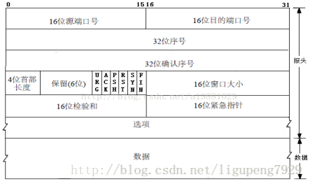
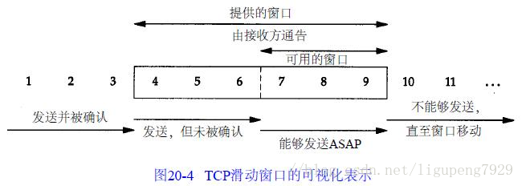
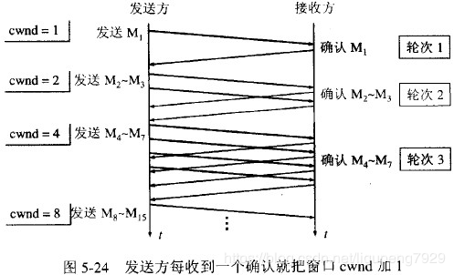
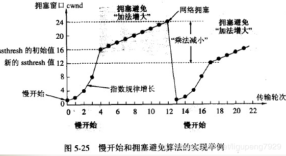

因此我们先了解一下16位的窗口大小究竟有什么作用。

窗口分为滑动窗口和拥塞窗口。

滑动窗口是接受数据端使用的窗口大小，用来告知发送端接收端的缓存大小，以此可以控制发送端发送数据的大小，从而达到流量控制的目的。

那么对于数据的发送端就是拥塞窗口了，拥塞窗口不代表缓存，拥塞窗口指某一源端数据流在一个RTT内可以最多发送的数据包数

一、滑动窗口

滑动窗口协议是传输层进行流控的一种措施，接收方通过通告发送方自己的可以接受缓冲区大小（这个字段越大说明网络吞吐量越高），从而控制发送方的发送速度，不过如果接收端的缓冲区一旦面临数据溢出，窗口大小值也会随之被设置一个更小的值通知给发送端，从而控制数据发送量（发送端会根据接收端指示，进行流量控制）。

 

对ACK的再认识，ack通常被理解为收到数据后给出的一个确认ACK，ACK包含两个非常重要的信息：

```
一是期望接收到的下一字节的序号n，该n代表接收方已经接收到了前n-1字节数据，此时如果接收方收到第n+1字节数据而不是第n字节数据，接 收方是不会发送序号为n+2的ACK的。举个例子，假如接收端收到1-1024字节，它会发送一个确认号为1025的ACK,但是接下来收到的是 2049-3072，它是不会发送确认号为3072的ACK,而依旧发送1025的ACK。
```


二是当前的窗口大小m，如此发送方在接收到ACK包含的这两个数据后就可以计算出还可以发送多少字节的数据给对方，假定当前发送方已发送到第x字节，则可以发送的字节数就是y=m-(x-n).这就是滑动窗口控制流量的基本原理.

滑动窗口协议如图所示:


 

 

在这个图中，我们将字节从1至11进行 标号。接收方通告的窗口称为提出的窗口，它覆盖了从第4字节到第9字节的区域，表明接收方已经确认了包括第3字节在内的数据，且通告窗口大小为6。我们知 道窗口大小是与确认序号相对应的。发送方计算它的可用窗口，该窗口表明多少数据可以立即被发送。当接收方确认数据后，这个滑动窗口不时地向右移动。窗口两 个边沿的相对运动增加或减少了窗口的大小。我们使用三个术语来描述窗口左右边沿的运动：

称窗口左边沿向右边沿靠近为窗口合拢。这种现象发生在数据被发送和确认时。
当窗口右边沿向右移动时将允许发送更多的数据，我们称之为窗口张开。这种现象发生在另一端的接收进程读取已经确认的数据并释放了T C P的接收缓存时。
当右边缘向左移动时，称之为窗口收缩。
当接收端的缓冲区满了，发送端接收到接收端的窗口大小为0，这个时候停止发送数据，这个时候发送端会过了超时重发的时间，发送一个窗口探测的包，此数据端仅含一个字节以获取最新的窗口大小信息


二、拥塞窗口


 拥塞控制：防止过多的数据注入到网络中，这样可以使网络中的路由器或链路不致过载。拥塞控制所要做的都有一个前提：网络能够承受现有的网络负荷。拥塞控制是一个全局性的过程，涉及到所有的主机、路由器，以及与降低网络传输性能有关的所有因素。

    流量控制：指点对点通信量的控制，是端到端正的问题。流量控制所要做的就是抑制发送端发送数据的速率，以便使接收端来得及接收。
    
    拥塞控制代价：需要获得网络内部流量分布的信息。在实施拥塞控制之前，还需要在结点之间交换信息和各种命令，以便选择控制的策略和实施控制。这样就产生了额外的开销。拥塞控制还需要将一些资源分配给各个用户单独使用，使得网络资源不能更好地实现共享。

2. 几种拥塞控制方法
    慢开始( slow-start )、拥塞避免( congestion avoidance )、快重传( fast retransmit )和快恢复( fast recovery )。

### 2.1 慢开始和拥塞避免
​    发送方维持一个拥塞窗口 cwnd ( congestion window )的状态变量。拥塞窗口的大小取决于网络的拥塞程度，并且动态地在变化。发送方让自己的发送窗口等于拥塞。

    发送方控制拥塞窗口的原则是：只要网络没有出现拥塞，拥塞窗口就再增大一些，以便把更多的分组发送出去。但只要网络出现拥塞，拥塞窗口就减小一些，以减少注入到网络中的分组数。
    
    慢开始算法：当主机开始发送数据时，如果立即所大量数据字节注入到网络，那么就有可能引起网络拥塞，因为现在并不清楚网络的负荷情况。因此，较好的方法是 先探测一下，即由小到大逐渐增大发送窗口，也就是说，由小到大逐渐增大拥塞窗口数值。通常在刚刚开始发送报文段时，先把拥塞窗口 cwnd 设置为一个最大报文段MSS的数值。而在每收到一个对新的报文段的确认后，把拥塞窗口增加至多一个MSS的数值。用这样的方法逐步增大发送方的拥塞窗口 cwnd ，可以使分组注入到网络的速率更加合理。



 

每经过一个传输轮次，拥塞窗口 cwnd 就加倍。一个传输轮次所经历的时间其实就是往返时间RTT。不过“传输轮次”更加强调：把拥塞窗口cwnd所允许发送的报文段都连续发送出去，并收到了对已发送的最后一个字节的确认。

另，慢开始的“慢”并不是指cwnd的增长速率慢，而是指在TCP开始发送报文段时先设置cwnd=1，使得发送方在开始时只发送一个报文段（目的是试探一下网络的拥塞情况），然后再逐渐增大cwnd。

    为了防止拥塞窗口cwnd增长过大引起网络拥塞，还需要设置一个慢开始门限ssthresh状态变量（如何设置ssthresh）。慢开始门限ssthresh的用法如下：
    
    当 cwnd < ssthresh 时，使用上述的慢开始算法。
    
    当 cwnd > ssthresh 时，停止使用慢开始算法而改用拥塞避免算法。
    
    当 cwnd = ssthresh 时，既可使用慢开始算法，也可使用拥塞控制避免算法。

拥塞避免算法：让拥塞窗口cwnd缓慢地增大，即每经过一个往返时间RTT就把发送方的拥塞窗口cwnd加1，而不是加倍。这样拥塞窗口cwnd按线性规律缓慢增长，比慢开始算法的拥塞窗口增长速率缓慢得多。

    无论在慢开始阶段还是在拥塞避免阶段，只要发送方判断网络出现拥塞（其根据就是没有收到确认），就要把慢开始门限ssthresh设置为出现拥塞时的发送 方窗口值的一半（但不能小于2）。然后把拥塞窗口cwnd重新设置为1，执行慢开始算法。这样做的目的就是要迅速减少主机发送到网络中的分组数，使得发生 拥塞的路由器有足够时间把队列中积压的分组处理完毕。
    
    如下图，用具体数值说明了上述拥塞控制的过程。现在发送窗口的大小和拥塞窗口一样大。

 


<1>. 当TCP连接进行初始化时，把拥塞窗口cwnd置为1。前面已说过，为了便于理解，图中的窗口单位不使用字节而使用报文段的个数。慢开始门限的初始值设置为16个报文段，即 cwnd = 16 。

<2>. 在执行慢开始算法时，拥塞窗口 cwnd 的初始值为1。以后发送方每收到一个对新报文段的确认ACK，就把拥塞窗口值另1，然后开始下一轮的传输（图中横坐标为传输轮次）。因此拥塞窗口cwnd 随着传输轮次按指数规律增长。当拥塞窗口cwnd增长到慢开始门限值ssthresh时（即当cwnd=16时），就改为执行拥塞控制算法，拥塞窗口按线 性规律增长。

<3>. 假定拥塞窗口的数值增长到24时，网络出现超时（这很可能就是网络发生拥塞了）。更新后的ssthresh值变为12（即变为出现超时时的拥塞窗口数值 24的一半），拥塞窗口再重新设置为1，并执行慢开始算法。当cwnd=ssthresh=12时改为执行拥塞避免算法，拥塞窗口按线性规律增长，每经过 一个往返时间增加一个MSS的大小。

强调：“拥塞避免”并非指完全能够避免了拥塞。利用以上的措施要完全避免网络拥塞还是不可能的。“拥塞避免”是说在拥塞避免阶段将拥塞窗口控制为按线性规律增长，使网络比较不容易出现拥塞。

 

 

### 2.2 快重传和快恢复
​    如果发送方设置的超时计时器时限已到但还没有收到确认，那么很可能是网络出现了拥塞，致使报文段在网络中的某处被丢弃。这时，TCP马上把拥塞窗口 cwnd 减小到1，并执行慢开始算法，同时把慢开始门限值ssthresh减半。这是不使用快重传的情况。

    快重传算法首先要求接收方每收到一个失序的报文段后就立即发出重复确认（为的是使发送方及早知道有报文段没有到达对方）而不要等到自己发送数据时才进行捎带确认。


接收方收到了M1和M2后都分别发出了确认。现在假定接收方没有收到M3但接着收到了M4。显然，接收方不能确认M4，因为M4是收到的失序报文段。根据 可靠传输原理，接收方可以什么都不做，也可以在适当时机发送一次对M2的确认。但按照快重传算法的规定，接收方应及时发送对M2的重复确认，这样做可以让 发送方及早知道报文段M3没有到达接收方。发送方接着发送了M5和M6。接收方收到这两个报文后，也还要再次发出对M2的重复确认。这样，发送方共收到了 接收方的四个对M2的确认，其中后三个都是重复确认。快重传算法还规定，发送方只要一连收到三个重复确认就应当立即重传对方尚未收到的报文段M3，而不必 继续等待M3设置的重传计时器到期。由于发送方尽早重传未被确认的报文段，因此采用快重传后可以使整个网络吞吐量提高约20%。

    与快重传配合使用的还有快恢复算法，其过程有以下两个要点：
    
    <1>. 当发送方连续收到三个重复确认，就执行“乘法减小”算法，把慢开始门限ssthresh减半。这是为了预防网络发生拥塞。请注意：接下去不执行慢开始算法。
    
    <2>. 由于发送方现在认为网络很可能没有发生拥塞，因此与慢开始不同之处是现在不执行慢开始算法（即拥塞窗口cwnd现在不设置为1），而是把cwnd值设置为 慢开始门限ssthresh减半后的数值，然后开始执行拥塞避免算法（“加法增大”），使拥塞窗口缓慢地线性增大。
    
    下图给出了快重传和快恢复的示意图，并标明了“TCP Reno版本”。
    
    区别：新的 TCP Reno 版本在快重传之后采用快恢复算法而不是采用慢开始算法。


说明：新的 TCP Reno 版本在快重传之后采用快恢复算法而不是采用慢启动算法。从接收方对发送方的流量控制的角度考虑，发送方的发送窗口一定不能超过对方给出的接收窗口rwind 。

也有的快重传实现是把开始时的拥塞窗口cwnd值再增大一点，即等于 ssthresh + 3 X MSS 。这样做的理由是：既然发送方收到三个重复的确认，就表明有三个分组已经离开了网络。这三个分组不再消耗网络 的资源而是停留在接收方的缓存中。可见现在网络中并不是堆积了分组而是减少了三个分组。因此可以适当把拥塞窗口扩大了些。

    在采用快恢复算法时，慢开始算法只是在TCP连接建立时和网络出现超时时才使用。
    
    采用这样的拥塞控制方法使得TCP的性能有明显的改进。
    
    接收方根据自己的接收能力设定了接收窗口rwnd，并把这个窗口值写入TCP首部中的窗口字段，传送给发送方。因此，接收窗口又称为通知窗口。因此，从接收方对发送方的流量控制的角度考虑，发送方的发送窗口一定不能超过对方给出的接收窗口rwnd 。
    
    发送方窗口的上限值 = Min [ rwnd, cwnd ]
    
    当rwnd < cwnd 时，是接收方的接收能力限制发送方窗口的最大值。
    
    当cwnd < rwnd 时，则是网络的拥塞限制发送方窗口的最大值。

 


两者简单比较：
相同：提高网络性能。 
不同： 
  [1].流量控制：在TCP连接上实现对发送流量的控制，考虑点对点之间对通信量的控制，端到端，即：控制发送端的数据发送速率，使接收端可以来得及接收，保证网络高效稳定运行。 
  [2].拥塞控制：处理网络拥塞现象，考虑网络能够承受现有的网络负荷，全局性变量，涉及所有的路由器、主机以及与降低网络传输性能有关的因素。防止过多的数据注入到网络，使网络中的路由器或链路不致过载，确保通信子网可以有效为主机传递分组。

