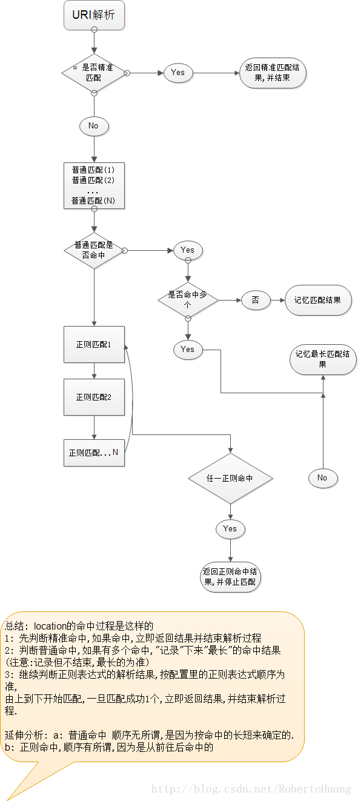

# Nginx

## 优点

。。。

。。。

## location 匹配规则

location 语法

```properties
location [ = | ~ | ~* | ^~] uri {
}
```

1、= ：用于不含正则表达式的 uri 前，要求请求字符串与 uri 严格匹配，如果匹配成功，就停止继续向下搜索并立即处理该请求。

2、~：用于表示 uri 包含正则表达式，并且区分大小写。

3、~*：用于表示 uri 包含正则表达式，并且不区分大小写。

4、^~：用于不含正则表达式的 uri 前，跳过正则，要求 Nginx 服务器找到标识 uri 和请求字符串匹配度最高的 location 后，立即使用此 location 处理请求，而不再使用 location 块中的正则 uri 和请求字符串做匹配。

**注意：如果 uri 包含正则表达式，则必须要有 ~ 或者 ~* 标识。**

> 匹配顺序总结为以下两点：
>
> 1. 匹配的顺序是先匹配普通字符串，然后再匹配正则表达式。另外普通字符串匹配顺序是根据配置中字符长度从长到短，也就是说使用普通字符串配置的location顺序是无关紧要的，反正最后nginx会根据配置的长短来进行匹配，但是需要注意的是正则表达式按照配置文件里的顺序测试。找到第一个匹配的正则表达式将停止搜索。
>
> 2. 一般情况下，匹配成功了普通字符串location后还会进行正则表达式location匹配。有两种方法改变这种行为，其一就是使用“=”前缀，这时执行的是严格匹配，并且匹配成功后立即停止其他匹配，同时处理这个请求；另外一种就是使用“^~”前缀，如果把这个前缀用于一个常规字符串那么告诉nginx 如果路径匹配那么不测试正则表达式。



## 代理

### 正向代理

客户端需要做一些配置，此时客户端知道我要采用代理的方式来进行访问

如 VPN


### 反向代理

反向代理和正向代理的区别就是：**正向代理代理客户端，反向代理代理服务器。**

反向代理，其实客户端对代理是无感知的，因为客户端不需要任何配置就可以访问，我们只需要将请求发送到反向代理服务器，由反向代理服务器去选择目标服务器获取数据后，在返回给客户端，此时反向代理服务器和目标服务器对外就是一个服务器，暴露的是代理服务器地址，**隐藏了真实服务器IP地址**。

**反向代理配置：**

```properties
#配置反向代理tomcat服务器：拦截.jsp结尾的请求转向到tomcat
location ~ \.jsp$ {
    proxy_pass http://192.168.1.171:8080;
}	
```


## 负载均衡

> 为什么要用负载均衡？：减轻服务器压力，将流量分发到不同的服务器

负载均衡主要通过专门的硬件设备或者软件算法实现。通过硬件设备实现的负载均衡效果好、效率高、性能稳定，但是成本较高。而通过软件实现的负载均衡主要依赖于均衡算法的选择和程序的健壮性。均衡算法又主要分为两大类：

* 静态负载均衡算法：主要包括轮询算法、基于比率的加权轮询算法或者基于优先级的加权轮询算法。

* 动态负载均衡算法：主要包括基于任务量的最少连接优化算法、基于性能的最快响应优先算法、预测算法及动态性能分配算法等。

静态负载均衡算法在一般网络环境下也能表现的比较好，动态负载均衡算法更加适用于复杂的网络环境。


#### 负载均衡配置

```properties
upstream OrdinaryPolling {
server 127.0.0.1:8080;
server 127.0.0.1:8081;
}
server {
	listen       80;
	server_name  localhost;

	location / {
		proxy_pass http://OrdinaryPolling;
		index  index.html index.htm index.jsp;

	}
}
```

效果：


#### 加权轮训配置

**由于Tomcat1服务器的配置更高点，我们希望该服务器接受更多的请求，而 Tomcat2 服务器配置低，希望其处理相对较少的请求。**

那么这时候就用到了加权轮询机制了。

```properties
upstream OrdinaryPolling {
      server 127.0.0.1:8080 weight=5;
      server 127.0.0.1:8081 weight=2;
}
# 其他都不变
```


#### session 共享问题

http协议是无状态的，通常保存状态是通过cookies 、session机制，这些信息是单个服务器独有的，但是如果用户请求被分发到多个服务器上，则用户需要重复建立回话，影响用户体验。

这既是集群环境下的session共享问题

解决办法有两种：

1. 选择中间件存储护花信息，如Redis
2. 根据ip控制用户访问的服务器，此时就没有session共享的问题了

而Ngnix采用的就是第二种方式，主要有一下策略

配置：

```properties
upstream OrdinaryPolling {
	  ip_hash;   
	  # 就是简单的加了一个ip hash
      server 127.0.0.1:8080 weight=5;
      server 127.0.0.1:8081 weight=2;
}
# 其他都不变
```

#### 按照服务器响应时间负载分配

> 根据服务器处理请求的时间来进行负载，处理请求越快，也就是响应时间越短的优先分配。

```properties
upstream OrdinaryPolling {
      server 127.0.0.1:8080 weight=5;
      server 127.0.0.1:8081 weight=2;
      fair;
}
```

#### 根据访问url实现负载均衡

> 配置多个location ，通过字符串或者正则，选择代理到不同的服务器上，每个服务器配置一个负载均衡，再次将流量分发。


#### 负载均衡算法

> Nginx 主要有5中实现负载均衡的算法

- [1.round robin（默认）](#round robin（默认）)
- [2.weight](https://www.cnblogs.com/DarrenChan/p/8967412.html#_label1)
- [3. IP_hash](https://www.cnblogs.com/DarrenChan/p/8967412.html#_label2)
- [4.url_hash（第三方）](https://www.cnblogs.com/DarrenChan/p/8967412.html#_label3)
- [5. fair（第三方）](https://www.cnblogs.com/DarrenChan/p/8967412.html#_label4)

##### round robin（默认）
轮询方式，依次将请求分配到各个后台服务器中，默认的负载均衡方式。 
适用于后台机器性能一致的情况。 
挂掉的机器可以自动从服务列表中剔除。

##### weight

根据权重来分发请求到不同的机器中，指定轮询几率，weight和访问比率成正比，用于后端服务器性能不均的情况。  

例如：  

```
upstream bakend {    
server 192.168.0.14 weight=10;    
server 192.168.0.15 weight=10;    
}  
```

##### IP_hash

根据请求者ip的hash值将请求发送到后台服务器中，可以保证来自同一ip的请求被打到固定的机器上，可以解决session问题。

例如：

```properties
upstream bakend {    
    ip_hash;    
    server 192.168.0.14:88;    
    server 192.168.0.15:80;    
}   
```

##### url_hash（第三方）

根据请求的url的hash值将请求分到不同的机器中，当后台服务器为缓存的时候效率高。

例如：

在upstream中加入hash语句，server语句中不能写入weight等其他的参数，hash_method是使用的hash算法  

```properties
upstream backend {    
    server squid1:3128;    
    server squid2:3128;    
    hash $request_uri;
    hash_method crc32;
}  
```

##### fair（第三方）

根据后台响应时间来分发请求，响应时间短的分发的请求多。

例如：

```
upstream backend {    
server server1;    
server server2;    
fair;    
}  
```

### tips

```properties
upstream bakend{#定义负载均衡设备的Ip及设备状态    
ip_hash;    
server 127.0.0.1:9090 down;    
server 127.0.0.1:8080 weight=2;    
server 127.0.0.1:6060;    
server 127.0.0.1:7070 backup;    
}
```

1. down 表示单前的server暂时不参与负载  
2. weight 默认为1.weight越大，负载的权重就越大。  
3. max_fails ：允许请求失败的次数默认为1.当超过最大次数时，返回proxy_next_upstream 模块定义的错误  
4. fail_timeout:max_fails次失败后，暂停的时间。  
5. backup： 其它所有的非backup机器down或者忙的时候，请求backup机器。所以这台机器压力会最轻。  

## 参数

```properties
$arg_PARAMETER #这个变量包含GET请求中，如果有变量PARAMETER时的值。

$args #这个变量等于请求行中(GET请求)的参数，例如foo=123&bar=blahblah;

$binary_remote_addr #二进制的客户地址。

$body_bytes_sent #响应时送出的body字节数数量。即使连接中断，这个数据也是精确的。

$content_length #请求头中的Content-length字段。

$content_type #请求头中的Content-Type字段。

$cookie_COOKIE #cookie COOKIE变量的值

$document_root #当前请求在root指令中指定的值。

KaTeX parse error: Expected 'EOF', got '#' at position 14: document_uri #̲与uri相同。

$host #请求主机头字段，否则为服务器名称。

$hostname #Set to the machine’s hostname as returned by gethostname

$http_HEADER

KaTeX parse error: Expected 'EOF', got '#' at position 9: is_args #̲如果有args参数，这个变量等于”?”，否则等于”"，空值。

$http_user_agent #客户端agent信息

$http_cookie #客户端cookie信息

$limit_rate #这个变量可以限制连接速率。

KaTeX parse error: Expected 'EOF', got '#' at position 14: query_string #̲与args相同。

$request_body_file #客户端请求主体信息的临时文件名。

$request_method #客户端请求的动作，通常为GET或POST。

$remote_addr #客户端的IP地址。

$remote_port #客户端的端口。

$remote_user #已经经过Auth Basic Module验证的用户名。

$request_completion #如果请求结束，设置为OK. 当请求未结束或如果该请求不是请求链串的最后一个时，为空(Empty)。

$request_method #GET或POST

$request_filename #当前请求的文件路径，由root或alias指令与URI请求生成。

$request_uri #包含请求参数的原始URI，不包含主机名，如：”/foo/bar.PHP?arg=baz”。不能修改。

$scheme #HTTP方法（如http，https）。

$server_protocol #请求使用的协议，通常是HTTP/1.0或HTTP/1.1。

$server_addr #服务器地址，在完成一次系统调用后可以确定这个值。

$server_name #服务器名称。

$server_port #请求到达服务器的端口号。
```


## 配置

```properties

#user  nobody;

#开启进程数 <=CPU数 
worker_processes  1;

#错误日志保存位置
#error_log  logs/error.log;
#error_log  logs/error.log  notice;
#error_log  logs/error.log  info;

#进程号保存文件
#pid        logs/nginx.pid;

#每个进程最大连接数（最大连接=连接数x进程数）每个worker允许同时产生多少个链接，默认1024
events {
    worker_connections  1024;
}

http {
	#文件扩展名与文件类型映射表
    include       mime.types;
	#默认文件类型
    default_type  application/octet-stream;

	#日志文件输出格式 这个位置相于全局设置
    log_format  main  '$remote_addr - $remote_user [$time_local] "$request" '
                      '$status $body_bytes_sent "$http_referer" '
                      '"$http_user_agent" "$http_x_forwarded_for"';

	#请求日志保存位置
    #access_log  logs/access.log  main;
	
	#打开发送文件
    sendfile        on;
    #tcp_nopush     on;

    #keepalive_timeout  0;
	#连接超时时间
    keepalive_timeout  65;

	#打开gzip压缩
    #gzip  on;
	
	#设定请求缓冲
	#client_header_buffer_size 1k;
	#large_client_header_buffers 4 4k;
	
	#设定负载均衡的服务器列表
	#upstream myproject {
		#weigth参数表示权值，权值越高被分配到的几率越大
		#max_fails 当有#max_fails个请求失败，就表示后端的服务器不可用，默认为1，将其设置为0可以关闭检查
		#fail_timeout 在以后的#fail_timeout时间内nginx不会再把请求发往已检查出标记为不可用的服务器
	#}
	
    #webapp
    #upstream myapp {   
  	# server 192.168.1.171:8080 weight=1 max_fails=2 fail_timeout=30s;   
	# server 192.168.1.172:8080 weight=1 max_fails=2 fail_timeout=30s;   
    #} 

	#配置虚拟主机，基于域名、ip和端口
    server {
		#监听端口
        listen       80;
		#监听域名
        server_name  localhost;

        #charset koi8-r;
		
		#nginx访问日志放在logs/host.access.log下，并且使用main格式（还可以自定义格式）
        #access_log  logs/host.access.log  main;

		#返回的相应文件地址
        location / {
            #设置客户端真实ip地址
            #proxy_set_header X-real-ip $remote_addr;		
			#负载均衡反向代理
			#proxy_pass http://myapp;
			
			#返回根路径地址（相对路径:相对于/usr/local/nginx/）
            root   html;
			#默认访问文件
            index  index.html index.htm;
        }

		#配置反向代理tomcat服务器：拦截.jsp结尾的请求转向到tomcat
        #location ~ \.jsp$ {
        #    proxy_pass http://192.168.1.171:8080;
        #}		
		
        #error_page  404              /404.html;
        # redirect server error pages to the static page /50x.html
        #
		
		#错误页面及其返回地址
        error_page   500 502 503 504  /50x.html;
        location = /50x.html {
            root   html;
        }

        # proxy the PHP scripts to Apache listening on 127.0.0.1:80
        #
        #location ~ \.php$ {
        #    proxy_pass   http://127.0.0.1;
        #}

        # pass the PHP scripts to FastCGI server listening on 127.0.0.1:9000
        #
        #location ~ \.php$ {
        #    root           html;
        #    fastcgi_pass   127.0.0.1:9000;
        #    fastcgi_index  index.php;
        #    fastcgi_param  SCRIPT_FILENAME  /scripts$fastcgi_script_name;
        #    include        fastcgi_params;
        #}

        # deny access to .htaccess files, if Apache's document root
        # concurs with nginx's one
        #
        #location ~ /\.ht {
        #    deny  all;
        #}
    }
	
	#虚拟主机配置：
	server {
		listen 1234;
		server_name bhz.com;
		location / {
		#正则表达式匹配uri方式：在/usr/local/nginx/bhz.com下 建立一个test123.html 然后使用正则匹配
		#location ~ test {
			## 重写语法：if return （条件 = ~ ~*）
			#if ($remote_addr = 192.168.1.200) {
			#       return 401;
			#}		
			# 如果 用户的浏览器是 firefox(忽略大小写) 就重定向到...
			#if ($http_user_agent ~* firefox) {
			#	   rewrite ^.*$ /firefox.html;
			#	   break;
			#}			
						
			root bhz.com;
			index index.html;
		}
		
		#location /goods {
		#		rewrite "goods-(\d{1,5})\.html" /goods-ctrl.html;
		#		root bhz.com;
		#		index index.html;
		#}
		
		#配置访问日志
		access_log logs/bhz.com.access.log main;
	}
	


    # another virtual host using mix of IP-, name-, and port-based configuration
    #
    #server {
    #    listen       8000;
    #    listen       somename:8080;
    #    server_name  somename  alias  another.alias;

    #    location / {
    #        root   html;
    #        index  index.html index.htm;
    #    }
    #}


    # HTTPS server
    #
    #server {
    #    listen       443 ssl;
    #    server_name  localhost;

    #    ssl_certificate      cert.pem;
    #    ssl_certificate_key  cert.key;

    #    ssl_session_cache    shared:SSL:1m;
    #    ssl_session_timeout  5m;

    #    ssl_ciphers  HIGH:!aNULL:!MD5;
    #    ssl_prefer_server_ciphers  on;

    #    location / {
    #        root   html;
    #        index  index.html index.htm;
    #    }
    #}

}

```

