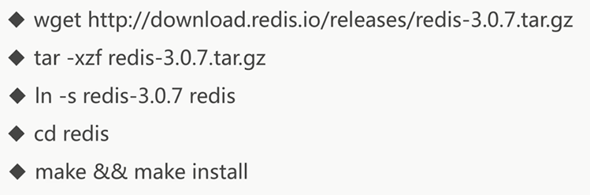
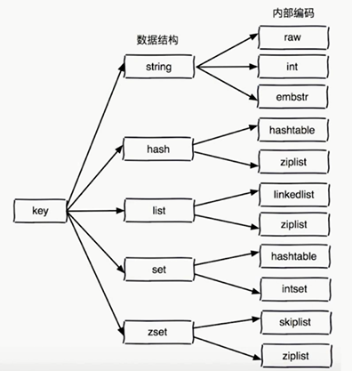
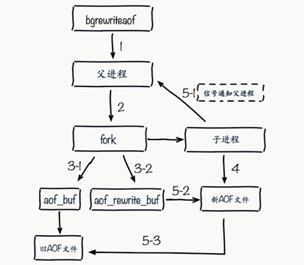
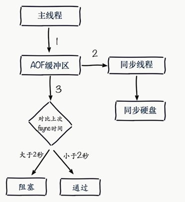

## Redis

### 线程模型

NIO 单线程

> 文件事件处理器

IO多路复用

### Redis 于 memcached 的区别

数据结构 Redis 比较多

内存使用效率memcached更高

性能Redis只使用单核，而memcached可以使用多核，性能更高

memcached没有原生集群模式（能通过第三方插件实现），Redis支持cluster模式


### Redis 数据结构

* 字符串
* hashMap
* list
* set 集合
* sort set 有序jihe
* BitMaps  位图
* HyperLogLog   超小内存唯一计数
* GEO  地理位置信息


### 高可用&分布式

Redis-Sentinel（V2.8)

Redis-Cluster（V3.0)


### 应用场景

缓存（最主要的应用）

排行榜

点赞数

简单的发布订阅  


### 启动



### 配置

获取所有的配置情况

```sh
> config get * 
```


### 简单使用

keys [pattern]

dbsize  判断数据库存放的数据数量 

exists key  检查key是否存在

del key  删除指定的key-value  返回值 1 成功，0 key不存在

expire key seconds  声明周期

ttl  查看当前key的过期时间   ttl返回-2如果key已经被删除了  -1 表示key存在，但是没有过期时间

persist key  去掉过期时间  如果还没有过期

type  查看类型

> 除了keys 是 O(n)复杂度，其他都是O(1)


### redis底层

#### RedisObject

* 数据类型 type
  * string
  * hash
  * list
  * set
  * sortSet
* 编码方式 encoding
  * raw
  * int
  * ziplist
  * linkedlist
  * hashtable  |  hashmap
  * intset
* 数据指针ptr
* 虚拟内存 vm
* 其他




#### 为何那么快

* 纯内存
* 非阻塞IO 内部使用了Epoll模型
* 避免线程切换和竞态消耗

#### 单线程

一次只运行一条命令

拒绝长命令   keys，  flushall  ，flushdb  ，slow lua script，operate big value

其实吧，也不是单线程，fysnc file descriptor| close file descriptor 还是用了多线程来处理

### 数据结构

#### 字符串

key 为字符串  最大值512M

value 可以是字符串，数字，二进制

##### 使用场景：

* 缓存

* 计数器

* 分布式锁

##### API

* get key
* mget key1,key2 获取多个key 对应的value
* set key valye
* getset key newvalue  获取旧的值设置新的值
* append key value  将value追加到旧的value  （字符串？） 返回总长度
* strlen key  获取字符串长度（注意中文 * 2）O(1)复杂度
* setnx key value  如果key不存在，才设置 （原子操作，可用于实现分布式锁）
* set key value xx (xx固定的) 如果key存在，才设置
* incr key    自增key的值，如果key不存在，则自增后返回get(key) =1；
* decr key    如果key不存在 ，返回get(key) = -1
* incrby key x    增加x ，如果key不存在，返回get(key) = x
* decrby
* incrbyfloat key 3.5 将key增加3.5 
* getrange key start end   获取字符串指定下标的所有值 返回范围为(start ,,,,end)， 长度为（end-start+1）
* setrange key index value 设置指定下标的值

为什么要用mset: 

* n次get  =  n次网络时间 + n次命令时间
* mget = 1次网络时间 + n 次命令时间


#### hash

> 将每一个key，看做一个表，表中存放了一个键值对，也可以看成是mapmap，key 对应一个map，而这个map中又对应了一个key-value结构的map 

##### 应用场景

网站访问量  

##### API

* **hget key field** 
* **set key field value**
* **hdel key field**
* **hexists key field**  判断某个key 是否有field  O(1)
* **hlen key**  判断 一个key中有多少field  O(1)
* **hmget key field1,field2**  O(n)
* **hmset key field value filed2 value2**
* **hincrby key filed count**  将某个key对应的map 的某个field增加count （虽然不如字符串那么多incr，但是可以通过这一个命令去实现所有的命令）
* **hincribyfloat**   浮点数版本
* **hsetnx key filed value**  如果不存在，则设置，如果存在，则失败(return 0)
* **hgetall  key** 返回所有filed   O(n)

> hash好虽好，但是不能对每个field设置过期时间（过期时间ttl只能通过key 来设置）

#### List

##### 应用场景


##### API

* lpush key value1,value2   从右面插入
* rpush key value1,value2
* linset key before|after value newvalue  在指定的值前|后面插入newvalue
* lpop key  从左边弹出元素
* rpop kye  
* lrem key count value   根据count的值进行删除和value相等的项 O(n)
  1. count > 0 从左到右，依次删除count个value值
  2. count < 0 从右到左，依次删除abs(count) 个value的值
  3. count = 0 删除所有
* ltrim key start end  按照索引修剪列表，值保留start 到 end 范围内的value
* lrange key start end  遍历开始到结束的值  start 可以为负值 （解析为+lengh 后的值），如果end 为-1 ，则代表从start到所有
* lindex key index  获取下标为index的值  O(n)
* llen key  列表的长度 O(1)
* lset key index newValue  设置新的值
* blpop key timeout（s)  阻塞的弹出，如果没有值，就阻塞，直到有值或者超时 ，如果timeout 为 0 代表 死等
* brpop key timeout 

**有趣的组合：**

stack  ： lpush + lpop

queue ：lpush + rpop

固定集合： lpush + ltrim

MQ: lpush + brpop


#### set

##### 应用场景

使用spop进行抽奖系统

赞的实现

 给用户添加标签

共同关注  sunion 

无序

无重复

##### API

* sadd key value  如果存在，就会失败（return 0）  O(1)
* srem key value  O(1)
* scard  key  计算总数
* sismember  key  判断是否存在  =1 存在  =0 不存在
* srandremember key count  随机从set中取出count个元素  ，不会删除元素
* spop key count 随机弹出count个元素，会删除元素
* smembers key  取出所有元素

**集合间的操作**

* sdiff  差集
* sinter 交集
* sunion 并集

#### zset

##### 应用场景


##### API

> 有序的集合的value 可以看做是 score  +  value 

* zadd key [score element ]*  O(logn)
* zrem key element *
* zscore key element  返回分数
* zincrby key incriScore element
* zcard key  元素个数
* zrange key start end  [withscore]  返回在某个索引没的value  [可以附加score] end为-1 则直到最后
* zrangebuscore key min max [withscore]  返回在某个score范围内的value [可以附加score]
* zcount key min max 获取范围个数
* zremrangebyrank  key start end  根据排名进行删除
* zremrangebyscore  key min max  根据score 范围进行删除

不常用：

* zrevrank  获取排名
* zrevrange
* zrevrangebyscore
* zinterstore
* zunionstore


### redis客户端

#### jedis

> java中Jedis的客户端一些命令都和redis的API很像

连接池 

`getJedisFromPool`  高性能，避免TCP连接断开的开销

`jedis = jedisPool.getResource()`

#### redis-py

#### redigo


### 瑞士军刀Redis

#### 慢查询

生命周期

1. send commed
2. 排队
3. 执行
4. 返回结果

慢查询发生在第三阶段


#### popeline

流水线命令

将一些命令打包发送给服务器执行，执行完毕后，服务器返回所有操作的结果

```java
Pipiline pipeline = jedis.pipeline();
pipeline.hset|zadd...();
pipeline.syncAndReturnAll();
```

于M操作对比
M操作时原子命令，而pipeline不是原子操作，而死在服务端拆分


#### 发布订阅

角色：

* 发布者
* 订阅者
* 频道

通讯模型

生产者和订阅者都是cli  ，而频道在server，发布者往server的频道中发送消息，订阅者收到消息


##### API

* pulish channel message  返回订阅者个数
* subscribe [channel] 订阅频道  客户端订阅后，返回订阅的频道和数量，且会阻塞，如果有发布者发布消息，会收到消息
* unsubscribe [channel] 取消订阅
* psubscribe [pattern...]  订阅模式
* pubsub channels 列出至少一个订阅者的频道
* pubsub numsub  [channel]  列出给定频道的订阅者数量
* pubsub numpat  列出被订阅 模式的数量

> 消息队列和发布订阅的区别：前者是强占消息，消息只能被一个消费者消费，后者所有订阅者都能收到消息


#### bitmap

可以通过bit位进行一些二进制操作，比如，用户访问量：

假如有1000W个用户，我们如果用set来保存每个用户的id（假设是Integer）则需要32*1000W bit

如果用bitmap来存储，只需要1000Wbit


##### API

* setbit key offset value(0|1)  设置一个值的offset位的比特值  如果过于大，缺少部分将会补0
* getbit key offset   返回0或者1
* bitcount key [start end]  获取指定范围的1的个数
* bitop op(and|or|xor|not) destkey key [key...] 将key进行op操作后赋值给destkey ,返回字节长度
* bitpos key targetBit [start] [end] 计算指定范围，第一个bit位的值为targetBit的下标位置


#### HyperLogLog


##### 实现

维基百科。。。

本质是个字符串

判断独立用户个数

会有百分之0.81 的错误率

##### API

* pfadd key element [element...] 想hll中添加元素
* pfcount key [key...] 计算元素个数
* pfmerge destkey key [key...]  合并多个key到destkey中


#### GEO

> GEO 存储地理信息定位

##### API

* geo key longitude latitude member添加member地方的经纬度

* peopos key member[member...]  获取一些地方的经纬度

* geodist key member1 member2 unit(m|km|mi英里|ft尺) 计算两地的距离

* georadius key longitude latitude radiusm|km|mi [withcoord] [withdist] [withhash] [COUNT count] [asc|dsc] [store key] [storedis key]

* georadiusbymember key member  [...同上...]

  withcoord : 返回结果包含经纬度

  withdist: 返回结果中包含距离中心节点的位置

  withhash: 返回结果中包含geohash

  COUNT count: 指定返回结果的数量

  asc|desc: 返回结果按照距离中心节点的距离做升序或者降序

  store key: 将返回结果的地理位置信息保存到指定键

  storedist key : 将返回结果距离中心节点的距离保存到指定的键


### 持久化

> 持久化，就是把内存中的数据dump到硬盘中永久保存

#### RDB

> 将内存中完整的数据都保存到rdb文件中
>
> 当redis重启时，将rdb中的数据在读到内存中

##### 触发机制

* save

* bgsave  (多进程)  fork一个进程来处理，fork过程还是会阻塞客户端进程

  fork子进程过程中，子进程和父进程共享一块内存三级页表，而且有copy-on-write策略，所以不会复制父进程的数据到自己进程中，但是IO依旧很慢

* 自动  在config中配置 

  seconds  changes  在seconds秒内有changes次写入操作，就出发一次保存操作（是否是异步的？）


**save & bgsave** 

save不消耗额外内存，但是bgsave的fork还是会消耗额外内存，这取决于是否能忍受客户端的阻塞时间

##### 配置

通常不适用默认触发配置，而根据实际情况进行配置

rdb文件名称通常为 `dump-${port}.rdb` 

dir 也会选择一个硬盘路径，而不是默认在当前文件夹下


#### AOF

> 记录日志而不是所有，比如set key value ,aof文件就会格式化该命令进行写入

##### 触发机制

* always

  每条命令都会写入

* seconds

  命令存到缓冲区，每秒写入，在高性能中保护硬盘，但可能会丢失一秒数据

* no

  让操作系统来判断是否写入，此方法不可控

**AOF重写**

将一些命令进行优化保存

* 比如过期数据命令丢弃
* 重复set 相同的value只保存最后一条
* 重复增加命令可以直接赋值为总和
* list的push操作可以写成一条

> 减少磁盘占用率，加速恢复速度

##### 重写AOF方式

* bgrewriteaof   fork子进程，将内存中的数据进行回溯


###### 配置

`auto-aof-rewrite-min-size`   aof文件重写需要的尺寸

`auto-aof-rewirte-percentage`   aof 文件增长率

**统计项**

`aof_current_size`    aof 当前尺寸（字节为单位）

`aof_base_size`    aof 上次启动和重写的尺寸（字节为单位）

###### 重写机制

当同事满足一下两条的时候就进行重写

```
aof_current_size  >  auto-aof-rewrite-min-size
(aof_current_size  -  aof_base_size)  /  aof_base_size  >   auto-aof-rewirte-percentage
```

AOF重写流程



2: 当开始重写，父进程fork一个子进程来执行重写

3-1,3-2:  在执行重写过程中，会将当前的写命令以两个管道的方式分别输出到旧的aof文件和aof_rewrite_buf 中，来进行aof写入期间的一个数据补充

4: 子进程生成重写的aof命令

5-2,5-3 : 重写完成后，补充重写期间的命令到新的aof文件中，并用新的文件特换旧的aof文件


##### 配置

appendonly   yes  不打开怎么aof

appendonlyfilename 

appendfsync everysec  写入策略

dir  保存目录

no-appendfsync-on-rewrite yes   是否在aof重写过程中对旧文件进行append操作，这里是no，所以是不重写

`auto-aof-rewrite-min-size`  64mb   aof文件重写需要的尺寸

`auto-aof-rewirte-percentage`  100   aof 文件增长率

aof-load-truncated yes  在server重启时，是否忽略aof文件中的错误（产生错误的原因可能是aof重写过程中宕机）


##### 一些命令

由于aof支持动态改变，所以可以用config命令来进行设置

```sh
cli> config get appendonly
cli> config set appendonly yes
cli> config rewrite   #  OK
```

#### EDB和AOF混合模式


#### RDB和AOF进行抉择

| 命令       | RDB        | AFO          |
| ---------- | ---------- | ------------ |
| 启动优先级 | 低         | 高           |
| 体积       | 小         | 大           |
| 回复速度   | 快         | 慢           |
| 数据安全性 | 可能丢数据 | 看你的决策了 |
| 轻重       | 重量级     | 轻量级       |


### 常见问题

#### fork操作

同步操作：虽然fork 不是内存的拷贝，而是内存页的拷贝（三级页表）

与内存有关：内存越大，页越大

info ：latst_fork_usec  上次fork所用的时间

**如何改善：**

 硬件问题

通过maxmemory 进行对Redis使用内存的限制

Linux的内存分配策略  vm.overcommit_memory=1  （默认为0）当内存不够内存分配的时候，就不去分配，这可能会导致fork操作的阻塞

降低fork频率 

#### 进程外的开销

CPU开销： rdb和aof文件属于CPU密集型操作

**优化**

不要做CPU绑定，不和CPU密集型部署

no-appendfsync-on-rewrite = yes 

#### AOF阻塞

使用everysec(每秒)刷盘策略的流程图



AOF 阻塞策略：

1. 主线程负责AOF缓冲区

2. AOF线程负责每秒一次同步磁盘操作,并记录最近一次同步时间.

3. 主线程对比AOF同步时间:
   1. 如果距离上次同步时间在两秒内,主线程直接返回。
   2. 如果距离上次同步时间超过两秒(意识是现在还在同步),主线程将会被阻塞, 直到同步完成。

可以通过以下命令查看

info: persistence 

aof_delayed_fsync : 100

因为aof阻塞产生的次数

**没办法，优化你的硬盘去吧...**