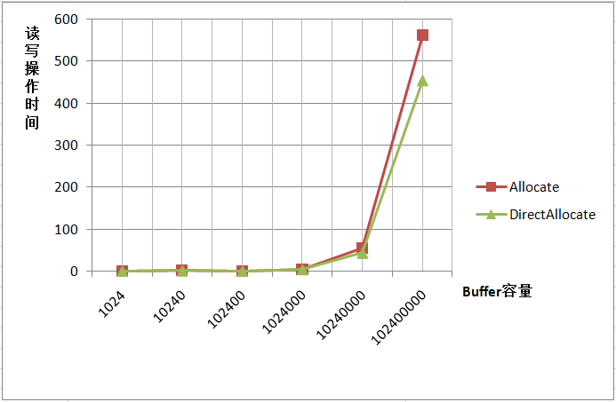
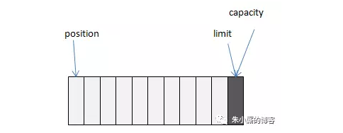
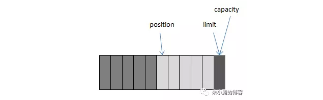
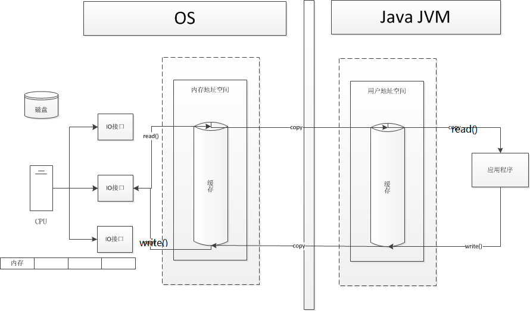
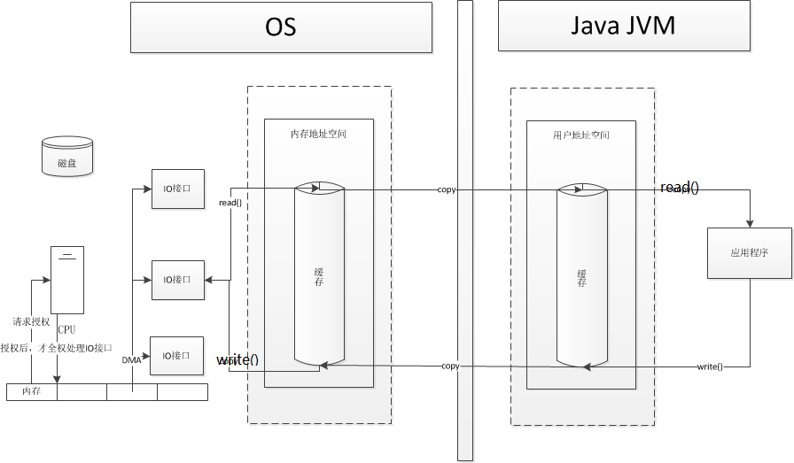
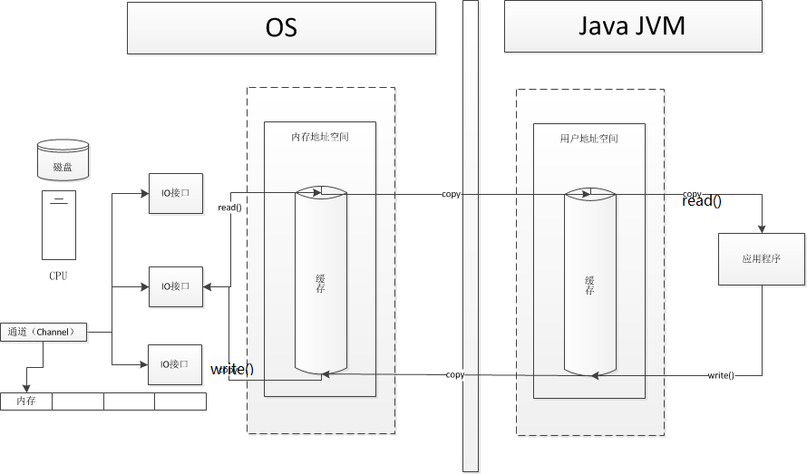

# IO

> java 的 IO ，主要 有BIO，NIO，AIO，分别为阻塞式，(可选)非阻塞式，和异步回调式(类似于nodeJs)

## BIO

> 这有什么说的呢，恩，没有~

## NIO

[这个博客讲的很好](https://blog.csdn.net/u011381576/article/details/79876754)

Java NIO 的核心组成部分：

1. **Channels**

2. **Buffers**

3. **Selectors**

> channel 是一个绕不开的话题

### channel

> 由java.nio.channels包定义的，Channel表示IO源与目标打开的连接，Channel类似于传统的“流”，只不过Channel本身不能直接访问数据，**Channel只能与Buffer进行交互**。通道主要用于传输数据，从缓冲区的一侧传到另一侧的实体（如文件、套接字...），反之亦然；通道是访问IO服务的导管，通过通道，我们可以以最小的开销来访问操作系统的I/O服务；顺便说下，缓冲区是通道内部发送数据和接收数据的端点。

> 与缓冲区**不同**，通道API主要由**接口**指定。不同的操作系统上通道实现（Channel Implementation）会有根本性的差异，所以通道API仅仅描述了可以做什么。因此很自然地，通道实现经常使用操作系统的**本地代码**。通道接口允许您以一种受控且可移植的方式来访问底层的I/O服务。


在哪之前，又涉及到buffer的概念

#### buffer

在Java中当我们要对数据进行更底层的操作时，一般是操作数据的字节（byte）形式，这时经常会用到ByteBuffer这样一个类。ByteBuffer提供了两种静态实例方式： 

```java
public static ByteBuffer allocate(int capacity)  
public static ByteBuffer allocateDirect(int capacity)  
```

> 第一种分配方式产生的内存开销是在JVM中的，而另外一种的分配方式产生的开销在JVM之外，以就是系统级的内存分配。当Java程序接收到外部传来的数据时，首先是被系统内存所获取，然后在由系统内存**复制**到JVM内存中供Java程序使用。所以在另外一种分配方式中，能够省去复制这一步操作，效率上会有所提高。可是系统级内存的分配比起JVM内存的分配要耗时得多，所以并非不论什么时候allocateDirect的操作效率都是最高的。



> 由图能够看出，当操作数据量非常小时，两种分配方式操作使用时间基本是同样的，第一种方式有时可能会更快，可是当数据量非常大时，另外一种方式会远远大于第一种的分配方式

使用Buffer一般遵循下面几个步骤：

- 分配空间（ByteBuffer buf = ByteBuffer.allocate(1024); 还有一种allocateDirector后面再陈述）
- 写入数据到Buffer(int bytesRead = fileChannel.read(buf);)
- 调用filp()方法（ buf.flip();）
- 从Buffer中读取数据（System.out.print((char)buf.get());）
- 调用clear()方法或者compact()方法


Buffer顾名思义：缓冲区，实际上是一个容器，一个连续数组。Channel提供从文件、网络读取数据的渠道，但是读写的数据都必须经过Buffer。如下图：


向Buffer中写数据：

- 从Channel写到Buffer (fileChannel.read(buf))
- 通过Buffer的put()方法 （buf.put(…)）

从Buffer中读取数据：

- 从Buffer读取到Channel (channel.write(buf))
- 使用get()方法从Buffer中读取数据 （buf.get()）

可以把Buffer简单地理解为一组基本数据类型的元素列表，它通过几个变量来保存这个数据的当前位置状态：capacity, position, limit, mark：

| 索引     | 说明                                                    |
| -------- | ------------------------------------------------------- |
| capacity | 缓冲区数组的总长度                                      |
| position | 下一个要操作的数据元素的位置                            |
| limit    | 缓冲区数组中不可操作的下一个元素的位置：limit<=capacity |
| mark     | 用于记录当前position的前一个位置或者默认是-1            |



举例：我们通过ByteBuffer.allocate(11)方法创建了一个11个byte的数组的缓冲区，初始状态如上图，position的位置为0，capacity和limit默认都是数组长度。当我们写入5个字节时，变化如下图：




这时我们需要将缓冲区中的5个字节数据写入Channel的通信信道，所以我们调用ByteBuffer.flip()方法，变化如下图所示(position设回0，并将limit设成之前的position的值)：


这时底层操作系统就可以从缓冲区中正确读取这个5个字节数据并发送出去了。在下一次写数据之前我们再调用clear()方法，缓冲区的索引位置又回到了初始位置。

调用clear()方法：position将被设回0，limit设置成capacity，换句话说，Buffer被清空了，其实Buffer中的数据并未被清除，只是这些标记告诉我们可以从哪里开始往Buffer里写数据。如果Buffer中有一些未读的数据，调用clear()方法，数据将“被遗忘”，意味着不再有任何标记会告诉你哪些数据被读过，哪些还没有。如果Buffer中仍有未读的数据，且后续还需要这些数据，但是此时想要先写些数据，那么使用compact()方法。compact()方法将所有未读的数据拷贝到Buffer起始处。然后将position设到最后一个未读元素正后面。limit属性依然像clear()方法一样，设置成capacity。现在Buffer准备好写数据了，但是不会覆盖未读的数据。

通过调用Buffer.mark()方法，可以标记Buffer中的一个特定的position，之后可以通过调用Buffer.reset()方法恢复到这个position。Buffer.rewind()方法将position设回0，所以你可以重读Buffer中的所有数据。limit保持不变，仍然表示能从Buffer中读取多少个元素。

//这一段 好晦涩难懂


OK ，进入正题

在标准的IO当中，都是基于字节流/字符流进行操作的，而在NIO中则是是基于Channel和Buffer进行操作，其中的Channel的虽然模拟了流的概念，实则大不相同。

| 区别               | Stream         | Channel                                          |
| ------------------ | -------------- | ------------------------------------------------ |
| 支持异步           | 不支持         | 支持                                             |
| 是否可双向传输数据 | 不能，只能单向 | 可以，既可以从通道读取数据，也可以向通道写入数据 |
| 是否结合Buffer使用 | 不             | 必须结合Buffer使用                               |
| 性能               | 较低           | 较高                                             |

#### 不同IO的差别

IO操作由CPU负责

> CPU 处理IO，开销很大



后来由DMA(直接存储器)授权处理IO接口：

> DMA向CPU申请权限，IO的操作全部由DMA管理。CPU不要干预。
> 若有大量的IO请求，会造成DMA的走线过多，则也会影响性能。



通道Channel 模式

> Channel为完全独立的单元，不需要向CPU申请权限，专门用于IO




有关于到底从User context 到 kernel context 到底copy了多少次的问题：

[零拷贝](https://mp.weixin.qq.com/s?__biz=MzU0MzQ5MDA0Mw==&mid=2247483913&idx=1&sn=2da53737b8e8908cf3efdae9621c9698&chksm=fb0be89dcc7c618b0d5a1ba8ac654295454cfc2fa81fbae5a6de49bf0a91a305ca707e9864fc&scene=21#wechat_redirect)


#### 获取channel的方法

java.nio.channels.Channel接口：

* FileChannel
* SocketChannel
* ServerSocketChannel
* DatagramChannel

Java针对支持通道的类提供了getChannel()方法

本地IO：

* FileInputStream/FileOutputStream

* RandomAccessFile

网络IO：

* Socket

* ServerSocket

* DatagramSocket

* Pip
* .....等等

2）在JDK1.7中的NIO.2针对各个通过提供了静态方法open()

3）在JDK1.7中的NIO.2的Files工具类的newByteChannel()

4）Channles工具类中提供了静态方法newChannel()。

[摘自](https://blog.csdn.net/qq_22771739/article/details/86370771)

#### 文件通道

**文件通道总是阻塞式的**，因此**不能被置于非阻塞模式**。现代操作系统都有复杂的缓存和预取机制，使得本地磁盘I/O操作延迟很少。网络文件系统一般而言延迟会多些，不过却也因该优化而受益。面向流的I/O的非阻塞范例对于面向文件的操作并无多大意义，这是由文件I/O本质上的不同性质造成的。对于文件I/O，最强大之处在于异步I/O（asynchronous I/O），它允许一个进程可以从操作系统请求一个或多个I/O操作而不必等待这些操作的完成。发起请求的进程之后会收到它请求的I/O操作已完成的通知。

**FileChannel对象是线程安全**（thread-safe）的。多个进程可以在同一个实例上并发调用方法而不会引起任何问题，**不过并非所有的操作都是多线程的**（multithreaded）。**影响通道位置或者影响文件大小的操作都是单线程的**（single-threaded）。如果有一个线程已经在执行会影响通道位置或文件大小的操作，那么其他尝试进行此类操作之一的线程必须等待。并发行为也会受到底层的操作系统或文件系统影响。

**每个FileChannel对象都同一个文件描述符（file descriptor）有一对一的关系**，所以上面列出的API方法与在您最喜欢的POSIX（可移植操作系统接口）兼容的操作系统上的常用文件I/O系统调用紧密对应也就不足为怪了。本质上讲，RandomAccessFile类提供的是同样的抽象内容。在通道出现之前，底层的文件操作都是通过RandomAccessFile类的方法来实现的。FileChannel模拟同样的I/O服务，因此它的API自然也是很相似的。

利用文件通道写文件

```java
public class GetChannel {
    private static final int SIZE = 1024;

    public static void main(String[] args) throws Exception {
        // 获取通道，该通道允许写操作
        FileChannel fc = new FileOutputStream("data.txt").getChannel();
        // 将字节数组包装到缓冲区中
        fc.write(ByteBuffer.wrap("Some text".getBytes()));
        // 关闭通道
        fc.close();

        // 随机读写文件流创建的管道
        fc = new RandomAccessFile("data.txt", "rw").getChannel();
        // fc.position()计算从文件的开始到当前位置之间的字节数
		//position(long newPosition):设置通道的文件位置
        System.out.println("此通道的文件位置：" + fc.position());
        // 设置此通道的文件位置,fc.size()此通道的文件的当前大小,该条语句执行后，通道位置处于文件的末尾
        fc.position(fc.size());
        // 在文件末尾写入字节
        fc.write(ByteBuffer.wrap("Some more".getBytes()));
        fc.close();

        // 用通道读取文件
        fc = new FileInputStream("data.txt").getChannel();
        ByteBuffer buffer = ByteBuffer.allocate(SIZE);
        // 将文件内容读到指定的缓冲区中
        fc.read(buffer);
        buffer.flip();//反转操作
        /*将缓存字节数组的指针设置为数组的开始序列即数组下标0。这样就可以从buffer开头，对该buffer进行遍历*/
        while (buffer.hasRemaining()) {
            System.out.print((char)buffer.get());
        }
                  fc.close();
    }
}
```

//TODO    RandomAccessFile 类


#### socket 通道

* DatagramChannel
* SocketChannel
* ServerSocketChannel

socket通道类可以运行非阻塞模式并且是可选择的

DatagramChannel和SocketChannel实现定义读和写功能的接口而ServerSocketChannel不实现。ServerSocketChannel负责监听传入的连接和创建新的SocketChannel对象，它本身从不传输数据。

要把一个socket通道置于非阻塞模式，我们要依靠所有socket通道类的公有超级类：SelectableChannel。就绪选择（readiness selection）是一种可以用来查询通道的机制，该查询可以判断通道是否准备好执行一个目标操作，如读或写。非阻塞I/O和可选择性是紧密相连的，那也正是管理阻塞模式的API代码要在**SelectableChannel**超级类中定义的原因。

[说的很详细，但是有些看不懂](https://www.cnblogs.com/ysw-go/p/5974372.html)

通道可以只读、只写或者同时读写，因为Channel类可以只实现只读接口ReadableByteChannel或者只实现只写接口WritableByteChannel，**而我们常用的Channel类FileChannel、SocketChannel、DatagramChannel是双向通信的， 因为实现了ByteChannel接口。**

```java
public class SocketChannelTest
{
    public static void main(String[] args) throws Exception
    {
        //获取socket通道
        SocketChannel sc = SocketChannel.open();
        //设置为非阻塞模式
        sc.configureBlocking(false);
        //建立连接，非阻塞模式下，该方法可能在连接建立之前就返回了
        sc.connect(new InetSocketAddress("wap.cmread.com",80));
        //判断连接是否建立
        while(!sc.finishConnect())
        {
            System.out.println("连接未建立");
            Thread.sleep(5);
        }
        ByteBuffer buffer = ByteBuffer.allocate(48);
        int byteRead = sc.read(buffer);
        System.out.println(byteRead);
        sc.close();
        buffer.clear();  
    }
}
```


AIO机制

